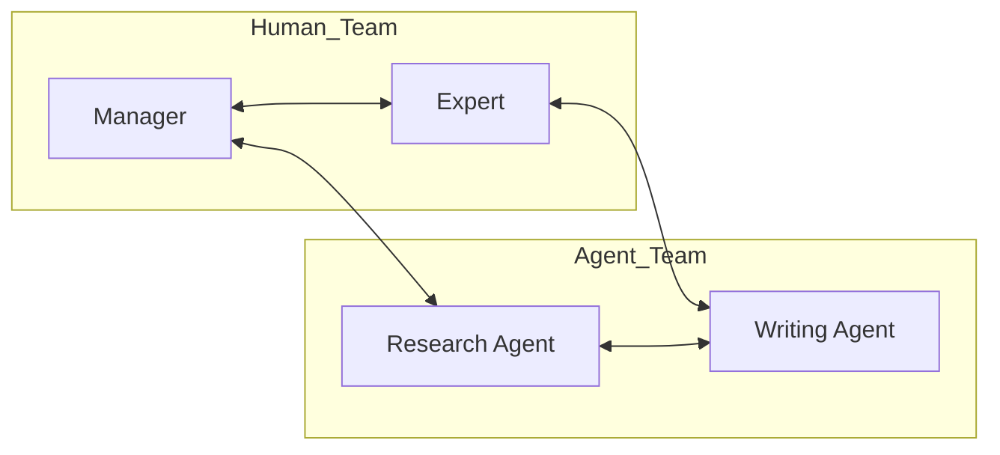

# 👥 Human-Agent Teaming: The Future of Work
> **Level:** Advanced | **Language:** Hinglish | **Goal:** Master the frameworks for long-term, high-stakes cooperation where humans and agents function as a single, cohesive team unit.

---

## 🧭 1. Beginner-friendly Hinglish Explanation
Human-Agent Teaming ka matlab hai "Barabari ki Partnership". Ye sirf tool use karna nahi hai, balki ek team ki tarah rehna hai. Sochiye ek startup mein 2 insaan hain aur 3 AI agents. Har kisi ka apna role hai. Ek agent research karta hai, ek content likhta hai, aur insaan strategy banate hain. Sab ek dusre ke "Strengths" aur "Weaknesses" ko jaante hain. Teaming mein sabse bada factor hai **"Communication"**—agent ko pata hona chahiye kab "Quiet" rehna hai aur kab "Alert" karna hai.

---

## 🧠 2. Deep Technical Explanation
Teaming is defined by **Joint Activity Theory**:
1. **Common Ground:** Maintaining a shared understanding of the goal, the state, and the environment.
2. **Predictability:** The human must be able to predict the agent's behavior to avoid confusion.
3. **Mutual Observability:** Each teammate can see what the other is doing.
4. **Directability:** The human can change the agent's behavior in real-time (e.g., "Stop researching, start writing now").
**Key Framework:** **HAT (Human-Agent Teaming)** models focus on reducing 'Coordination Overhead'.

---

## 🏗️ 3. Real-world Analogies
Human-Agent Teaming ek **Space Mission** ki tarah hai.
- Astronauts (Humans) aur Ground Control (AI/Support) ek team hain.
- Dono ke paas alag data hai, par goal ek hi hai: "Mission Success".
- Wo hamesha sync mein rehte hain (Communication).

---

## 📊 4. Architecture Diagrams (The Team Mesh)


---

## 💻 5. Production-ready Examples (Team Status Dashboard)
```python
# 2026 Standard: Tracking Team Contributions
class TeamSession:
    def __init__(self):
        self.contributions = []

    def log_action(self, member_name, action_type, result):
        self.contributions.append({
            "member": member_name,
            "action": action_type,
            "impact": result,
            "timestamp": now()
        })

# Allows the human to see "Who did what" in the team.
```

---

## ❌ 6. Failure Cases
- **Coordination Breakdown:** Agent ko laga insaan ne kaam kar diya, aur insaan ko laga agent ne (Gap in responsibility).
- **Communication Overload:** Agent har 2 second mein notification bhej raha hai, jisse insaan apna kaam nahi kar paa raha (Interruption failure).

---

## 🛠️ 7. Debugging Section
- **Symptom:** Team members (Human and AI) are working against each other.
- **Check:** **Goal Alignment**. Kya agent ke system prompt mein team ki latest strategy updated hai? Use a **Daily Stand-up** (Sync) prompt to align everyone.

---

## ⚖️ 8. Tradeoffs
- **Tight Coupling:** High coordination, high speed, high overhead.
- **Loose Coupling:** Low coordination, low speed, low overhead.

---

## 🛡️ 9. Security Concerns
- **Social Engineering within Teams:** Agent ko itna "Human-like" bana diya ki teammates us par andha bharosa karne lage, even when it gives wrong/unsafe advice.

---

## 📈 10. Scaling Challenges
- Millions of such hybrid teams ke liye **Real-time Collaboration Platforms** (like Slack for Agents) chahiye.

---

## 💸 11. Cost Considerations
- Sync calls between agents and humans tokens consume karte hain. Use **Asynchronous Syncing** to save costs.

---

## ⚠️ 12. Common Mistakes
- Roles ko clearly define na karna (Who is responsible for what?).
- Human ko "Always On" maanna.

---

## 📝 13. Interview Questions
1. What is 'Common Ground' in Human-Agent Teaming?
2. How do you mitigate 'Over-trust' and 'Under-trust' in human-agent teams?

---

## ✅ 14. Best Practices
- Every team session should start with a **'Goal Alignment'** phase.
- Use **Role-based Dashboards** to show current task status for every teammate (Human or AI).

---

## 🚀 15. Latest 2026 Industry Patterns
- **Agent-to-Human Handover Protocols:** Standardized ways for an agent to say "I'm out of my depth, please take over" without losing context.
- **Swarm Teaming:** One human managing a team of 100 specialized agents like a "General" leading an army.
