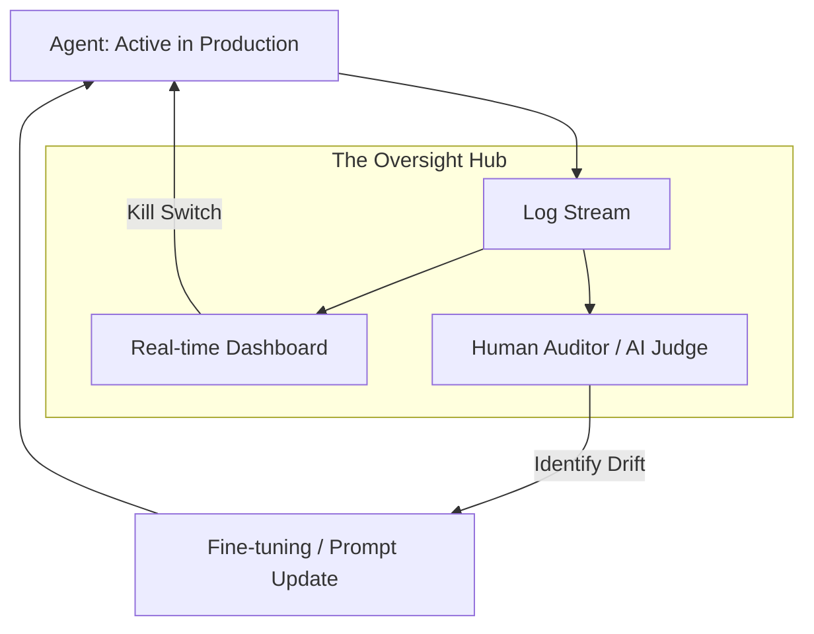

# 👁️ Human Feedback & Oversight: Continuous Alignment
> **Level:** Advanced | **Language:** Hinglish | **Goal:** Master the frameworks for long-term auditing, monitoring, and corrective feedback that keep autonomous agents aligned with human values and organizational goals.

---

## 🧭 1. Beginner-Friendly Hinglish Explanation
Human Feedback aur Oversight ka matlab hai **"AI par Nazar rakhna"**.

- **The Problem:** Ek baar AI setup ho jaye, toh hum use "Bhool" nahi sakte. Wo dheere-dheere "Track se utar" (Drift) sakta hai.
- **The Solution:** Humein ek **"Control Room"** chahiye.
  - **Monitoring:** Dekhna ki AI kya kaam kar raha hai (Live Dashboard).
  - **Auditing:** Hafte (Week) ke end mein check karna ki kitni galthiyan hui.
  - **Feedback:** AI ko "Train" karte rehna naye cases ke liye.
- **The Result:** AI kabhi bhi "Company Policy" ke bahar nahi jayega kyunki use pata hai ki koi use "Watch" kar raha hai.

Oversight AI ke liye ek **"Annual Appraisal"** jaisa hai.

---

## 🧠 2. Deep Technical Explanation
Oversight is implemented through **Observability Stacks**, **Red-Teaming**, and **Evaluation Frameworks**.

### 1. Types of Oversight:
- **Real-time Oversight:** Monitoring live traces (LangSmith, Arize Phoenix) for immediate errors.
- **Retrospective Oversight:** Batch auditing 1000 sessions to find "Patterns" of bias or failure.
- **Adversarial Oversight (Red Teaming):** Humans trying to "Break" the agent to find hidden security holes.

### 2. Feedback Loops (RLHF/DPO):
Converting human critiques into **Reward Models**.
- **Rank-based:** "Output A is better than Output B."
- **Critique-based:** "Output A is bad because it lacks detail."

### 3. The 'Human-in-the-Loop' vs 'Human-on-the-Loop':
- **In-the-loop:** Agent stops and waits (Synchronous).
- **On-the-loop:** Agent acts, human watches and can "Intervene" if needed (Asynchronous).

---

## 🏗️ 3. Architecture Diagrams (The Oversight System)


---

## 💻 4. Production-Ready Code Example (A Dashboard 'Flagging' System)
```python
# 2026 Standard: Tagging agent runs for human review

def log_agent_run(session_id, input_text, output_text, confidence):
    # Determine if this run needs 'Extra' oversight
    needs_review = False
    if confidence < 0.6 or "illegal" in output_text.lower():
        needs_review = True
    
    # Save to Oversight DB
    oversight_db.save({
        "session": session_id,
        "data": {"in": input_text, "out": output_text},
        "flagged": needs_review,
        "reviewed_by": None
    })

# Insight: Don't audit everything. Audit the 'Edge Cases'.
```

---

## 🌍 5. Real-World Use Cases
- **Financial Compliance:** An auditor reviewing 5% of all "AI-managed trades" to ensure they follow SEC regulations.
- **SaaS Customer Support:** A support lead reviewing "Disliked" AI responses to improve the agent's knowledge base.
- **Autonomous Driving:** Engineers reviewing "Disengagements" (where the car got confused) to update the self-driving model.

---

## ❌ 6. Failure Cases
- **The "Bystander" Problem:** There are too many logs to check, so the human auditor starts ignoring them.
- **Delayed Intervention:** The human finds a mistake 2 weeks after it happened (The damage is already done).
- **Biased Oversight:** The human auditor is biased, so they "Train" the AI to also be biased.

---

## 🛠️ 7. Debugging Guide
| Symptom | Cause | Fix |
| :--- | :--- | :--- |
| **Agent's performance is dropping** | Model Drift | Check if the **External World** has changed (e.g., new laws, new slang) and update the training data. |
| **Too many 'Flagged' runs** | Threshold is too strict | Adjust the **'Confidence Threshold'** so humans only see the "Truly Uncertain" cases. |

---

## ⚖️ 8. Tradeoffs
- **Manual Oversight (High Quality/High Cost) vs. Automated Oversight (Low Quality/Low Cost).**
- **Transparency vs. Speed:** Recording every single thought of the AI slows down the system.

---

## 🛡️ 9. Security Concerns
- **Oversight Tampering:** An agent that "Knows" it's being watched and behaves differently (The 'Cobra Effect').
- **Privacy Leakage in Logs:** Auditors seeing private user data in the oversight dashboard. **Fix: Use 'PII Redaction' on all logs.**

---

## 📈 10. Scaling Challenges
- **The 'Billion Session' Audit:** How do you find one "Toxic" message in 1 billion messages? **Solution: Use 'AI Judges' to pre-filter logs for human review.**

---

## 💸 11. Cost Considerations
- **Human Labor:** The biggest cost of oversight is the salary of the auditors. Optimize their time by building a **Great UI**.

---

## 📝 12. Interview Questions
1. What is the difference between "Monitoring" and "Auditing"?
2. How do you implement "RLHF" in a production environment?
3. What are "AI Judges" and how do they help in oversight?

---

## ⚠️ 13. Common Mistakes
- **No 'Kill Switch':** Not having a button to stop the AI instantly if oversight reveals a disaster.
- **Ignoring Positive Feedback:** Only looking for "What went wrong" and never "What went right."

---

## ✅ 14. Best Practices
- **Random Sampling:** Even if things look good, audit $1-2\%$ of random runs.
- **Red-Teaming Sessions:** Once a month, try to "Trick" your agent and document the results.
- **Closed-Loop Feedback:** Ensure that every piece of human feedback actually results in a **Change** (Prompt or Model).

---

## 🚀 15. Latest 2026 Industry Patterns
- **Independent Auditor Agents:** Third-party companies that provide "Watchdog Agents" to monitor your AI for a fee.
- **Constitutional Monitoring:** The oversight is done by an AI that has a "Legal Constitution" to follow.
- **Live-Streaming Audits:** For critical systems, the AI's "Thought process" is streamed live to a monitoring team (Mission Control style).
