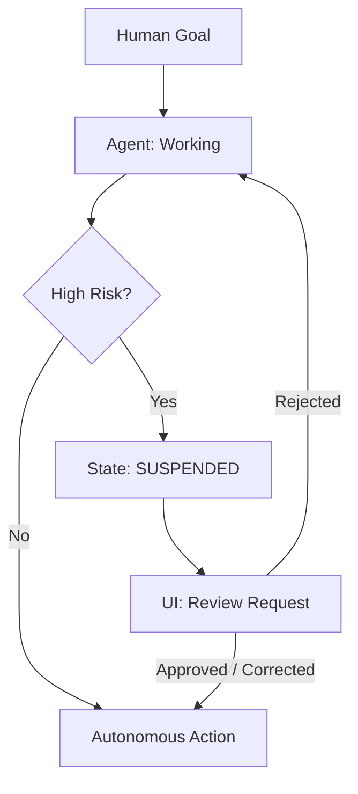

# 🛠️ Human-in-the-Loop (HITL) Patterns: The Safety Net
> **Level:** Advanced | **Language:** Hinglish | **Goal:** Master the various architectural patterns for integrating human intervention into autonomous agent workflows to ensure safety, quality, and trust.

---

## 🧭 1. Beginner-Friendly Hinglish Explanation
Human-in-the-Loop (HITL) ka matlab hai **"Beech mein insaan ka hona"**.

- **The Problem:** AI smart hai, par wo hamesha "Perfect" nahi hota. Agar wo koi badi galti karde (e.g., galat bank account mein paise bhej de), toh problem ho jayegi.
- **The Solution:** Hum system mein "Break points" banate hain.
  - AI apna kaam karta hai, par "Final Action" lene se pehle wo ruk jata hai.
  - Wo insaan ko batata hai: "Main ye karne wala hoon, kya ye sahi hai?"
  - Insaan **"Yes"** bolta hai toh kaam aage badhta hai, warna insaan use "Theek" kar deta hai.
- **The Result:** Speed AI ki, aur Safety insaan ki.

HITL AI ko "Khula Saand" (Uncontrolled) banne se rokta hai.

---

## 🧠 2. Deep Technical Explanation
HITL is an **Interventionist Architecture**. It is defined by **Trigger Conditions** and **State Suspension**.

### 1. Key HITL Patterns:
- **Approval Pattern:** Agent drafts a result and waits for a "Go/No-go" signal.
- **Correction Pattern:** Agent drafts a result, human edits it, and then it is finalized.
- **Clarification Pattern:** Agent stops because the instruction is ambiguous and asks the human for details.
- **Escalation Pattern:** Agent detects its own failure or a high-risk situation and "Hands over" the entire task to a human.

### 2. State Suspension:
When HITL is triggered, the agent's **Workflow State** must be saved (serialized) to a database so the human can review it later without the session timing out.

### 3. Threshold-based HITL:
Using confidence scores. `If confidence < 0.85 -> Ask Human`.

---

## 🏗️ 3. Architecture Diagrams (The HITL Workflow)


---

## 💻 4. Production-Ready Code Example (A Human-Approval Node in LangGraph)
```python
# 2026 Standard: Using 'Interrupt' for human-in-the-loop

from langgraph.graph import StateGraph

def human_review_node(state):
    # This node doesn't 'Do' anything; it just serves 
    # as a marker for the graph to STOP and wait for input.
    pass

workflow = StateGraph(MyState)
workflow.add_node("agent", my_agent)
workflow.add_node("human_review", human_review_node)

# Set an interrupt BEFORE the human_review node
app = workflow.compile(interrupt_before=["human_review"])

# Insight: Using 'Interrupts' allows you to scale 
# to 1000s of users waiting for approval in parallel.
```

---

## 🌍 5. Real-World Use Cases
- **Enterprise Spend:** "Agent, buy 50 Macbooks for the new employees." -> Agent finds the best price -> Asks Finance Manager to "Confirm Payment."
- **Content Moderation:** Agent flags a post as "Toxic" -> Human Moderator reviews and decides to "Delete" or "Keep."
- **Medical AI:** Agent suggests a "Treatment Plan" -> Doctor reviews and "Signs off" before the patient sees it.

---

## ❌ 6. Failure Cases
- **The "Notification" Spam:** Agent asks for approval for every $1 transaction. **Fix: Use 'Dynamic Thresholds'.**
- **The "Rubber Stamp" Problem:** Human gets so used to clicking "Approve" that they stop actually reading the agent's work.
- **Deadlock:** The agent is waiting for a human who is on vacation. **Fix: Implement 'Fallbacks' or 'Redirects' to another human.**

---

## 🛠️ 7. Debugging Guide
| Symptom | Cause | Fix |
| :--- | :--- | :--- |
| **Agent is skipping the human check** | Logic error in threshold | Log the **'Confidence Score'** and the **'Decision Logic'** to see why the `if` statement failed. |
| **Human can't understand the request** | Lack of context | Always provide the **'Reasoning Chain'** (Why did the agent decide this?) along with the approval request. |

---

## ⚖️ 8. Tradeoffs
- **Velocity vs. Security:** HITL slows down the process but prevents catastrophic failures.
- **Cost:** Human labor is expensive. Aim to use HITL only for the **Top 5%** of risky tasks.

---

## 🛡️ 9. Security Concerns
- **Social Engineering the Reviewer:** An agent (controlled by an attacker) presenting a "Fake" safe-looking summary to the human to get approval for a malicious action.
- **Unauthorized Approval:** Someone else clicking "Approve" on the human's behalf. **Fix: Use 'Multi-factor Authentication' for high-value approvals.**

---

## 📈 10. Scaling Challenges
- **Management Bottleneck:** One human managing 100 agents. **Solution: Use a 'Triage Agent' to prioritize which requests the human should see first.**

---

## 💸 11. Cost Considerations
- **Human Latency:** If a human takes 2 hours to respond, the "Cost of Delay" for the business might be high.

---

## 📝 12. Interview Questions
1. What is an "Interrupt" in the context of an agent graph?
2. How do you decide which tasks need a "Human-in-the-loop"?
3. What is the "Rubber Stamping" problem and how do you solve it?

---

## ⚠️ 13. Common Mistakes
- **No 'Reject' logic:** Letting the human "Approve" but not giving them a way to say "No, do it differently."
- **Hiding the 'Why':** Showing the human the "Action" but not the "Reasoning."

---

## ✅ 14. Best Practices
- **Explicit 'Wait' States:** Clearly show the user that the "Agent is waiting for you."
- **Confidence Scoring:** Use it as the primary trigger for HITL.
- **One-click Review:** Make the UI so simple that the human can review and approve in $< 5$ seconds.

---

## 🚀 15. Latest 2026 Industry Patterns
- **Active Learning via HITL:** Every time a human corrects an agent, that correction is used as **Fine-tuning data** to make the agent smarter.
- **Multi-human Consensus:** For extremely high-risk tasks (e.g., nuclear plant maintenance), requiring 2 out of 3 humans to approve.
- **AI-as-a-Human:** Using a "Stronger" AI model to play the role of the "Human Reviewer" for medium-risk tasks (The 'AI-in-the-loop' pattern).
