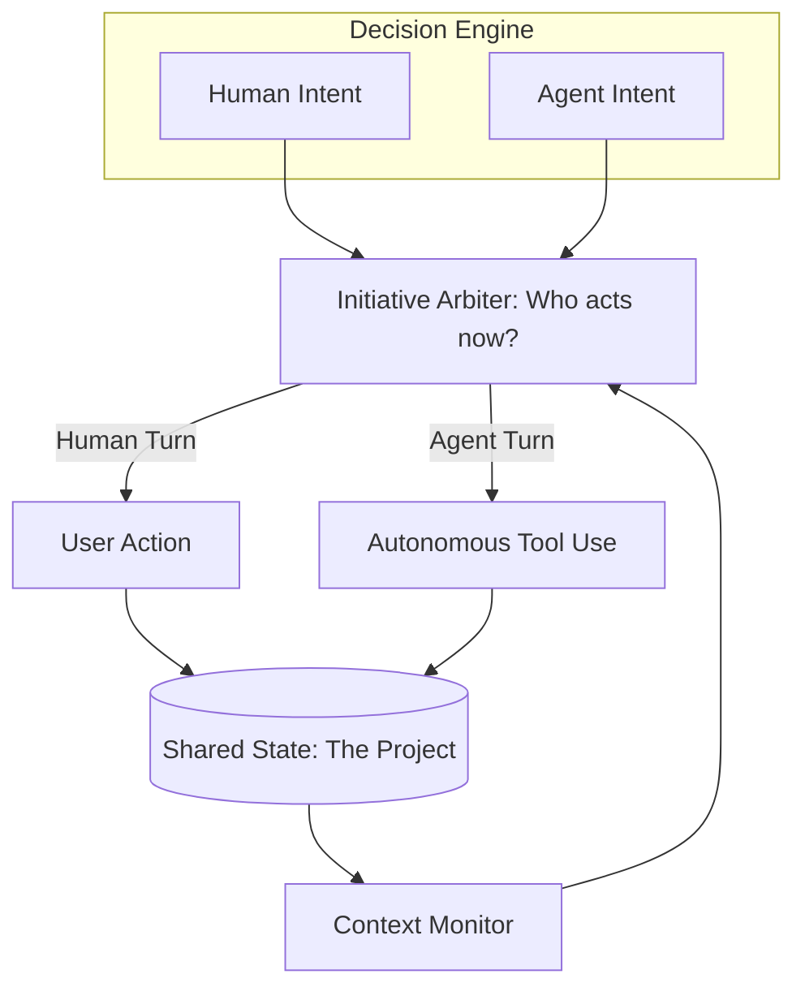

# 🎛️ Mixed-Initiative Systems: Shared Control
> **Level:** Extreme Advanced | **Language:** Hinglish | **Goal:** Master the design of systems where the "Initiative" (who starts the next action) shifts dynamically between the human and the agent based on context, goals, and expertise.

---

## 🧭 1. Beginner-Friendly Hinglish Explanation
Mixed-Initiative Systems ka matlab hai **"Kabhie tumhari baari, kabhie meri"**.

- **The Concept:** Traditional systems mein ya toh insaan command deta hai (User-driven), ya AI apna kaam karta hai (Autonomous).
- **The "Mixed" Approach:**
  - AI dekh raha hai ki aap kya kar rahe ho.
  - Agar aap "Galti" karne wale ho, toh AI khud se bolta hai: "Rukiye! Kya main help karun?" (AI initiative).
  - Agar aapko kuch chahiye, toh aap AI ko bolte ho (User initiative).
- **The Goal:** AI aur Insaan ek **"Tandem Bicycle"** ki tarah hain jahan dono milkar handle mod sakte hain.

Mixed-initiative AI ko sirf ek "Servant" se badal kar ek **"Proactive Partner"** bana deta hai.

---

## 🧠 2. Deep Technical Explanation
Mixed-initiative interaction (MII) is a type of **Human-Computer Interaction (HCI)** where the agent and user collaborate as peers.

### 1. The 'Initiative' Triggers:
- **Human Initiative:** Explicit commands, questions, or goal setting.
- **Agent Initiative:** 
  - **Correction:** "You are about to delete a protected file."
  - **Suggestion:** "I noticed you are repeating this task, should I automate it?"
  - **Questioning:** "I found two conflicting dates, which one should I use?"

### 2. Coordination Protocols:
- **Turn-taking:** Managing who is "Speaking" or "Acting" to avoid conflicts.
- **Interrupt Management:** Deciding when it is "Safe" or "Polite" for the agent to interrupt the human.
- **Negotiation:** When the human and agent disagree on a goal or a path.

### 3. Shared Workspace:
A common state where both the human and agent can see and modify the environment (e.g., a shared Google Doc or a Code Repo).

---

## 🏗️ 3. Architecture Diagrams (The Collaborative See-saw)


---

## 💻 4. Production-Ready Code Example (An Initiative Arbiter)
```python
# 2026 Standard: Deciding when the agent should speak up

def monitor_human_action(action, state):
    # 1. Analyze risk of current human action
    risk_score = risk_model.evaluate(action, state)
    
    if risk_score > 0.8:
        # AGENT INITIATIVE: Interrupt the human
        return {
            "take_initiative": True,
            "message": "⚠️ Warning: This action might break the production database. Proceed?"
        }
    
    # 2. Check for automation potential
    if state.is_repetitive(action):
        # AGENT INITIATIVE: Suggest help
        return {
            "take_initiative": True,
            "message": "💡 I've seen you do this 3 times. Want me to handle the rest?"
        }
    
    return {"take_initiative": False}

# Insight: Effective agents don't just 'Wait' for commands; 
# they 'Watch' for opportunities to add value.
```

---

## 🌍 5. Real-World Use Cases
- **Smart IDEs:** A developer is coding; the agent "Initiates" a fix for a hidden security bug (GitHub Copilot).
- **Crisis Management:** A pilot is flying; the agent "Initiates" the landing procedure because it detects the pilot is incapacitated.
- **Data Entry:** A user is typing; the agent "Initiates" an auto-fill for the remaining 50 rows based on the pattern it saw.

---

## ❌ 6. Failure Cases
- **The "Annoying Assistant" (Clippy Effect):** The agent interrupts the human every 10 seconds with "Useless" suggestions.
- **Control Confusion:** Both the human and agent try to move the mouse/cursor at the same time.
- **Over-Passivity:** The agent sees a disaster coming but "Waits" for the human to ask for help.

---

## 🛠️ 7. Debugging Guide
| Symptom | Cause | Fix |
| :--- | :--- | :--- |
| **User feels 'Controlled' by the AI** | High Agent-Initiative frequency | Reduce the **'Interrupt Frequency'** or only allow initiative for "Critical" errors. |
| **Agent is 'Silent' during errors** | Low sensitivity | Improve the **'Risk Detection'** model to better understand the consequences of human actions. |

---

## ⚖️ 8. Tradeoffs
- **User Agency (Freedom) vs. Agent Assistance (Safety).**
- **Proactive (Fast/Helpful) vs. Reactive (Predictable/Safe).**

---

## 🛡️ 9. Security Concerns
- **Initiative Hijacking:** An attacker making the agent "Initiate" a dangerous action (e.g., "I've detected a problem, let me reset your password for you").
- **Forced Reliance:** Designing a system where the human *cannot* act without the agent's permission.

---

## 📈 10. Scaling Challenges
- **Multi-user MII:** One agent working with 5 humans. Who gets to "Initiate"? **Solution: Use 'Role-based Permissions' for initiative.**

---

## 💸 11. Cost Considerations
- **Monitoring Overhead:** The cost of constantly "Watching" the human's actions (even when not doing anything) can add up.

---

## 📝 12. Interview Questions
1. What is "Mixed-Initiative Interaction"?
2. How do you design an agent that doesn't "Interrupt" the user at the wrong time?
3. What is the "Clippy Effect" and how do you avoid it?

---

## ⚠️ 13. Common Mistakes
- **Interrupting 'Flow' State:** Not detecting when the human is "Focused" and shouldn't be disturbed.
- **Unclear Ownership:** Not knowing "Who is in control" at any given second.

---

## ✅ 14. Best Practices
- **Human-First Control:** The human should always have the "Final Word" and be able to "Mute" the agent's initiative.
- **Subtle Nudges:** Use visual cues (e.g., a small icon) for low-priority initiatives instead of pop-up messages.
- **Contextual Awareness:** The agent should know *why* it is interrupting.

---

## 🚀 15. Latest 2026 Industry Patterns
- **Haptic Initiative:** Wearable devices that "Vibrate" when the agent wants to take initiative (Low-noise communication).
- **Silent Partnership:** Agents that take initiative "Behind the scenes" (e.g., optimizing a query while the user is still writing it) and only report the success.
- **Personality Matching:** Agents that learn when *this specific user* likes to be interrupted and when they want to be left alone.
