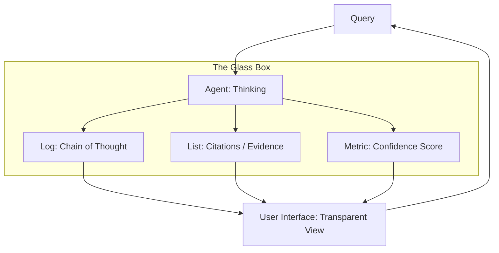

# 🛡️ Trust & Transparency: Building the AI-Human Bond
> **Level:** Advanced | **Language:** Hinglish | **Goal:** Master the techniques for making agent reasoning "Visible" and "Understandable" to humans, ensuring long-term trust and reliable collaboration.

---

## 🧭 1. Beginner-Friendly Hinglish Explanation
Trust aur Transparency ka matlab hai **"AI ko ek Khuli Kitaab banana"**.

- **The Problem:** Agar AI koi decision leta hai par batata nahi "Kyun?", toh hum uspar trust nahi kar sakte. Ise "Black Box" kehte hain.
- **The Solution:** Humein AI ko **"Transparent"** banana hoga:
  - **Explainability:** AI bataye: "Maine ye step isliye liya kyunki data ye kehta hai."
  - **Honesty:** Agar AI ko kuch nahi pata, toh wo "Gues" na kare, balki bole: "Mujhe nahi pata."
  - **Source Citation:** Jo bhi AI bole, uska "Saboot" (Source) dikhaye.
- **The Goal:** User ko "Andhere" mein nahi rakhna. Jab user ko pata hota hai ki AI kaise soch raha hai, toh **Trust** apne aap badh jata hai.

Transparency AI ki **"Vishwaas-yogyata"** (Credibility) badhati hai.

---

## 🧠 2. Deep Technical Explanation
Trust is built through **Chain-of-Thought (CoT) Visualizations**, **Certainty Scoring**, and **Verifiable Citations**.

### 1. The Transparency Stack:
- **Reasoning Traces:** Showing the "Internal Monologue" of the agent.
- **Evidence Grounding:** Linking every claim to a specific row in a database or a URL.
- **Uncertainty Quantification:** The agent saying "I am 70% sure about this" vs. "I am 99% sure."

### 2. Explainable AI (XAI) in Agents:
Using **Attribution Techniques** to show which part of the input led to which part of the output (e.g., highlighting the specific paragraph in a PDF that justified a refund).

### 3. The 'Hallucination' Kill-switch:
Implementing **Self-Check nodes** that verify the final response against the source documents before the user sees it.

---

## 🏗️ 3. Architecture Diagrams (The Transparent Agent)


---

## 💻 4. Production-Ready Code Example (A Transparent Response Object)
```python
# 2026 Standard: Returning more than just 'Text'

class TransparentResponse:
    def __init__(self, answer, reasoning, confidence, sources):
        self.answer = answer
        self.reasoning = reasoning # The 'Why'
        self.confidence = confidence # e.g., 0.95
        self.sources = sources # e.g., ["doc_1.pdf", "api_call_2"]

def agent_logic(query):
    # Agent does its work...
    return TransparentResponse(
        answer="You should buy Apple stock.",
        reasoning="P/E ratio is lower than historical average and Q3 earnings were strong.",
        confidence=0.88,
        sources=["Yahoo Finance API", "Q3 Earnings Report"]
    )

# Insight: Users are $3x$ more likely to follow advice 
# when they can see the 'Reasoning' behind it.
```

---

## 🌍 5. Real-World Use Cases
- **Medical AI:** "I suggest this treatment because your blood test (Ref: Page 2) shows high glucose."
- **Legal Agents:** "This clause is risky because it contradicts Section 5 of the local law (Link)."
- **Smart Homes:** "I turned off the AC because no motion was detected in the room for 20 minutes (Sensor Log)."

---

## ❌ 6. Failure Cases
- **The "Over-Explain" Trap:** Giving the user 10 pages of "Logic" for a simple question, causing "Analysis Paralysis."
- **Fake Transparency:** The agent "Invents" a logical-sounding reason for a hallucinated answer. **Fix: Cross-verify reasoning with the environment.**
- **Privacy vs. Transparency:** Showing "Too much" internal logic might reveal sensitive company data or other users' info.

---

## 🛠️ 7. Debugging Guide
| Symptom | Cause | Fix |
| :--- | :--- | :--- |
| **User doesn't trust the agent** | Reasoning is too 'Bot-like' | Tell the agent to **'Explain in Simple Terms'** or use analogies. |
| **Confidence scores are always '1.0'** | Model Overconfidence | Calibrate the model by comparing its "Confidence" vs. "Actual Accuracy" on a test set. |

---

## ⚖️ 8. Tradeoffs
- **Full Transparency (Trustworthy/Slow/Expensive) vs. Silent Action (Fast/Clean/Risky).**
- **User-facing Reasoning (Simplified) vs. Developer-facing Traces (Raw/Technical).**

---

## 🛡️ 9. Security Concerns
- **Prompt Injection via Explanation:** An attacker reading the "Reasoning" to figure out the agent's hidden security rules and bypass them.
- **Adversarial Confidence:** An attacker "Tricking" the agent into being $100\%$ confident about a wrong/dangerous action.

---

## 📈 10. Scaling Challenges
- **Storing Traces:** Keeping the "Thought logs" of 1 million users is a massive database challenge. **Solution: Only store logs for 'Failed' or 'High-risk' sessions.**

---

## 💸 11. Cost Considerations
- **Reasoning Tokens:** Generating a "Chain of Thought" can use $2x-5x$ more tokens than the final answer. **Strategy: Use 'Small Models' to generate the explanation.**

---

## 📝 12. Interview Questions
1. What is "Chain of Thought" (CoT) and why does it help trust?
2. How do you quantify "Uncertainty" in an LLM?
3. What is the "Black Box" problem in AI?

---

## ⚠️ 13. Common Mistakes
- **Hiding Failures:** Not telling the user when a tool call failed.
- **Static Explanations:** Giving the same "Generic" reason for every answer.

---

## ✅ 14. Best Practices
- **Show, Don't Just Tell:** Use charts, highlights, and links to back up the agent's words.
- **Admit Ignorance:** Train the agent to say "I don't have enough data to be certain."
- **Interactive Traces:** Let the user "Click" to see more detail if they want, but keep the default view clean.

---

## 🚀 15. Latest 2026 Industry Patterns
- **Trace-as-a-Service:** Platforms like **LangSmith** that specialize in making agent thoughts visible and searchable.
- **Visual Reasoning Maps:** Agents that output a "Flowchart" of their decision process instead of just text.
- **Trust-Scores for Agents:** Independent ratings for agents based on how "Honest" and "Transparent" they are in production.
