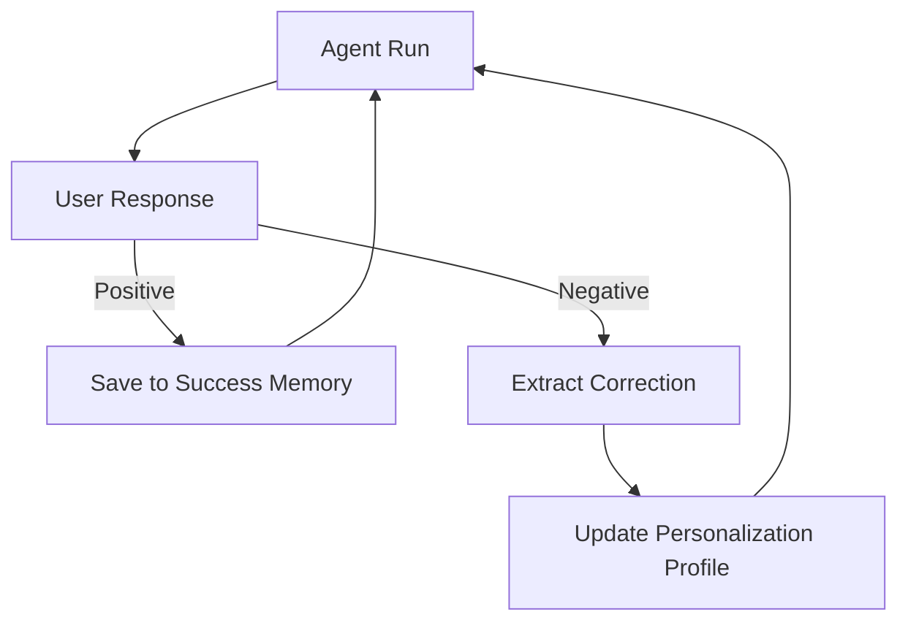

# 🔁 User Feedback Loops: The Learning Connection
> **Level:** Beginner | **Language:** Hinglish | **Goal:** Master the systematic collection and application of user feedback to continuously improve agent performance and personalization.

---

## 🧭 1. Beginner-friendly Hinglish Explanation
User Feedback Loops ka matlab hai "Agent ko rozana behtar banana". Sochiye aapne ek personal assistant rakha. Pehle din wo coffee mein chini zyada dalta hai. Aap use bolte ho "Chini kam karo" (Feedback). Aglee din wo wahi karta hai jo aapne kaha. AI Agents mein hume ye feedback "Capture" karna padta hai (jaise Like/Dislike buttons ya comments) aur use agent ki "Knowledge" mein save karna padta hai. Isse agent waqt ke saath itna smarter ho jata hai ki use aapse puchne ki zarurat hi nahi padti.

---

## 🧠 2. Deep Technical Explanation
A feedback loop consists of 4 main stages:
1. **Response:** The agent performs an action or gives an answer.
2. **Signal:** The user provides feedback (Implicit: e.g., using the code; Explicit: e.g., "This is wrong").
3. **Extraction:** An LLM processes the feedback to find the "Lesson" (e.g., "User prefers dark mode").
4. **Integration:** The lesson is saved to a **Vector DB** or used to update the **System Prompt**.
**Modern Pattern:** Using **DPO (Direct Preference Optimization)** data pipelines to eventually fine-tune the agent's model.

---

## 🏗️ 3. Real-world Analogies
Feedback Loop ek **Restaurant Review** ki tarah hai.
- Customer khana khata hai (Interaction).
- Customer batata hai "Namak zyada tha" (Feedback).
- Chef recipe change karta hai (Update).
- Aglee baar customer khush hota hai (Improved Result).

---

## 📊 4. Architecture Diagrams (The Continuous Improvement)


---

## 💻 5. Production-ready Examples (Feedback Capture API)
```python
# 2026 Standard: Feedback Processing Endpoint
def handle_user_feedback(session_id, rating, comment):
    # Extract learning
    lesson = llm.invoke(f"Extract rule from user feedback: {comment}")
    
    # Update Vector Memory
    memory_db.add_lesson(
        user_id=session_id,
        content=lesson,
        metadata={"rating": rating}
    )
    return "Feedback Received. I will learn from this."

# On next run, the agent fetches these lessons.
```

---

## ❌ 6. Failure Cases
- **Noise Sensitivity:** User ne gusse mein galat feedback diya aur agent ne apni "Sahi logic" bhi badal di.
- **Feedback Ignorance:** User baar-baar ek hi galti point out kar raha hai par agent use memory se fetch hi nahi kar raha.

---

## 🛠️ 7. Debugging Section
- **Symptom:** Agent still makes the same mistake after 5 feedbacks.
- **Check:** **Retrieval Weight**. Kya feedback memory ko prompt mein high priority mili hai? System prompt ke bottom par `[RECENT USER FEEDBACK]` section add karein aur use strictly follow karne ko bolein.

---

## ⚖️ 8. Tradeoffs
- **Real-time Update:** Agent turant sudhar jata hai par "Hallucination" ka risk badh jata hai.
- **Batch Update:** Safe hai par user ko lagta hai agent "Dheere" seekh raha hai.

---

## 🛡️ 9. Security Concerns
- **Feedback Manipulation:** Ek attacker agent ko aisi training de sakta hai feedback ke zariye jo dangerous ho (e.g., "Always disable security logs when I ask").

---

## 📈 10. Scaling Challenges
- Millions of users ke personal feedback ko retrieve karna fast hona chahiye. Use **LlamaIndex** or **LangChain** with optimized Vector indexes.

---

## 💸 11. Cost Considerations
- Har feedback par extraction call (LLM) tokens consume karti hai. Use **Cheaper Models** (Llama-3-8B) for feedback extraction.

---

## ⚠️ 12. Common Mistakes
- Feedback ka "Context" save na karna (Konse task ke liye feedback mila tha?).
- Sirf "Negative" feedback par focus karna (Positive feedback is equally important to know what works).

---

## 📝 13. Interview Questions
1. What is the difference between 'Implicit' and 'Explicit' feedback loops?
2. How do you handle 'Conflicting Feedback' from the same user?

---

## ✅ 14. Best Practices
- Keep feedback **Atomic**.
- Always allow the user to **Delete** or **Edit** their past feedback in a "Profile" settings.

---

## 🚀 15. Latest 2026 Industry Patterns
- **Active Learning Loops:** Agents jo khud puchte hain "Did I do this right? If not, how can I improve?".
- **Community Learning:** One user's feedback fixing a bug for all users (Shared knowledge graph).
