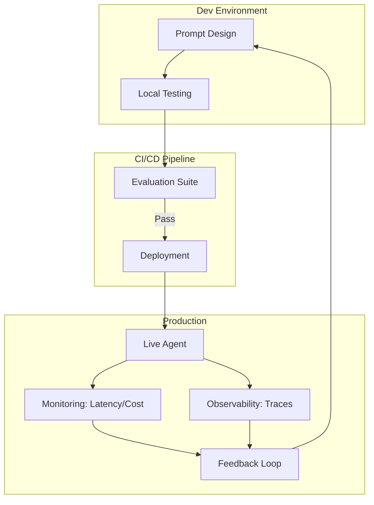

# ⚙️ Agent Ops Fundamentals: Production-Grade Reliability
> **Level:** Fundamentals | **Language:** Hinglish | **Goal:** Master the operational lifecycle of AI agents, from deployment and monitoring to versioning and infrastructure.

---

## 🧭 1. Beginner-Friendly Hinglish Explanation
Agent Ops (ya Agent Operations) ka matlab hai AI agent ko **"Production"** mein chalana.

- **The Problem:** Ek agent banana asaan hai, par use 10,000 users ke liye stable rakhna bahut mushkil hai.
- **The Solution:** Humein wahi discipline chahiye jo normal Software (DevOps) mein hoti hai:
  1. **Deployment:** Agent ko server par kaise daalein?
  2. **Monitoring:** Kya agent slow hai? Kya wo zyada paise kharch kar raha hai?
  3. **Versioning:** Agar humne prompt badla, toh kya purana version save hai?
  4. **Safety:** Kya agent out-of-control ho raha hai?

Agent Ops hi wo cheez hai jo ek "Experiment" ko ek "Real Business" banati hai.

---

## 🧠 2. Deep Technical Explanation
Agent Ops is the intersection of **MLOps**, **LLMOps**, and traditional **SRE** (Site Reliability Engineering).

### 1. The Core Lifecycle:
- **Prompt Engineering & Iteration:** Writing and testing versions of the "Brain."
- **Infrastructure Management:** Orchestrating the compute (GPUs/Cloud) and databases (Vector/SQL).
- **Inference Optimization:** Managing latency, throughput, and costs (e.g., using Quantized models).
- **Observability:** Tracking every "Thought" and "Action" for audit and debugging.

### 2. The Feedback Loop:
Unlike standard software, agent performance can "Degrade" over time (Model Drift). Agent Ops ensures that real-world failures are fed back into the training or prompting cycle.

### 3. Agentic CI/CD:
Automatically running a suite of **Evals** (Evaluations) before deploying a new version of the agent's system prompt.

---

## 🏗️ 3. Architecture Diagrams (The Agent Ops Stack)


---

## 💻 4. Production-Ready Code Example (A Simple Monitoring Wrapper)
```python
# 2026 Standard: Tracking metrics for every agent run

import time
import datadog # Conceptual

def run_agent_with_ops(user_task):
    start_time = time.time()
    
    try:
        # Execute agent logic
        result = agent.execute(user_task)
        
        # 1. Log Success
        datadog.increment("agent.success_rate")
        return result
        
    except Exception as e:
        # 2. Log Failure & Alert
        datadog.increment("agent.failure_rate")
        logger.error(f"Critical Agent Failure: {str(e)}")
        raise
        
    finally:
        # 3. Track Latency and Tokens
        latency = time.time() - start_time
        datadog.histogram("agent.latency", latency)
        datadog.histogram("agent.token_usage", agent.total_tokens)

# Insight: Monitoring 'Token Usage' is as important as 
# monitoring 'CPU Usage' for AI apps.
```

---

## 🌍 5. Real-World Use Cases
- **Enterprise SaaS:** Ensuring that 1000 parallel customer support agents don't hit the API rate limit simultaneously.
- **Autonomous Trading:** Real-time monitoring of "Trade Success" vs "Loss" with an automatic "Kill Switch" if loss exceeds $2\%$.
- **HealthTech:** Versioning prompts so that every medical advice given can be traced back to the exact version of the AI's "Rules."

---

## ❌ 6. Failure Cases
- **The Token Spike:** A bug in a loop causes an agent to spend $\$1000$ in an hour. **Fix: Implement 'Rate Limiting' at the proxy layer.**
- **The Silent Failure:** The agent is returning "Success" but the answer is halluncinated garbage. **Fix: Use 'LLM-as-a-judge' for real-time monitoring.**
- **Version Drift:** Deploying a "Smarter" prompt that accidentally breaks all the existing tool integrations.

---

## 🛠️ 7. Debugging Guide
| Symptom | Cause | Fix |
| :--- | :--- | :--- |
| **Agent is getting slower** | Context window is getting too full | Implement **Context Pruning** or **Summarization** before each turn. |
| **Costs are rising** | Redundant tool calls | Check the **Episodic Memory** to see if the agent is searching for the same info repeatedly. |

---

## ⚖️ 8. Tradeoffs
- **Managed vs. Self-hosted Ops:** Managed (OpenAI/LangSmith) is fast; Self-hosted (Langfuse/Postgres) is cheap and private.
- **Latency vs. Reliability:** Checking every answer with a "Judge" model adds 2-3 seconds of latency but increases reliability.

---

## 🛡️ 9. Security Concerns
- **Prompt Leakage:** If your "System Message" is leaked, competitors can clone your agent.
- **Model Poisoning:** An attacker feeding "Bad Feedback" to your monitoring system to trick you into deploying a worse model.

---

## 📈 10. Scaling Challenges
- **Concurrency:** Handling 1,000,000 requests per day.
- **Distributed Memory:** Sharing a "Short-term Memory" cache across multiple regional servers.

---

## 💸 11. Cost Considerations
- **Prompt Caching:** Using providers that support caching can save $90\%$ on repetitive input costs.

---

## 📝 12. Interview Questions
1. What is the difference between MLOps and Agent Ops?
2. How do you implement a "Kill Switch" for an autonomous agent?
3. What metrics are most important for monitoring a production agent?

---

## ⚠️ 13. Common Mistakes
- **No Rate Limits:** Letting a single user bankrupt you with 10,000 parallel requests.
- **Ignoring the 'Why':** Logging the result but not the "Trace" (The steps the agent took).

---

## ✅ 14. Best Practices
- **Implement a 'Gateway':** Never talk to the LLM directly; use a proxy (like LiteLLM or Portkey) to handle retries and monitoring.
- **A/B Testing:** Always run a new prompt version against $5\%$ of traffic before full deployment.
- **Immutable Traces:** Never allow logs/traces to be edited; they are your "Black Box" for legal and technical audits.

---

## 🚀 15. Latest 2026 Industry Patterns
- **Autonomous SREs:** Agents that monitor *other* agents and fix their infrastructure issues automatically.
- **Serverless Agents:** Deploying agents as AWS Lambda/Vercel Functions that scale to zero when not in use.
- **Local-first Ops:** Running small models on the user's device for privacy, while only sending "Hard Tasks" to the cloud.
