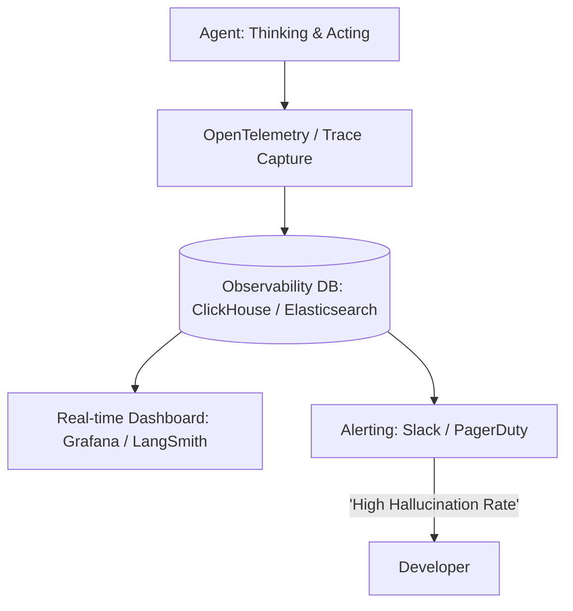

# 👁️ Monitoring & Observability for Agents: The Live Audit
> **Level:** Advanced | **Language:** Hinglish | **Goal:** Master the tools and techniques for tracking agent "thoughts," "actions," and "costs" in real-time within a production environment.

---

## 🧭 1. Beginner-Friendly Hinglish Explanation
Monitoring aur Observability ka matlab hai AI ke kaam par **"Nazar rakhna"**.

- **Monitoring:** "Kya agent zinda hai?" (Health check).
- **Observability:** "Agent aisa kyun kar raha hai?" (Deep understanding).
- **The Concept:** Jab agent khud se decision leta hai, toh humein ek "Live Feed" chahiye:
  1. Usne kya socha?
  2. Usne kaunsa tool use kiya?
  3. Usse kitne paise (tokens) kharch hue?
  4. Response time kitna tha?

Bina monitoring ke, agar agent ne koi badi galti ki, toh aap use kabhi dhoond nahi paoge.

---

## 🧠 2. Deep Technical Explanation
Observability in agents is about capturing **Semantic Traces** rather than just logs.

### 1. The Observability Triad:
- **Metrics:** Quantitative data (Token count, Latency, Cost, Success Rate).
- **Logs:** Discrete events (Tool called, File saved, Error caught).
- **Traces:** The "Golden Thread" linking a user's question to every internal LLM call and external action (LangSmith/Phoenix/Honeycomb).

### 2. Semantic Tracing:
Tracking the **Intent** and **Reasoning**. We log not just the input/output, but the `Thought` process in between.

### 3. Feedback Loop Monitoring:
Tracking how many times an agent had to "Reflect" or "Retry" before succeeding. A high number of retries usually means the "System Prompt" needs an update.

---

## 🏗️ 3. Architecture Diagrams (The Observability Pipeline)


---

## 💻 4. Production-Ready Code Example (A Tracing Wrapper)
```python
# 2026 Standard: Using Langfuse for open-source observability

from langfuse import Langfuse

langfuse = Langfuse()

def run_observed_agent(user_query):
    # 1. Start a Trace
    trace = langfuse.trace(name="CustomerSupportAgent", user_id="user_123")
    
    # 2. Log the 'Thought'
    span = trace.span(name="Thinking", input=user_query)
    thought = agent.think(user_query)
    span.end(output=thought)
    
    # 3. Log the 'Tool Use'
    generation = trace.generation(name="SearchAction", model="gpt-4o")
    result = agent.call_tool("search", thought)
    generation.end(output=result)
    
    return result

# Insight: Traces allow you to 'Replay' exactly what the agent 
# was thinking at 3 AM last Tuesday.
```

---

## 🌍 5. Real-World Use Cases
- **B2B Customer Support:** Monitoring if an agent is giving correct technical advice based on the company's private wiki.
- **Financial Compliance:** An "Audit Trail" for every single trade suggested by an autonomous agent.
- **SaaS Performance:** Identifying that a specific tool (e.g., Google Search) is responsible for $80\%$ of the agent's latency.

---

## ❌ 6. Failure Cases
- **Trace Overload:** Logging every single character for $1000$ agents creates terabytes of data, becoming more expensive than the LLM itself! **Fix: Use 'Head-based Sampling'.**
- **The "Missing Context" Trace:** You see the error but you don't see the "Prompt" that caused it.
- **Privacy Leakage:** Logging a user's sensitive password into a "Public" observability dashboard. **MANDATORY: Sanitize logs.**

---

## 🛠️ 7. Debugging Guide
| Symptom | Cause | Fix |
| :--- | :--- | :--- |
| **Agent cost is spiking** | Infinite reflection loop | Add a monitor for **'Tokens-per-session'** and set an alert if it exceeds a threshold. |
| **Low user satisfaction** | Agent is 'Too Slow' | Check the **Spans** to see if a specific API tool is hanging. |

---

## ⚖️ 8. Tradeoffs
- **Real-time vs. Batch:** Real-time (Socket) is cool but adds overhead; Batch (Post-task) is more efficient.
- **SaaS vs. Self-hosted:** SaaS (LangSmith) has the best UI; Self-hosted (Arize Phoenix) gives you total data control.

---

## 🛡️ 9. Security Concerns
- **Observability Hijacking:** If an attacker gets access to your tracing dashboard, they can see exactly how your agent's "Secret System Prompt" works.
- **Data Residence:** Sending every chat turn to a third-party observability provider.

---

## 📈 10. Scaling Challenges
- **High Throughput:** Logging 10,000 thoughts per second. **Solution: Use 'Asynchronous Logging' with a message queue.**

---

## 💸 11. Cost Considerations
- **Sampling Strategy:** Only log $100\%$ of errors and $5\%$ of successful runs to save $90\%$ on storage costs.

---

## 📝 12. Interview Questions
1. What is the difference between Monitoring and Observability for AI?
2. What are "Semantic Traces"?
3. How do you monitor "Hallucination" in real-time?

---

## ⚠️ 13. Common Mistakes
- **No Trace IDs:** Logging everything into one giant file where you can't tell which line belongs to which user.
- **Ignoring Latency:** Only caring about "Accuracy" while your users are waiting 30 seconds for a "Hello."

---

## ✅ 14. Best Practices
- **Standardize on OpenTelemetry (OTel):** It makes your traces portable across different tools.
- **Automatic Alerting:** Don't just watch a dashboard; set up Slack alerts for "High Error Rate" or "High Token Cost."
- **Visualize the Graph:** Use a tool that can show you the agent's logic as a **Flowchart** of nodes and edges.

---

## 🚀 15. Latest 2026 Industry Patterns
- **AI-Generated Observability Reports:** An agent that watches your *other* agents and writes a weekly report on their performance trends.
- **Dynamic Sampling:** Automatically increasing the log level if a user starts being "Angry" in the chat.
- **In-Trace Debugging:** Clicking a "Fix" button directly in the observability UI to update the agent's prompt for future runs.
