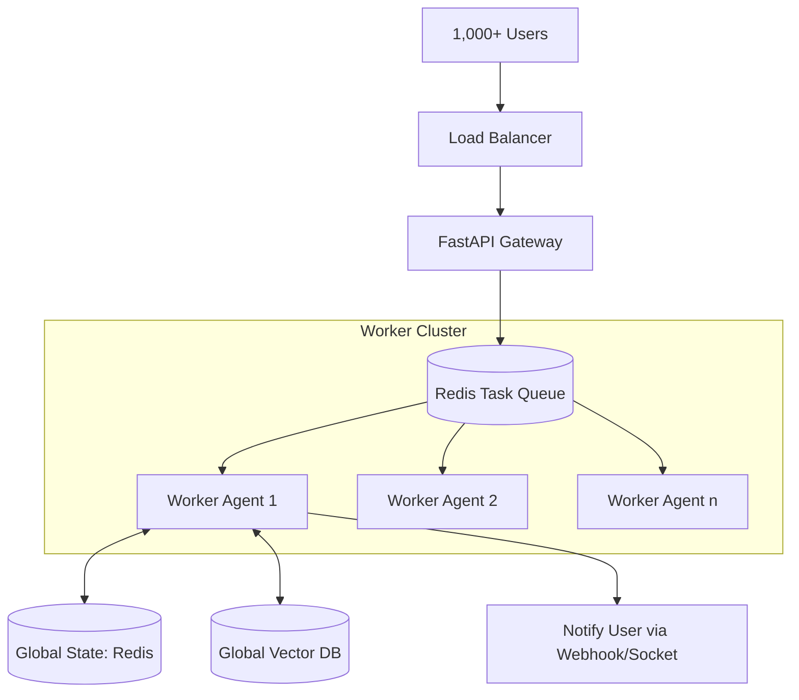

# 📈 Scaling Agentic Systems: From 1 to 1 Million
> **Level:** Extreme Advanced | **Language:** Hinglish | **Goal:** Master the architectural patterns required to scale complex agentic workflows to support enterprise-level traffic and performance.

---

## 🧭 1. Beginner-Friendly Hinglish Explanation
Scaling ka matlab hai AI system ko **"Bada"** karna.

- **The Problem:** Ek agent laptop par chalana asaan hai. Par jab 1 lakh log ek saath agent se kaam karwayenge, toh:
  1. Server crash ho jayega.
  2. API ki limit khatam ho jayegi.
  3. Response bahut slow ho jayega.
- **The Solution:** Humein system ko "Divide" karna padta hai.
  - Alag-alag kaam alag-alag servers par.
  - "Cache" use karo taki bar-bar same sawal AI se na puchna pade.
  - "Queue" use karo taki requests line mein khadi rahein aur system load na le.

Scaling ka matlab hai bina quality giraye "Zyaada" kaam karna.

---

## 🧠 2. Deep Technical Explanation
Scaling agentic systems is fundamentally a **Distributed Systems** problem with an LLM bottleneck.

### 1. Architectural Scaling Patterns:
- **Asynchronous Processing:** Don't wait for the LLM. Put the task in a queue (Redis/RabbitMQ), run the agent in a worker process, and notify the user when done.
- **Micro-Agents:** Instead of one giant agent, break it into tiny, specialized agents that run on separate containers/functions.
- **Horizontal Scaling:** Deploying the agent logic across 100s of serverless functions (e.g., AWS Lambda).

### 2. The Memory Bottleneck:
Scaling state is the hardest part.
- **Distributed State:** Using a global database (Redis/Postgres) to store agent history instead of local memory.
- **Vector DB Sharding:** Splitting the "Long-term Memory" across multiple clusters to maintain search speed.

### 3. Rate Limit Management:
- **Load Balancing:** Rotating between 10 different API keys or 3 different providers (OpenAI, Anthropic, Local) to stay within limits.

---

## 🏗️ 3. Architecture Diagrams (Scaling the Swarm)


---

## 💻 4. Production-Ready Code Example (A Distributed Worker Pattern)
```python
# 2026 Standard: Using Celery/Redis for Scalable Agent Tasks

from celery import Celery

app = Celery('agent_swarm', broker='redis://localhost:6379/0')

@app.task
def process_agent_request(user_id, task_description):
    # 1. Fetch persistent state from Redis/Postgres
    state = db.get_user_state(user_id)
    
    # 2. Run Agent logic (Long-running)
    result = my_agent.run(task_description, state)
    
    # 3. Update State & Notify
    db.save_user_state(user_id, result.new_state)
    notify_user(user_id, "Task Completed!")

# Usage: process_agent_request.delay(user_123, "Analyze this report")
# Result: API returns instantly, agent runs in background.
```

---

## 🌍 5. Real-World Use Cases
- **Customer Support for a Global Bank:** Handling 50,000 chats simultaneously during a system outage.
- **Automated Code Review (GitHub wide):** Scanning every single commit to millions of repos for security flaws.
- **Global Weather Prediction:** 10,000 agents analyzing local weather station data and merging it into a global forecast.

---

## ❌ 6. Failure Cases
- **The "Thundering Herd" Problem:** 10,000 agents all waking up at 9 AM and trying to call the same database. **Fix: Use 'Jitter' and 'Exponential Backoff'.**
- **State Inconsistency:** Agent A updates the memory, but Agent B (running in parallel) doesn't see the change.
- **API Starvation:** One user's massive task consumes the entire company's API quota. **Fix: Implement 'Per-User Quotas'.**

---

## 🛠️ 7. Debugging Guide
| Symptom | Cause | Fix |
| :--- | :--- | :--- |
| **Responses are taking minutes** | Queue is too long | Add more **Worker Instances** or use cheaper, faster models (e.g. 8B) for simple steps. |
| **Memory usage is spiking** | State not being cleared | Implement **Context Truncation** and clear the Redis cache for finished sessions. |

---

## ⚖️ 8. Tradeoffs
- **Cost vs. Latency:** Using parallel agents is faster but uses much more API tokens at once.
- **Consistency vs. Speed:** Storing everything in a global DB is safe but adds $50-100ms$ of latency to every turn.

---

## 🛡️ 9. Security Concerns
- **Distributed Prompt Injection:** An attacker using 1000 accounts to "Train" your global memory with malicious data.
- **Secret Management:** Ensuring API keys are securely distributed to 100s of workers.

---

## 📈 10. Scaling Challenges
- **Cold Starts:** Serverless functions taking 2 seconds to "Wake up" before the agent can start thinking.
- **Cross-region Latency:** An agent in the US reading from a database in India.

---

## 💸 11. Cost Considerations
- **Tiered Model Usage:** Scaling by using $90\%$ small models and $10\%$ large models for the "Hardest" $10\%$ of tasks.

---

## 📝 12. Interview Questions
1. How do you handle "State" in a distributed multi-agent system?
2. What is a "Task Queue" and why is it essential for scaling?
3. How do you prevent one user from exhausting your API rate limits?

---

## ⚠️ 13. Common Mistakes
- **Sync Code in Production:** Trying to run agent loops in a standard HTTP request without a background worker.
- **No Persistence:** Storing history in a Python list (which disappears when the server restarts).

---

## ✅ 14. Best Practices
- **Idempotent Tools:** Ensure that if an agent calls a tool twice (due to a retry), it doesn't cause errors (e.g., `create_user` becomes `get_or_create_user`).
- **Health Checks:** Monitor not just the "Server," but the "Agent's Health" (e.g., is it halluncinating more than usual?).
- **Prompt Caching:** Use it religiously to save money and reduce latency at scale.

---

## 🚀 15. Latest 2026 Industry Patterns
- **Agentic Kubernetes (K8s):** Using K8s to automatically spin up new "Agent Pods" based on the length of the task queue.
- **Global Agent Routing:** Routing requests to the cheapest LLM region automatically (e.g., US-East vs. Europe-West).
- **Decentralized State (CRDTs):** Using advanced data structures to allow agents to update shared memory without needing a central lock.
