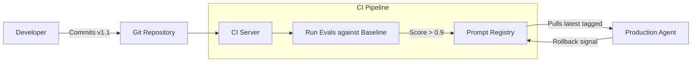

# 🌿 Version Control for Agents & Prompts: The Lineage of Thought
> **Level:** Advanced | **Language:** Hinglish | **Goal:** Master the techniques for managing changes in system prompts, model versions, and tool schemas without breaking production systems.

---

## 🧭 1. Beginner-Friendly Hinglish Explanation
Version Control ka matlab hai **"Purana wala kahan gaya?"**.

- **The Problem:** AI agents ko "Code" se zyada "English" (Prompts) control karti hai. 
  - Aaj aapne prompt badla, agent "Smarter" ho gaya. 
  - Kal aapne phir badla, aur ab agent "Pagal" ho gaya. 
- **The Solution:** Humein har change ko "Version" karna padta hai.
  - Prompt v1 (Original).
  - Prompt v2 (Modified for speed).
  - Prompt v3 (Added security).
- **Why it matters:** Agar v3 fail ho jaye, toh aap turant "Rollback" karke v2 par ja sako.

Bina version control ke, aap ek "Risk" par kaam kar rahe ho jahan ek chota sa word (like "don't") poore system ko crash kar sakta hai.

---

## 🧠 2. Deep Technical Explanation
Version control for agents is complex because it involves three independent variables: **Code**, **Prompt**, and **Model Weights**.

### 1. The Triad of Versioning:
- **Model Versioning:** (e.g., `gpt-4o-2024-05-13` vs `gpt-4o-latest`). **MANDATORY: Always use pinned dates.**
- **Prompt Versioning:** Managing the `.txt` or `.yaml` files that contain the system instructions.
- **Tool Schema Versioning:** Ensuring that the agent is calling the version of the API that currently exists.

### 2. Prompt-as-Code:
Treating prompts like software.
- Use **Git** for prompt files.
- Use **DVC (Data Version Control)** for larger datasets used in few-shot prompting.

### 3. Semantic Versioning (SemVer) for Agents:
- **Major (1.0.0):** Change in core logic (e.g., switching from Sequential to Hierarchical).
- **Minor (0.1.0):** New tool added or system prompt updated.
- **Patch (0.0.1):** Small tweak to a word in the prompt.

---

## 🏗️ 3. Architecture Diagrams (The Deployment Pipeline)


---

## 💻 4. Production-Ready Code Example (Using a Prompt Registry)
```python
# 2026 Standard: Fetching versioned prompts from a registry

class PromptRegistry:
    def __init__(self, provider="Portkey"):
        self.provider = provider

    def get_prompt(self, agent_name, version="latest"):
        # Fetch from a dedicated prompt management UI (e.g. Pezzo, Portkey, LangSmith)
        return registry_api.fetch(agent_name, tag=version)

# Usage
system_msg = registry.get_prompt("CustomerSupport", version="v2.4-safe")
agent = Agent(system_prompt=system_msg)

# Insight: Never hardcode your prompts directly in the .py files!
```

---

## 🌍 5. Real-World Use Cases
- **Medical Diagnostics:** Every version of the AI must be archived for 10 years for legal auditing.
- **Gaming AI:** Releasing a "Season 2" agent that is smarter but maintaining the "Legacy" agent for older players.
- **Financial Compliance:** Rolling back an agent's prompt immediately if it starts suggesting high-risk trades after an update.

---

## ❌ 6. Failure Cases
- **The "Latest" Trap:** Using `model="gpt-4-latest"`. OpenAI updates the model, and suddenly your agent's tool calls start failing because the new model is "Too creative."
- **Ghost Prompts:** A developer changes a prompt in the production UI but doesn't commit it to Git. Nobody knows why the agent is acting differently.
- **Dependency Hell:** You update the "Search Tool" code but the "Agent Prompt" still thinks it uses the old parameters.

---

## 🛠️ 7. Debugging Guide
| Symptom | Cause | Fix |
| :--- | :--- | :--- |
| **Agent failed suddenly** | Model update (Vendor side) | **Pin** the model version to a specific date (e.g. `2024-08-01`). |
| **Old bugs are back** | Merge conflict in prompt file | Use a **Prompt CMS** (Content Management System) instead of raw text files for production prompts. |

---

## ⚖️ 8. Tradeoffs
- **Raw Text Files (Git) vs. Prompt CMS:** Git is free and dev-friendly; CMS (like LangSmith) has better UI and "Instant Rollbacks."
- **One Large Prompt vs. Modular Snippets:** Large is easier to version; Modular (templates) is more powerful but harder to track.

---

## 🛡️ 9. Security Concerns
- **Prompt Injection in History:** An old version of a prompt might have a vulnerability that a newer one fixed. If you roll back, you re-expose the system.
- **Access Control:** Who is allowed to "Publish" a new prompt to production?

---

## 📈 10. Scaling Challenges
- **Massive Prompt Libraries:** Managing $1000$ different prompt variants for $100$ different sub-agents. **Solution: Hierarchical Prompt Management.**

---

## 💸 11. Cost Considerations
- **Testing Costs:** Every time you version a prompt, you must run "Evals" which costs tokens. Use **Sampling** to reduce costs.

---

## 📝 12. Interview Questions
1. Why should you avoid using "gpt-4-latest" in production?
2. How do you version a "Multi-agent" system where agents depend on each other?
3. What is "Prompt-as-Code"?

---

## ⚠️ 13. Common Mistakes
- **Hardcoding Prompts:** Putting the system message in a string inside `main.py`.
- **No Change Logs:** Changing a prompt and not writing *why* it was changed.

---

## ✅ 14. Best Practices
- **Atomic Commits:** Change one instruction at a time and test.
- **Side-by-side Testing (Diffing):** Always compare the output of Version A and Version B before deploying.
- **Environment Variables:** Use `PROMPT_VERSION=v2` in your `.env` file to control which prompt is active.

---

## 🚀 15. Latest 2026 Industry Patterns
- **A/B/C Testing:** Running 3 versions of a prompt in parallel and automatically picking the one with the highest "Conversion" or "Success Rate".
- **Semantic Versioning for Reasoning:** New versions that signify "Better Logic" vs. "New Tools."
- **Prompt-to-FineTune Pipeline:** Once a prompt version reaches "Stability," it is automatically used to generate data for fine-tuning a small, cheaper model.
