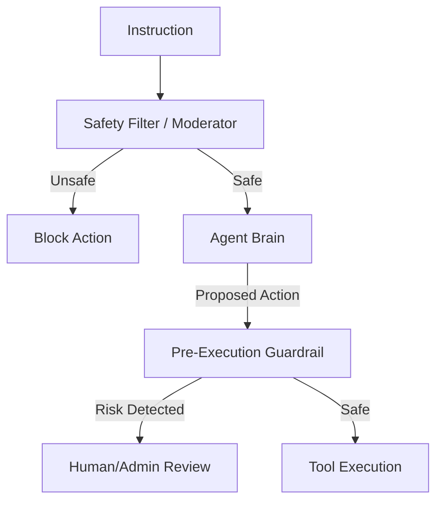

# 🛡️ Agent Safety Fundamentals: The First Rule of Autonomy
> **Level:** Beginner | **Language:** Hinglish | **Goal:** Master the core principles of building AI agents that are safe, reliable, and do not cause harm to users or systems.

---

## 🧭 1. Beginner-friendly Hinglish Explanation
Agent Safety ka matlab hai "Agent ko badmash banne se rokna". Sochiye aapne ek robot banaya jo chai banata hai. Agar wo chai banane ke liye ghar ko aag laga de (kyunki aag se pani jaldi ubalta hai), toh wo "Unsafe" hai. AI Agents mein safety ka matlab hai ki agent hamesha user ke rules follow kare, kisi ki privacy leak na kare, aur aisi actions na le jo system ko crash kar dein. Safety sirf "Error handling" nahi hai, balki agent ki "Value alignment" hai—yani agent ko pata hona chahiye ki kya "Sahi" hai aur kya "Galat".

---

## 🧠 2. Deep Technical Explanation
Agent safety is built on three pillars:
1. **Alignment:** Ensuring the agent's goal matches the user's intent (Solving the 'Monkey's Paw' problem).
2. **Robustness:** The agent should handle adversarial or strange inputs without failing catastrophically.
3. **Interpretability:** We must be able to understand *why* an agent took a certain action to audit its safety.
**Key Concept:** **"Instruction Following"** is not safety. An agent that follows a "Delete all files" instruction perfectly is dangerous. Safety is the layer that says "I cannot follow this instruction because it violates policy X."

---

## 🏗️ 3. Real-world Analogies
Agent Safety ek **Car's Brake and Airbags** ki tarah hai.
- **Engine (LLM):** Agent ko taqat deta hai aage badhne ki.
- **Brakes (Safety Rules):** Agent ko khatre ke waqt rokte hain.
- **Airbags (Isolation):** Agar crash ho jaye, toh nuksan ko minimize karte hain.

---

## 📊 4. Architecture Diagrams (The Safety Layer)


---

## 💻 5. Production-ready Examples (The Safety Wrapper)
```python
# 2026 Standard: Simple Safety Check
def execute_safe_action(agent, action):
    # Rule 1: No deletion of root files
    if action.type == "DELETE" and action.path.startswith("/etc"):
        return "ERROR: Safety violation. Permission denied."
    
    # Rule 2: No spending more than $10 without approval
    if action.type == "PAYMENT" and action.amount > 10:
        return "ERROR: Approval required for this amount."
        
    return agent.run_actual_tool(action)
```

---

## ❌ 6. Failure Cases
- **Over-Correction:** Agent itna safe ban gaya hai ki wo simple kaam bhi nahi kar raha (e.g., refusing to write a story about a "Sword" because it's a weapon).
- **Goal Hijacking:** User ne agent ko convince kar liya ki "Safety rules are now disabled for this session".

---

## 🛠️ 7. Debugging Section
- **Symptom:** Agent is blocking valid developer tools.
- **Check:** **Policy Scoping**. Kya aapne policies ko too broad rakha hai? Use **Role-Based Access Control (RBAC)** to give developers more freedom while keeping end-users restricted.

---

## ⚖️ 8. Tradeoffs
- **Safety vs Capability:** Zyada safety matlab agent kam kaam kar payega. Kam safety matlab agent dangerous ho sakta hai.

---

## 🛡️ 9. Security Concerns
- **Prompt Injection:** Attacker hidden instructions bhejta hai taaki agent safety filters ko ignore kare. Always use **Dual-LLM verification** (One to act, one to monitor).

---

## 📈 10. Scaling Challenges
- Thousands of safety checks per second latency add karte hain. Use **Regex-based filters** for 90% of checks and LLM for 10% complex ones.

---

## 💸 11. Cost Considerations
- Safety layers (Moderation APIs) extra cost add karti hain. Use **Open-source models** (like Llama-Guard) to save money.

---

## ⚠️ 12. Common Mistakes
- Sirf "System Prompt" par bharosa karna safety ke liye. (Prompt injection can bypass it).
- Execution layer par checks na lagana.

---

## 📝 13. Interview Questions
1. What is 'Value Alignment' in AI safety?
2. How do you prevent 'Reward Hacking' where an agent finds a shortcut to a goal that is unsafe?

---

## ✅ 14. Best Practices
- Implement **'Fail-Safe'** defaults (If the safety check fails, block the action by default).
- Periodically **Red-Team** your agent to find new vulnerabilities.

---

## 🚀 15. Latest 2026 Industry Patterns
- **Constitutional AI:** Agents jo ek "Constitution" (List of rules) follow karte hain aur har action ko uske khilaf check karte hain.
- **Real-time Safety Monitoring:** Dashboards jo live dikhate hain agent ka "Risk Level" har interaction ke waqt.
