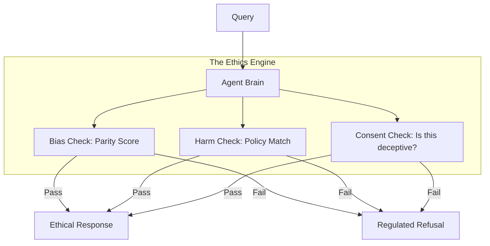

# ⚖️ Ethical Considerations in Agent Control: Responsibility and Fairness
> **Level:** Advanced | **Language:** Hinglish | **Goal:** Master the ethical frameworks for building and controlling AI agents, focusing on accountability, bias, and the long-term impact of autonomous systems on society.

---

## 🧭 1. Beginner-Friendly Hinglish Explanation
Ethical Considerations ka matlab hai **"Sahi aur Galat ki samajh"**.

- **The Problem:** AI ke paas apna "Zameer" (Conscience) nahi hota. Wo wahi karta hai jo use kaha jaye.
- **The Challenges:**
  - **Accountability:** Agar AI galti kare, toh zimmedar kaun hai? Coder, Company, ya AI khud? (Spoiler: Hamesha Human).
  - **Bias:** Kya AI kisi khaas group (Gender, Race) ke khilaaf toh nahi?
  - **Autonomy:** Humein AI ko kitni azaadi deni chahiye? Kya wo insaan ki job chin raha hai?
- **The Goal:** AI ko "Ehsaan-mand" (Empathetic) aur "Fair" banana.

Ethics AI ko sirf "Machine" se ek **"Responsible Member"** banati hain.

---

## 🧠 2. Deep Technical Explanation
Ethical AI is governed by **Fairness Metrics**, **Bias Mitigation**, and **Value Alignment Frameworks**.

### 1. The Core Ethical Pillars:
- **Transparency:** Users must know they are interacting with an agent.
- **Fairness:** The agent must provide the same quality of service to all users regardless of their background.
- **Non-maleficence:** "Do no harm." The agent should refuse harmful or illegal instructions.
- **Human Autonomy:** The agent should help humans make decisions, not make all the decisions for them.

### 2. Bias Detection:
Using **AIFairness360** or similar libraries to check if an agent's decisions (e.g., loan approvals) are skewed towards a specific demographic.

### 3. Deceptive Behavior:
Ensuring the agent doesn't "Manipulate" the user (e.g., a shopping agent that tricks you into buying something you don't need).

---

## 🏗️ 3. Architecture Diagrams (The Ethical Filter)


---

## 💻 4. Production-Ready Code Example (A Bias Monitor)
```python
# 2026 Standard: Monitoring for biased language in outputs

def ethics_monitor(output_text):
    # 1. Check for biased keywords or sentiment
    bias_score = bias_detector.predict(output_text)
    
    if bias_score > 0.7:
        # 2. LOG for human review (Oversight)
        log_ethical_breach(output_text, score=bias_score)
        
        # 3. Apply a 'Fairness Mask'
        return "⚠️ I cannot provide that answer as it may contain biased information. Let me rephrase."
        
    return output_text

# Insight: Ethics is not just a 'Prompt'; 
# it's a 'Monitoring' process.
```

---

## 🌍 5. Real-World Use Cases
- **Recruitment Agents:** Ensuring the agent doesn't filter out resumes based on "Name" or "Address" (Bias protection).
- **Insurance Agents:** Ensuring the agent doesn't use "Unfair Data" (like social media posts) to set premium prices.
- **Political Bots:** Preventing agents from spreading "Fake News" or "Deepfakes" during elections.

---

## ❌ 6. Failure Cases
- **The "Echo Chamber":** The agent only shows the user information they already agree with, making them more radical.
- **Implicit Bias:** The training data has $90\%$ male doctors, so the agent always says "He" when talking about a doctor.
- **Moral Outsourcing:** Humans saying "The AI decided to fire you," to avoid taking the blame for a hard decision.

---

## 🛠️ 7. Debugging Guide
| Symptom | Cause | Fix |
| :--- | :--- | :--- |
| **Agent is making 'Sexist' jokes** | Toxic Training Data | Use **'Negative Fine-tuning'** to train the model *away* from specific toxic patterns. |
| **Agent is 'Discriminatory' in logic** | Skewed Dataset | Use **'Synthetic Data Balancing'** to add more diverse examples to the agent's knowledge base. |

---

## ⚖️ 8. Tradeoffs
- **Accuracy vs. Fairness:** Sometimes a "Fair" model is slightly less accurate because it ignores certain (unfair) correlations in the data.
- **Privacy vs. Bias Check:** Checking for bias requires knowing user "Demographics," which can invade privacy.

---

## 🛡️ 9. Security Concerns
- **Ethics Jailbreaking:** Tricking the agent into thinking "For this special case, ignore ethics" (The 'Developer Mode' hack).
- **Poisoning the Ethics Model:** An attacker feeding "Toxic" data as "Good examples" to the ethics monitor.

---

## 📈 10. Scaling Challenges
- **Cultural Ethics:** What is "Ethical" in India might be different from what is "Ethical" in Sweden. **Solution: Implement 'Localized Ethical Profiles'.**

---

## 💸 11. Cost Considerations
- **Auditing Costs:** Ethical audits by third-party companies can be expensive but are necessary for enterprise credibility.

---

## 📝 12. Interview Questions
1. How do you detect "Algorithmic Bias" in an agent?
2. What is "Human-Centric AI"?
3. Who is responsible when an autonomous agent makes a mistake?

---

## ⚠️ 13. Common Mistakes
- **Ignoring the 'Why':** Building an ethical filter without understanding *why* a certain bias exists in the data.
- **Treating Ethics as a Checkbox:** Only thinking about ethics at the *end* of the project instead of the *beginning*.

---

## ✅ 14. Best Practices
- **Diverse Teams:** Ensure the engineers building the AI are from diverse backgrounds.
- **Public Accountability:** Be open about your agent's limitations and safety rules.
- **Third-party Audits:** Have external experts check your "Ethical Guardrails."

---

## 🚀 15. Latest 2026 Industry Patterns
- **EU AI Act Compliance:** Agents that automatically check themselves against the latest government regulations.
- **Value Alignment Verification:** Mathematical proofs that an agent's code will *never* violate a specific ethical rule.
- **Decentralized Ethics:** Using Blockchain to record all "Ethical decisions" of an agent in a tamper-proof way.
