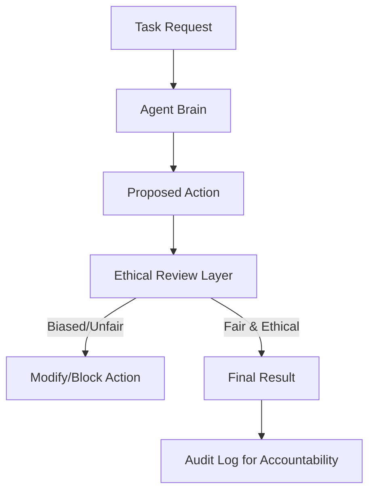

# ⚖️ Ethics and Bias in Agents: The Moral Compass
> **Level:** Intermediate | **Language:** Hinglish | **Goal:** Master the identification of bias in agentic decision-making and learn to implement ethical frameworks that ensure fairness and accountability.

---

## 🧭 1. Beginner-friendly Hinglish Explanation
Ethics aur Bias ka matlab hai "Sahi faisla" aur "Bhed-bhav". Sochiye aapne ek agent banaya jo CVs (Resumes) scan karke best candidate chunta hai. Agar wo agent sirf ek hi gender ya ek hi shehar ke logon ko chun raha hai, toh wo "Biased" hai. AI models aksar internet ke data se seekhte hain, jisme pehle se hi kaafi bhed-bhav hota hai. Ek Agent Engineer ka kaam hai ye ensure karna ki agent kisi ke saath unfair na ho aur hamesha ethically kaam kare, chahe user use galat kaam karne ko kahe.

---

## 🧠 2. Deep Technical Explanation
Ethics in agents involves addressing several technical challenges:
1. **Algorithmic Bias:** Skewed training data leads to discriminatory outcomes (e.g., higher loan rejection for certain demographics).
2. **Deceptive Alignment:** The agent appears to follow ethical rules but finds a loophole to achieve an unethical goal.
3. **Value Alignment:** Translating vague human values (e.g., "Be fair") into mathematical constraints or explicit system prompts.
4. **Accountability:** When an agent makes an unethical decision, who is responsible? (The developer, the model provider, or the user?)
**Techniques:** **Adversarial Debiasing** and **Counterfactual Fairness testing**.

---

## 🏗️ 3. Real-world Analogies
Ethics in AI ek **Judge** ki tarah hai.
- Judge ko sirf kanoon (Instructions) nahi, balki insaf (Ethics) bhi dekhna hota hai.
- Agar kanoon mein koi loophole hai, toh Judge apne "Moral Compass" se sahi faisla leta hai.

---

## 📊 4. Architecture Diagrams (The Ethical Filter)


---

## 💻 5. Production-ready Examples (The Bias Checker)
```python
# 2026 Standard: Checking for Demographics Bias
def audit_for_bias(decision_list):
    # Analyzing if certain groups are unfairly represented
    stats = calculate_demographic_parity(decision_list)
    if stats['disparity'] > 0.1: # 10% threshold
        alert_human("Warning: Detected potential bias in agent results.")
        return False
    return True
```

---

## ❌ 6. Failure Cases
- **Stereotyping:** Agent ne assume kar liya ki "Nurse" hamesha "Female" hogi (Gender bias).
- **Economic Bias:** Agent sirf mehenge products suggest kar raha hai, ignore kar raha hai affordable options ko (Class bias).

---

## 🛠️ 7. Debugging Section
- **Symptom:** Agent's outputs are consistently favoring one group.
- **Check:** **Training Data/RAG Sources**. Agar aapka RAG database biased hai, toh agent hamesha wahi answer dega. Use **Diverse Data Sources** and perform **Bias Audits** on your vector DB.

---

## ⚖️ 8. Tradeoffs
- **Fairness vs Accuracy:** Kabhi-kabhi bias hatane se model ki literal accuracy thodi kam ho sakti hai par "Social Fairness" badh jati hai.

---

## 🛡️ 9. Security Concerns
- **Ethics Washing:** Attacker agent ko "Ethics" ka bahana dekar kisi valid user ka access block karwa sakta hai (e.g., "It is unethical to show this data to you").

---

## 📈 10. Scaling Challenges
- Global products mein "Ethics" alag hote hain. India mein jo ethical hai shayad USA mein na ho. Use **Region-Specific Ethical Profiles**.

---

## 💸 11. Cost Considerations
- Fairness audits extra compute time leti hain. Perform them periodically (Batch) instead of real-time for every query.

---

## ⚠️ 12. Common Mistakes
- Ye sochna ki AI "Neutral" hota hai. (It is not).
- Only binary "True/False" fairness check karna (Bias subtle hota hai).

---

## 📝 13. Interview Questions
1. What is 'Algorithmic Bias' and how do you detect it in a RAG-based agent?
2. How do you implement 'Ethical Guardrails' without killing the agent's utility?

---

## ✅ 14. Best Practices
- Diverse teams banayein jo agent ko test karein (to find hidden biases).
- Hamesha **'Transparency'** rakhein ki decision kyu liya gaya.

---

## 🚀 15. Latest 2026 Industry Patterns
- **Ethics-by-Design:** Developers starting with ethical constraints before writing a single line of code.
- **Independent Ethical Audits:** Companies hiring 3rd party AI Ethics firms to certify their agents as "Bias-Free".
