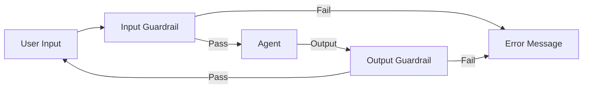

# 🚧 Guardrails and Moderation: The Safety Walls
> **Level:** Beginner | **Language:** Hinglish | **Goal:** Master the tools and frameworks that wrap around an agent to ensure every input and output stays within legal and ethical boundaries.

---

## 🧭 1. Beginner-friendly Hinglish Explanation
Guardrails ka matlab hai "Sadak ke kinare ki railing". Agar car (Agent) raste se bhatakne lage, toh railing use girne se bacha leti hai. AI Agents mein Guardrails wo "Checks" hain jo input aane se pehle aur output jaane se pehle hote hain. Agar agent ne galti se koi gaali likh di ya kisi ka phone number reveal kar diya, toh Guardrail use turant "Block" kar degi ya "Mask" (chupa) degi. Moderation wahi "Police" hai jo har message ko scan karti hai taaki environment safe rahe.

---

## 🧠 2. Deep Technical Explanation
Guardrails are a structural layer around the LLM:
1. **Input Guardrails:** Scan the user's prompt for toxicity, PII (Personally Identifiable Information), or malicious code before it reaches the model.
2. **Output Guardrails:** Scan the model's response for hallucinations, forbidden topics, or sensitive data leaks before it reaches the user.
3. **Structured Logic:** Using tools like **NeMo Guardrails** or **Guardrails AI** to define "Rail" files (logic flows) that the agent MUST follow.
4. **Moderation APIs:** External services (like OpenAI Moderation or Llama-Guard) that provide a safety score for text.

---

## 🏗️ 3. Real-world Analogies
Guardrails ek **Airport Security Check** ki tarah hain.
- Aap (Input) plane (Agent) mein baithne se pehle scan hote hain.
- Aapka saaman (Data) check hota hai.
- Agar kuch prohibited mila, toh aapko aage nahi jaane diya jata (Block).

---

## 📊 4. Architecture Diagrams (The Guardrail Chain)


---

## 💻 5. Production-ready Examples (Pydantic Guardrail)
```python
# 2026 Standard: Enforcing Output Structure
from pydantic import BaseModel, field_validator

class SafeResponse(BaseModel):
    answer: str
    confidence: float

    @field_validator('answer')
    def check_for_pii(cls, v):
        if "@" in v: # Simple example: blocking email leaks
            raise ValueError("PII detected in output!")
        return v

# The agent's output is forced through this model.
```

---

## ❌ 6. Failure Cases
- **Over-Blocking:** Guardrail itni sakht hai ki wo "Apple" word ko bhi block kar rahi hai kyunki wo use "Company Secret" samajh rahi hai.
- **Bypass via Context:** Agent ne PII direct nahi likhi par "Clues" de diye jisse user identity guess kar sake (e.g., "The CEO who lives in Seattle and founded Amazon").

---

## 🛠️ 7. Debugging Section
- **Symptom:** User sees "Action Blocked" for no apparent reason.
- **Check:** **Guardrail Logs**. Har block ka ek "Reason Code" hona chahiye. Check if the Regex or NLP model used in the guardrail is too aggressive.

---

## ⚖️ 8. Tradeoffs
- **LLM-based Guardrails:** Highly accurate but slow and expensive.
- **Rule-based Guardrails:** Fast and cheap but easy to bypass.

---

## 🛡️ 9. Security Concerns
- **Guardrail Circumvention:** Attacker agent ko aisi "Step-by-step" info nikalne ke liye bolta hai jo individual guardrails block nahi kar paati (Salami attack).

---

## 📈 10. Scaling Challenges
- High-volume systems mein har message ko 3-4 guardrails se guzaarna "Latency Bottleneck" ban sakta hai. Use **Parallel Guardrail Execution**.

---

## 💸 11. Cost Considerations
- Use **Regex-first** strategy. Pehle simple patterns check karein, agar wo pass ho jayein tabhi mehenga LLM-based check chalayein.

---

## ⚠️ 12. Common Mistakes
- Sirf Input check karna (Output is where hallucinations happen).
- Guardrails ko hamesha "Static" rakhna (They must evolve with new threats).

---

## 📝 13. Interview Questions
1. What is the difference between 'Syntactic' and 'Semantic' guardrails?
2. How do you implement a 'Soft Guardrail' that only warns but doesn't block?

---

## ✅ 14. Best Practices
- Every guardrail failure should trigger an **Admin Alert** for audit.
- Use **Masking** instead of blocking where possible (e.g., change "123-456-789" to "XXX-XXX-XXX").

---

## 🚀 15. Latest 2026 Industry Patterns
- **Context-Aware Guardrails:** Guardrails jo samajhti hain ki conversation kis bare mein hai aur sirf uske hisab se rules apply karti hain.
- **Self-Healing Output:** Guardrails jo galti detect karke agent ko turant "Auto-Correct" karne ka prompt bhejti hain bina user ko bataye.
