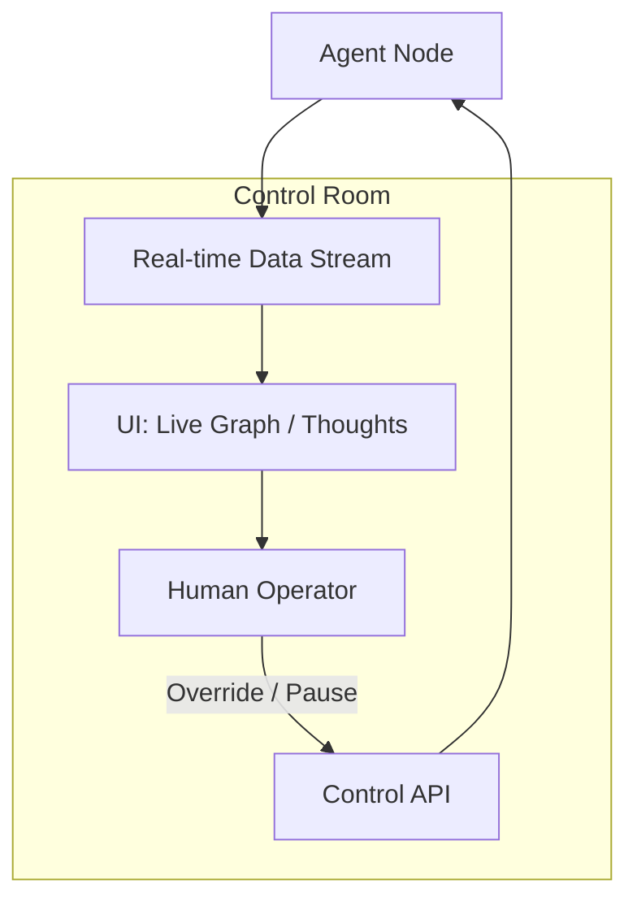

# 🕹️ Human Oversight & Control: The Remote Control
> **Level:** Advanced | **Language:** Hinglish | **Goal:** Master the tools and interfaces that allow humans to monitor, intervene, and "Take Over" autonomous agents in real-time, ensuring the human remains the ultimate authority.

---

## 🧭 1. Beginner-Friendly Hinglish Explanation
Human Oversight aur Control ka matlab hai **"AI ki Lagam (Leash) pakad kar rakhna"**.

- **The Concept:** Agent autonomously kaam kar raha hai, par aap use "Live" dekh rahe ho.
- **The Control Mechanisms:**
  - **The Kill Switch:** Ek button jise dabate hi AI ruk jaye (Emergency).
  - **Live Steering:** AI kuch kar raha hai, aur aap beech mein bolte ho: "Nahi, aise nahi, waise karo."
  - **The Dashboard:** Ek screen jahan aapko AI ke "Thoughts" aur "Actions" dikhte hain.
- **The Goal:** AI ko "Azaad" (Autonomous) toh chhodna hai, par itna nahi ki wo aapka control hi kho de.

Oversight se AI "Bharosemand" (Trustworthy) banta hai.

---

## 🧠 2. Deep Technical Explanation
Oversight mechanisms rely on **Real-time Observability** and **Manual Override Hooks**.

### 1. Types of Control:
- **Full Override:** Taking direct control of the agent's tools (e.g., typing in the terminal yourself).
- **Steering:** Modifying the agent's current "Goal" or "Plan" mid-execution.
- **Checkpointing:** Allowing the agent to run for 5 steps, then stopping for human review before the next 5.

### 2. Monitoring Stack:
- **Traces:** Detailed logs of every LLM call, tool call, and state change (LangSmith/Honeycomb).
- **Telemetry:** Heartbeats and resource usage (CPU/RAM) of the agent's worker node.
- **Sentiment Monitoring:** Detecting if the user is getting "Angry" and alerting a human manager.

---

## 🏗️ 3. Architecture Diagrams (The Oversight Console)


---

## 💻 4. Production-Ready Code Example (A 'Pause & Resume' Logic)
```python
# 2026 Standard: Implementing a state-controlled agent loop

class ControllableAgent:
    def __init__(self):
        self.status = "RUNNING" # Options: RUNNING, PAUSED, KILLED

    def run_step(self, task):
        # 1. Check for remote control signals before acting
        current_status = db.get_agent_status(self.id)
        
        if current_status == "KILLED":
            return "🛑 Termination signal received."
        if current_status == "PAUSED":
            print("⏸️ Agent is paused. Waiting for human resume signal...")
            return None # Stop and wait
            
        # 2. Proceed with task
        return self.brain.think(task)

# Insight: Always check for 'Control Signals' at the 
# start of every reasoning loop.
```

---

## 🌍 5. Real-World Use Cases
- **Autonomous Factories:** A manager watching 100 robots and "Steering" one if its sensor gets dirty.
- **AI Sales Teams:** A supervisor seeing a "High-value lead" in the chat and "Taking over" the conversation from the AI.
- **Drone Swarms:** A human operator monitoring 50 drones and clicking a "Kill Switch" if one drone enters a restricted area.

---

## ❌ 6. Failure Cases
- **Latency in Control:** The human clicks "Stop," but the agent has already executed 5 more actions because of a 2-second delay. **Fix: Use 'Priority Control Channels' (WebSockets).**
- **Decision Fatigue:** One human trying to oversee too many agents and missing a critical error.
- **User Disconnect:** The human's internet goes out while the agent is in a "Waiting for approval" state, causing a deadlock.

---

## 🛠️ 7. Debugging Guide
| Symptom | Cause | Fix |
| :--- | :--- | :--- |
| **Kill Switch didn't work** | Signal wasn't checked in the loop | Ensure the **Control Signal** check is at the *top* of the while loop, not tucked inside a tool call. |
| **Dashboard is 'Laggy'** | Too much data being sent | Use **'Downsampling'** or only send "Critical State Changes" instead of every token. |

---

## ⚖️ 8. Tradeoffs
- **Real-time Oversight (Expensive/Resource heavy) vs. Periodic Audits (Cheap/Risky).**
- **Strict Control (Safe/Slow) vs. Loose Control (Fast/Risky).**

---

## 🛡️ 9. Security Concerns
- **Control Hijacking:** An attacker gaining access to the "Oversight Dashboard" and killing all your agents or steering them to a malicious goal. **Solution: Use 'Biometric' or 'MFA' for the Control Panel.**

---

## 📈 10. Scaling Challenges
- **Management Ratios:** How many autonomous agents can one human reasonably oversee? (Usually 5-10 for complex tasks).

---

## 💸 11. Cost Considerations
- **Streaming Costs:** Keeping a WebSocket open for 1000 agents to stream their thoughts can be expensive in bandwidth.

---

## 📝 12. Interview Questions
1. How do you implement a "Kill Switch" for a distributed agent swarm?
2. What is the difference between "Direct Control" and "Steering"?
3. How do you handle "Manual Overrides" in a stateful graph (like LangGraph)?

---

## ⚠️ 13. Common Mistakes
- **No 'Read-only' mode:** Giving the human auditor the power to change things by accident while they are just trying to "Look."
- **Obscure UI:** Making the dashboard so technical that only a coder can understand what the agent is doing.

---

## ✅ 14. Best Practices
- **Clear Status Indicators:** Use Colors (Green/Yellow/Red) for agent health.
- **Action History:** Let the human "Rewind" and see the last 10 actions before a failure.
- **One-click Takeover:** The transition from "AI-driven" to "Human-driven" should be instant.

---

## 🚀 15. Latest 2026 Industry Patterns
- **Holographic Oversight:** Using AR/VR headsets to see the agent's "Graph" in 3D space.
- **Voice Override:** Saying "Hey Agent, stop what you're doing and listen" to instantly pause the system.
- **Collaborative Steering:** Multiple humans "Voting" on which direction the agent should take for high-stakes decisions.
