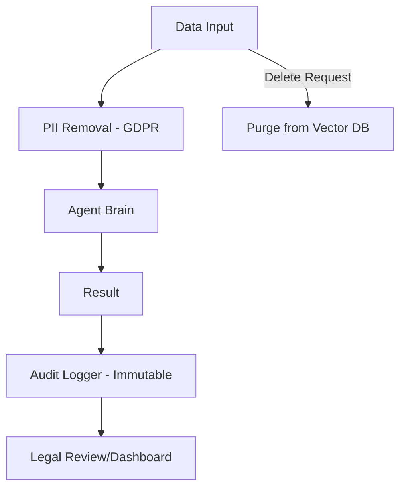

# ⚖️ Regulatory Compliance for Agents: The Legal Bound
> **Level:** Intermediate | **Language:** Hinglish | **Goal:** Master the legal frameworks (GDPR, EU AI Act, HIPAA) that govern the deployment of autonomous agents and learn how to ensure your agents are audit-ready.

---

## 🧭 1. Beginner-friendly Hinglish Explanation
Regulatory Compliance ka matlab hai "Kanoon ka palan karna". Sochiye aapne ek AI doctor banaya. Agar wo patient ka data leak kar de, toh aapko jail ho sakti hai (HIPAA violation). AI Agents ko aaj kal duniya bhar ki governments monitor kar rahi hain. Jaise sadak par chalne ke rules (Traffic rules) hote hain, waise hi AI ke liye **GDPR** (Data privacy) aur **EU AI Act** (Risk management) jaise rules hain. Ek professional engineer ko pata hona chahiye ki uska agent kanoon ke hisab se "Sahi" hai ya nahi.

---

## 🧠 2. Deep Technical Explanation
Compliance in agents is about **Data Sovereignty** and **Traceability**:
1. **GDPR (General Data Protection Regulation):** Ensuring the "Right to be Forgotten" (Deleting user data from the agent's memory/Vector DB).
2. **HIPAA (Health Insurance Portability and Accountability):** Standard for protecting sensitive patient data in medical agents.
3. **EU AI Act:** Categorizing agents by risk (Limited, High, Prohibited). High-risk agents (e.g., for hiring or credit scoring) must have strict human oversight.
4. **Audit Logs:** Maintaining a cryptographically signed log of every action an agent took and why.

---

## 🏗️ 3. Real-world Analogies
Regulatory Compliance ek **Passport and Visa** ki tarah hai.
- Aap kisi bhi desh (Industry/Market) mein bina sahi paperwork ke nahi ja sakte.
- Agar aap rules todte hain, toh aapko deport (System shutdown) kar diya jayega.

---

## 📊 4. Architecture Diagrams (The Compliant Pipeline)


---

## 💻 5. Production-ready Examples (GDPR Data Purge)
```python
# 2026 Standard: Implementing Right to be Forgotten
def purge_user_data(user_id):
    # 1. Delete from Vector Database (Memory)
    vector_db.delete(filter={"user_id": user_id})
    
    # 2. Delete from SQL Session Logs
    db.session.query(Logs).filter_by(user_id=user_id).delete()
    
    # 3. Notify Audit log that data was purged
    log_compliance_event(user_id, "DATA_PURGE_SUCCESSFUL")
```

---

## ❌ 6. Failure Cases
- **The Undeletable Memory:** Agent ne user ka data "Summarize" karke apne general prompt mein dal diya, ab wo delete karna impossible hai.
- **Cross-Border Leak:** USA ke user ka data Europe ke server par chala gaya bina permission ke.

---

## 🛠️ 7. Debugging Section
- **Symptom:** Legal team says the agent is "High Risk" and can't be deployed.
- **Check:** **Explainability Level**. Kya aapka agent ye bata sakta hai ki usne X decision kyu liya? Regulatory compliance requires **Explainable AI**. Ise theek karne ke liye `reasoning` logs enable karein.

---

## ⚖️ 8. Tradeoffs
- **Compliance vs Performance:** Data anonymization aur logging system ko slow kar sakte hain.

---

## 🛡️ 9. Security Concerns
- **Regulatory Ransomware:** Attacker agent ko aisi actions lene par majboor karta hai jo kanoon todti hain (e.g., leaking PII), taaki wo company ko sue (Legal case) kar sake.

---

## 📈 10. Scaling Challenges
- Different countries (India, USA, China) ke alag rules hain. Use **Geo-fencing** to run different compliance modules based on user location.

---

## 💸 11. Cost Considerations
- Legal audits aur compliance tools mehenge hote hain. Optimize by using **Automated Compliance Checkers**.

---

## ⚠️ 12. Common Mistakes
- Data "Anonymization" ko 100% safe samajhna (Users can often be re-identified from metadata).
- Logs ko plain text mein save karna.

---

## 📝 13. Interview Questions
1. What is the 'Right to be Forgotten' and how do you implement it in a Vector Database?
2. How does the 'EU AI Act' categorize different types of agent applications?

---

## ✅ 14. Best Practices
- Keep a **'Data Map'** that shows exactly kahan-kahan user data flow ho raha hai.
- Appoint a **'Data Protection Officer'** (DPO) for your agent project.

---

## 🚀 15. Latest 2026 Industry Patterns
- **Automated Compliance-as-a-Service:** APIs jo aapke agent ke logs scan karke batati hain ki wo legal hai ya nahi.
- **Privacy-Preserving Agents:** Agents jo **Differential Privacy** use karte hain taaki data analysis ho sake bina asli data reveal kiye.
