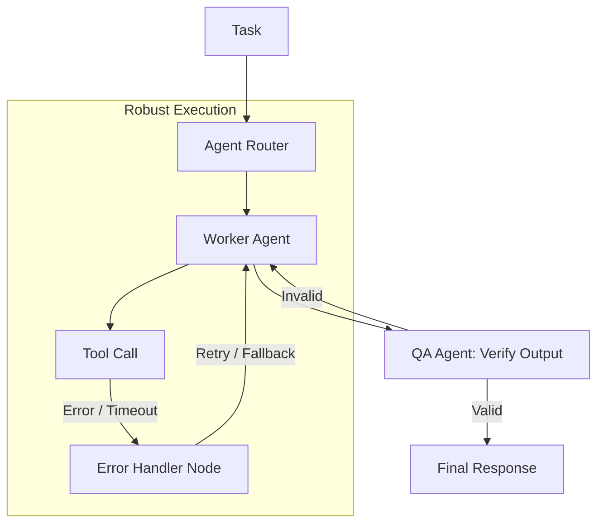

# 🏗️ Robustness & Reliability: The Bulletproof Agent
> **Level:** Advanced | **Language:** Hinglish | **Goal:** Master the engineering techniques required to build agents that don't crash, don't hallucinate under pressure, and handle "Edge Cases" gracefully in production environments.

---

## 🧭 1. Beginner-Friendly Hinglish Explanation
Robustness aur Reliability ka matlab hai **"AI ko Bharosemand (Reliable) banana"**.

- **The Problem:** AI "Moody" ho sakta hai. Kabhi ek prompt par sahi answer deta hai, kabhi wahi prompt par galti kar deta hai. 
- **The Concept:** 
  - **Robustness:** Agent "Mushkil" (Edge cases) halaat mein bhi na toote.
  - **Reliability:** Agent hamesha "Consistency" ke saath wahi quality ka result de.
- **The Analogy:** Ek "Naya Driver" sirf khali raste par gaadi chala sakta hai. Ek "Robust Driver" baarish, bheed, aur kharab raste mein bhi safe gaadi chalata hai.

Humein agent ko "Khali raste" se "Bheed wale raste" ke liye taiyar karna hai.

---

## 🧠 2. Deep Technical Explanation
Robustness in agentic systems is about **Error Handling**, **Input Sanitization**, and **Deterministic Logic Layers**.

### 1. Key Dimensions:
- **Input Robustness:** Handling "Invisible" characters, jailbreaks, or extremely long prompts.
- **Tool-use Robustness:** What if an API returns a 500 error? What if the JSON is malformed?
- **Logical Robustness:** Ensuring the agent doesn't get stuck in an infinite "Thinking" loop.

### 2. Failure-Mode Analysis:
- **Drift:** Model performance changing as the data changes.
- **Brittleness:** Small changes in the prompt causing huge changes in the output.
- **Cascading Failure:** One small agent error causing the whole "Swarm" to fail.

### 3. Reliability Patterns:
- **Redundancy:** Having two agents check each other's work.
- **Self-Healing:** The agent detecting its own crash and restarting from a "Checkpoint."

---

## 🏗️ 3. Architecture Diagrams (The Reliable Workflow)


---

## 💻 4. Production-Ready Code Example (An Async Retry Decorator)
```python
# 2026 Standard: Handling API flakiness with retries

import tenacity

@tenacity.retry(
    wait=tenacity.wait_exponential(multiplier=1, min=4, max=10),
    stop=tenacity.stop_after_attempt(3),
    retry=tenacity.retry_if_exception_type(Exception)
)
def reliable_agent_call(prompt):
    # This will automatically retry if the LLM API times out 
    # or returns a garbage response.
    response = model.generate(prompt)
    if not response:
        raise Exception("Empty response from LLM")
    return response

# Insight: 90% of 'Unreliable' agents are just 
# 'Unlucky' with API timeouts. Retries fix this.
```

---

## 🌍 5. Real-World Use Cases
- **Autonomous Banking:** Handling a "Network disconnect" mid-transaction without losing or doubling the money.
- **Medical Diagnostics:** Ensuring the AI doesn't give a diagnosis if its confidence score is below a certain "Safety" threshold.
- **E-commerce:** Handling "Out of stock" errors during an autonomous shopping task.

---

## ❌ 6. Failure Cases
- **The "Infinite Retry" Loop:** The agent keeps retrying a task that is "Impossible" (e.g., trying to read a file that doesn't exist).
- **Silent Failures:** The agent fails but doesn't tell the system, so the user just sees a "Spinning Wheel" forever.
- **Hallucinated Success:** The agent says "Task complete" even though the API call actually failed.

---

## 🛠️ 7. Debugging Guide
| Symptom | Cause | Fix |
| :--- | :--- | :--- |
| **Agent works sometimes, fails others** | Non-deterministic prompt | Set **Temperature to 0.0** and use **'Few-shot Examples'** to anchor the behavior. |
| **Agent is slow and 'Thinky'** | Loop is too deep | Implement a **'Circuit Breaker'** that kills the task if it takes more than 60 seconds. |

---

## ⚖️ 8. Tradeoffs
- **Reliability vs. Speed:** Adding 3 "Verification steps" makes the agent $99\%$ reliable but $3x$ slower.
- **Flexibility vs. Robustness:** Hard-coding rules makes it robust but less "Smart" for new types of tasks.

---

## 🛡️ 9. Security Concerns
- **Denial of Service (DoS):** An attacker providing an input that causes the agent to enter a "Heavy loop," burning all your API credits.
- **State Corruption:** An error causing the agent's "Memory" to become corrupted with wrong facts.

---

## 📈 10. Scaling Challenges
- **Consistent Quality across 1M users:** How do you ensure the agent doesn't "Break" when 1000 users are asking different things at once? **Solution: Use 'Rate Limiting' and 'Isolated State Containers'.**

---

## 💸 11. Cost Considerations
- **Redundancy Cost:** Running two models (e.g., GPT-4 and Claude) to compare results is expensive. Use this only for "Critical" logic.

---

## 📝 12. Interview Questions
1. How do you handle "Non-determinism" in production agents?
2. What is a "Circuit Breaker" pattern in AI engineering?
3. How do you test an agent for "Edge Cases"?

---

## ⚠️ 13. Common Mistakes
- **No 'Timeout' on Tool Calls:** Letting the agent wait forever for a broken API.
- **Ignoring 'Warnings':** Not checking the `warning` logs of the LLM provider (e.g., context window nearing limit).

---

## ✅ 14. Best Practices
- **Use JSON Mode:** Always force structured output to prevent parsing errors.
- **Log Every Trace:** Use tools like **LangSmith** to see exactly where the reliability broke.
- **Unit Test your Tools:** Before giving a tool to an agent, ensure it works $100\%$ on its own.

---

## 🚀 15. Latest 2026 Industry Patterns
- **Self-Correction (Self-Healing):** Agents that "Write and Run" their own tests to verify their work.
- **Model Consensus:** Having 3 small models "Vote" on the best answer instead of relying on 1 big model.
- **Zero-Hallucination RAG:** Using **Knowledge Graphs** instead of simple vector search for $100\%$ factual reliability.
