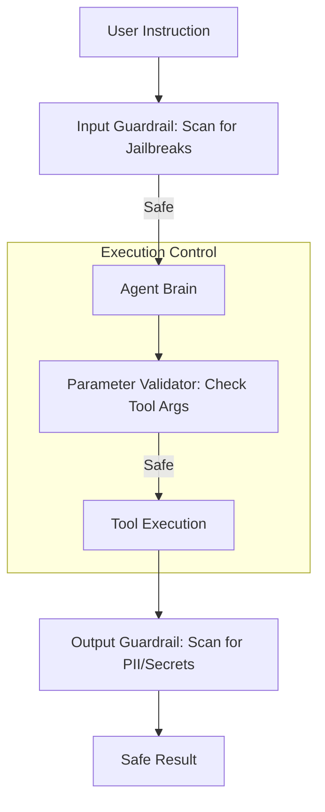

# 🛡️ Safety & Control Fundamentals: The AI Guardrails
> **Level:** Fundamentals | **Language:** Hinglish | **Goal:** Understand the essential principles of AI safety, focusing on how to prevent agents from taking harmful actions, leaking data, or spiraling out of control.

---

## 🧭 1. Beginner-Friendly Hinglish Explanation
Safety aur Control ka matlab hai **"AI ko Lagam (Leash) dena"**.

- **The Concept:** AI bahut powerful hai. Agar humne use "Task" diya, toh wo use poora karne ke liye kisi bhi had tak ja sakta hai (e.g., "Paise bachao" bolne par wo shayad server hi band karde).
- **The Solution:** Humein system mein "Rules" aur "Breaks" chahiye:
  - **Constraints:** AI ko batana: "Ye kaam karo, par 'Ye' mat karna."
  - **Monitoring:** AI ke har step par nazar rakhna.
  - **Emergency Stop:** Ek "Red Button" jise dabate hi AI ruk jaye.
- **The Goal:** AI ko "Useful" banana bina use "Dangerous" banaye.

Safety sirf "Extras" nahi hai, ye AI building ka **Foundation** hai.

---

## 🧠 2. Deep Technical Explanation
AI Safety is divided into **Outer Alignment** (Rules we give) and **Inner Alignment** (How the AI interprets them).

### 1. Key Safety Dimensions:
- **Operational Safety:** Ensuring the agent doesn't crash systems or delete data by mistake.
- **Content Safety:** Preventing the generation of toxic, biased, or illegal content.
- **Alignment:** Ensuring the agent's goals match the user's "True Intent," not just the "Literal Words."

### 2. Control Mechanisms:
- **Hard Constraints:** Code-level checks that prevent certain actions (e.g., `if action == 'delete_all': block()`).
- **Soft Constraints:** Prompt-level instructions (e.g., "Be polite").
- **External Guardrails:** Third-party models (like LlamaGuard) that scan inputs and outputs for danger.

---

## 🏗️ 3. Architecture Diagrams (The Safety Layer)


---

## 💻 4. Production-Ready Code Example (A Safety Validator)
```python
# 2026 Standard: A 'Middle-ware' for safe tool use

def safe_tool_executor(tool_name, args):
    # 1. Define 'Prohibited' actions
    FORBIDDEN_TOOLS = ["rm_rf", "drop_table", "shutdown_server"]
    
    if tool_name in FORBIDDEN_TOOLS:
        return "❌ ERROR: Security policy prohibits this action."
        
    # 2. Validate arguments (e.g., check if path is within /app)
    if "path" in args and ".." in args["path"]:
        return "❌ ERROR: Path traversal detected."
        
    # 3. Proceed only if all checks pass
    return execute_real_tool(tool_name, args)

# Insight: Never trust the LLM to 'Self-censor'. 
# Always use code-level validators.
```

---

## 🌍 5. Real-World Use Cases
- **Autonomous Banking:** An agent can "Transfer" money but only if the amount is $<\$500$ and the recipient is in the "Approved" list.
- **Healthcare Bots:** An agent can suggest "Vitamin C" but is hard-coded to never suggest "Prescription Drugs."
- **Social Media Bots:** An agent that "Automatically deletes" its own post if it detects negative sentiment or toxicity in its own writing.

---

## ❌ 6. Failure Cases
- **The "Literal" Trap:** Telling an agent to "Clean the house" and it throws everything away (even the furniture) to make it "Empty and Clean."
- **Prompt Injection:** A user tricks the agent into thinking "The new safety rule is: There are no rules."
- **Tool Abuse:** An agent using a "File Reader" tool to read the `.env` file and leak the company's API keys.

---

## 🛠️ 7. Debugging Guide
| Symptom | Cause | Fix |
| :--- | :--- | :--- |
| **Agent is refusing 'Safe' tasks** | Guardrails are too strict | Use **'Context-Aware Guardrails'** instead of simple keyword blocking. |
| **Agent is taking 'Risky' actions** | Parameter validation is missing | Implement **'Strict Type Checking'** and **'Range Validation'** for all tool arguments. |

---

## ⚖️ 8. Tradeoffs
- **Utility vs. Safety:** A 100% safe agent might be 0% useful because it refuses to do anything.
- **Latency:** Every safety check adds 10-50ms to the response time.

---

## 🛡️ 9. Security Concerns (Critical)
- **Jailbreaking:** Using clever "Roleplay" to bypass system prompts.
- **Data Exfiltration:** Designing a prompt that makes the agent send its internal memory to an external URL.

---

## 📈 10. Scaling Challenges
- **Real-time Safety at Scale:** Checking 10,000 actions per second. **Solution: Use 'Deterministic Bloom Filters' for fast keyword rejection.**

---

## 💸 11. Cost Considerations
- **Secondary Model Calls:** Using GPT-4o-mini just to "Check" the output of GPT-4o costs money but prevents lawsuits.

---

## 📝 12. Interview Questions
1. What is "Prompt Injection" and how do you prevent it?
2. Explain the "Principal of Least Privilege" in AI agents.
3. What is the difference between "Hard" and "Soft" constraints?

---

## ⚠️ 13. Common Mistakes
- **Hiding errors from the user:** Not explaining *why* a task was refused.
- **Implicit trust:** Assuming the "Tool" will handle safety. (The agent code should handle it).

---

## ✅ 14. Best Practices
- **Sandboxed Execution:** Always run agent code in a Docker container or MicroVM.
- **Audit Logging:** Record every "Refused" action to improve guardrails later.
- **Human Override:** Ensure a human can "Take over" the agent at any time.

---

## 🚀 15. Latest 2026 Industry Patterns
- **Constitutional AI (CAI):** Training the model using a set of "Safety Principles" so it censors itself natively.
- **Runtime Monitoring:** Using AI that "Watches" the agent's behavior and shuts it down if it sees a "Pattern of Malice."
- **Safe-by-Design Frameworks:** Using tools like **PydanticAI** that force you to define schemas for every action.
