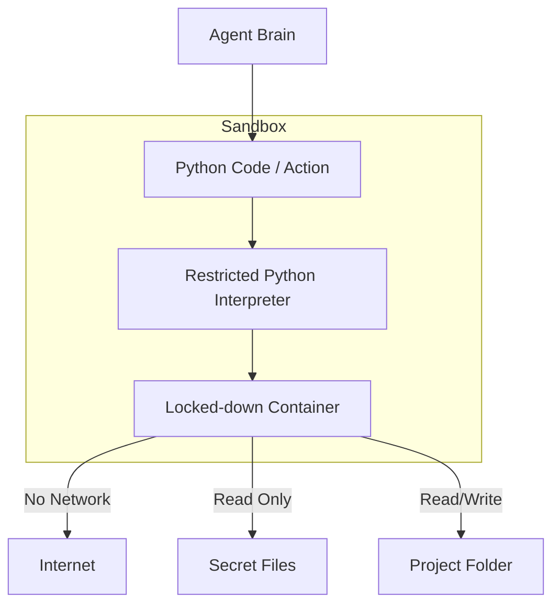

# 🏗️ Sandboxing and Isolation: Containing the Agent
> **Level:** Advanced | **Language:** Hinglish | **Goal:** Master the infrastructure patterns that isolate an agent's execution to prevent it from accessing unauthorized files, networks, or system resources.

---

## 🧭 1. Beginner-friendly Hinglish Explanation
Sandboxing ka matlab hai "Agent ko ek kaanch ke bakse mein band karna". Sochiye aapne ek bache ko paint karne ko diya. Agar aap use poore ghar mein paint karne denge, toh ghar ganda ho jayega. Isse behtar hai ki aap use ek "Playroom" (Sandbox) mein rakhein jahan wo jo chahe kare, bahar kuch ganda nahi hoga. AI Agents jab code chalate hain ya files edit karte hain, toh hum unhe ek "Isolated Environment" (jaise Docker ya VM) mein rakhte hain. Agar agent galti se `delete all` command chala de, toh sirf us bakse ka data jayega, aapka main system safe rahega.

---

## 🧠 2. Deep Technical Explanation
Sandboxing for agents involves multiple layers of isolation:
1. **Containerization (Docker/Podman):** Running the agent in a lightweight container with restricted CPU, RAM, and no root access.
2. **Virtual Machines (VMs):** Stronger isolation where the agent has its own OS kernel (e.g., Firecracker microVMs).
3. **Network Isolation:** Disabling internet access or using a whitelist (Allowing only `google.com`, blocking `internal-db.local`).
4. **Filesystem Mounts:** Giving the agent access only to a specific folder (e.g., `/workspace`) instead of the entire disk.
5. **Syscall Filtering:** Using `seccomp` to prevent the agent from making dangerous system calls (like `mount` or `ptrace`).

---

## 🏗️ 3. Real-world Analogies
Sandboxing ek **Test Tube in a Lab** ki tarah hai.
- Scientist (Agent) dangerous chemicals (Code) ke saath experiment karta hai.
- Agar test tube phat bhi jaye (System error), toh lab ki safety walls (Sandbox) blast ko contain kar leti hain.

---

## 📊 4. Architecture Diagrams (The Multi-Layer Sandbox)


---

## 💻 5. Production-ready Examples (The Docker Sandbox Logic)
```python
# 2026 Standard: Running Agent Code in a Sandbox
import docker

def run_in_sandbox(code):
    client = docker.from_env()
    container = client.containers.run(
        image="python:3.10-slim",
        command=f"python -c '{code}'",
        mem_limit="128m",       # Limit RAM
        cpu_period=100000,      # Limit CPU
        network_disabled=True,  # No internet
        read_only=True,         # Read-only root FS
        volumes={'/tmp/agent_work': {'bind': '/workspace', 'mode': 'rw'}},
        user="1000:1000"        # Non-root user
    )
    return container.logs()
```

---

## ❌ 6. Failure Cases
- **Sandbox Escape:** Agent ne container ki vulnerability use karke Host OS ka access le liya (e.g., Dirty Pipe attack).
- **Resource Exhaustion:** Agent ne infinite loop chala kar poore server ki CPU consume kar li (Bina limits ke).

---

## 🛠️ 7. Debugging Section
- **Symptom:** Agent says "Permission Denied" for every tool.
- **Check:** **Volume Mapping and User Permissions**. Docker container ke andar ka user (1000) shayad host ke folder ko write nahi kar paa raha. `chown` the workspace folder to the correct UID before starting.

---

## ⚖️ 8. Tradeoffs
- **Containers:** Fast and low-overhead, but weaker isolation.
- **MicroVMs:** Maximum isolation, but slow startup time.

---

## 🛡️ 9. Security Concerns
- **Side-Channel Attacks:** Agent CPU ke heat ya timing se detect kar sakta hai ki host par kya ho raha hai. High-security environments mein hamesha **Dedicated Hardware** use karein.

---

## 📈 10. Scaling Challenges
- Thousands of sandboxes start karna aur clean-up karna (Zombie containers) performance ko hit kar sakta hai. Use **Kubernetes** with short-lived pods.

---

## 💸 11. Cost Considerations
- VMs mehenge hote hain. Use **Wasm (WebAssembly)** runtimes for ultra-fast, cheap, and secure code isolation in the browser or on the edge.

---

## ⚠️ 12. Common Mistakes
- Container ko `--privileged` mode mein chalana (Safety zero).
- Internet access hamesha ON rakhna.

---

## 📝 13. Interview Questions
1. What is the difference between 'Container-level' and 'Kernel-level' isolation?
2. How do you prevent an agent from performing a 'Fork Bomb' inside a sandbox?

---

## ✅ 14. Best Practices
- Every sandbox should be **Ephemeral** (Deleted after the task).
- Limit the **Number of Processes** an agent can spawn.

---

## 🚀 15. Latest 2026 Industry Patterns
- **gVisor & Kata Containers:** Hybrids jo container ki speed aur VM ki safety dete hain.
- **Serverless Sandboxing:** Running every agent tool call as a separate AWS Lambda function or Vercel Edge Function for 100% isolation.
