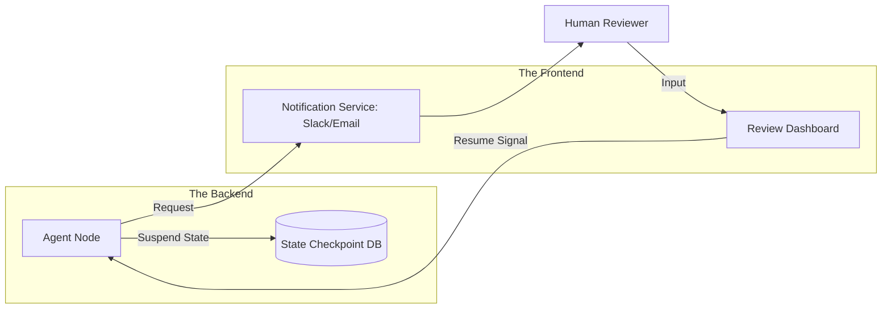

# 🏗️ Designing HITL Systems: Architecture for Collaboration
> **Level:** Advanced | **Language:** Hinglish | **Goal:** Master the design principles for building Human-in-the-Loop systems that are seamless, efficient, and prevent human "Review Fatigue."

---

## 🧭 1. Beginner-Friendly Hinglish Explanation
Designing HITL Systems ka matlab hai **"AI aur Insaan ke beech ka Pull (Bridge) banana"**.

- **The Problem:** Agar AI har baat par user ko "Disturb" karega, toh user pareshan ho jayega. Agar AI bilkul nahi puchega, toh galti hogi.
- **The Design Goal:** Humein ek aisa system banana hai jo:
  - Sirf **"Risky"** cheezon par approval maange.
  - Insaan ko **"Context"** de (e.g., "Maine ye option isliye chuna").
  - Insaan ko **"Simple Choice"** de (Approve/Edit/Reject).
- **The Result:** Ek "Smart" interface jahan AI aur insaan bina takraaye kaam karte hain.

Acche design se AI "Useful" lagta hai, "Annoying" nahi.

---

## 🧠 2. Deep Technical Explanation
Designing for HITL requires a focus on **Workflow State Management** and **Asynchronous Interaction**.

### 1. Design Patterns:
- **The Sandbox Review:** The agent executes in a temporary state; the human reviews the "Proposed State Change" before it is committed.
- **Progressive Disclosure:** Showing the high-level decision first, with a "Deep Dive" button to see the reasoning/logs.
- **Multi-level Approvals:** Level 1 (Low risk) -> Auto-approve; Level 2 (Mid risk) -> Single human; Level 3 (High risk) -> Two humans.

### 2. State Persistence:
Using **Checkpoints**. If a human takes 2 hours to approve, the agent's memory and environment state must be serialized and ready to resume instantly upon approval.

---

## 🏗️ 3. Architecture Diagrams (The Collaborative Interface)


---

## 💻 4. Production-Ready Code Example (A Schema for Approval Requests)
```python
# 2026 Standard: A structured Approval Request object

from pydantic import BaseModel
from typing import Any, Dict

class ApprovalRequest(BaseModel):
    task_id: str
    risk_score: float
    proposed_action: str
    args: Dict[str, Any]
    reasoning: str # The 'Chain of Thought'
    deadline_sec: int = 3600 # 1 hour to approve

def request_human_gate(request: ApprovalRequest):
    # 1. Save state to DB
    save_state(request.task_id)
    
    # 2. Trigger notification
    send_slack_message(f"🚨 Approval needed for {request.proposed_action}")
    
    # 3. Wait for Async signal (Webhook)
    return "PENDING_APPROVAL"

# Insight: Always include a 'Deadline'. If the human 
# doesn't respond, have a safe 'Default' action.
```

---

## 🌍 5. Real-World Use Cases
- **Cloud Infrastructure:** Agent wants to "Scale down" a server -> Asks DevOps engineer to confirm.
- **Legal Review:** Agent drafts a contract -> Highlights the "Liability Clause" for a lawyer to review.
- **E-commerce:** Agent suggests a "Refund" for an angry customer -> CS lead reviews the chat before clicking "Send."

---

## ❌ 6. Failure Cases
- **The "Context Window" Loss:** The agent is suspended for so long that when it resumes, its session tokens have expired.
- **Review Blindness:** The UI shows so much data that the human misses the one "Critical" error.
- **Inconsistent Thresholds:** One day the agent asks for approval for $\$5$, the next day it spends $\$500$ autonomously.

---

## 🛠️ 7. Debugging Guide
| Symptom | Cause | Fix |
| :--- | :--- | :--- |
| **Human is taking too long to approve** | Notification was missed | Add **'Multi-channel Alerts'** (Slack + SMS) or a **'Priority Queue'**. |
| **Agent 'Forgot' what it was doing** | State serialization error | Use a **'Robust Checkpoint Library'** (like LangGraph's checkpointers) to save the full object tree. |

---

## ⚖️ 8. Tradeoffs
- **Synchronous (Human waits for AI) vs. Asynchronous (AI waits for Human).**
- **In-chat Approval (Fast) vs. Dedicated Dashboard (Thorough).**

---

## 🛡️ 9. Security Concerns
- **Impersonation:** An attacker approving an agent's request by hacking the Slack/Email account used for notifications.
- **Data Leaks in UI:** Showing sensitive API logs in the "Review Dashboard" that a human reviewer shouldn't see.

---

## 📈 10. Scaling Challenges
- **Management Ratios:** How to design the UI so one person can approve 50 requests per hour without making mistakes? **Solution: Use 'Batch Approvals' and 'Diff-based Views'.**

---

## 💸 11. Cost Considerations
- **Wait-time Tokens:** Some LLM APIs charge for the time a "Session" is kept open. **Strategy: Always 'Freeze' the session and re-load it to save money.**

---

## 📝 12. Interview Questions
1. How do you design an HITL system that avoids "Review Fatigue"?
2. What are "Checkpoints" in an agentic workflow?
3. How do you handle "Session Timeouts" in a human-in-the-loop system?

---

## ⚠️ 13. Common Mistakes
- **No 'Reasoning' provided:** Asking for approval without telling the human *why* the action is necessary.
- **Complex UI:** Making the "Approval Button" hard to find.

---

## ✅ 14. Best Practices
- **Highlight the Diff:** Show exactly what is *changing* (e.g., "Deleting 5 lines, adding 10").
- **Time-to-Live (TTL):** Set a time limit for approvals.
- **Audit Trail:** Record exactly *who* approved the action and *when*.

---

## 🚀 15. Latest 2026 Industry Patterns
- **Predictive Approvals:** The system predicts which tasks you *would* approve based on your past behavior and only stops for "Surprises."
- **Voice-to-Approve:** For field engineers (e.g., in a factory), being able to say "Yes, proceed" into their headset.
- **Peer-Review Agents:** Using a "Strong Model" (GPT-4o) to review a "Small Model" (Llama-3), and only involving a human if the two models disagree.
