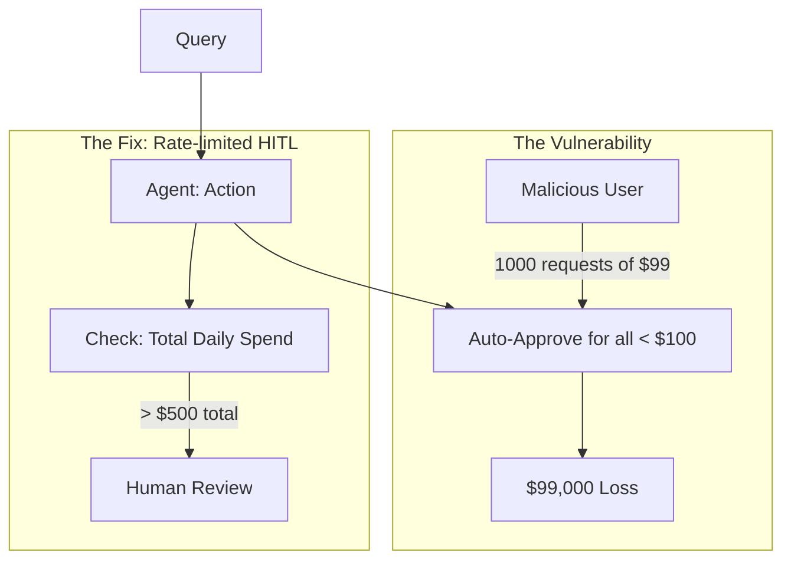

# 📚 HITL Case Studies: Lessons from the Frontlines
> **Level:** Advanced | **Language:** Hinglish | **Goal:** Analyze real-world successes and failures of Human-in-the-Loop systems to understand how to balance autonomy and human oversight in production.

---

## 🧭 1. Beginner-Friendly Hinglish Explanation
HITL Case Studies ka matlab hai **"Asli duniya ke kisse"**.

- **The Focus:** Hum dekhenge ki badi companies ne AI aur Insaan ko kaise joda.
- **The Lesson:** 
  - Kahan AI ne galti ki aur insaan ne use bachaya?
  - Kahan insaan ne galti ki aur AI ne use "Warn" kiya?
  - Kaise "Approval Systems" ne bade nuksan hone se roke?
- **The Goal:** Dusron ki galthiyon se seekhna taki hum apna system "Perfect" bana sakein.

Case studies humein "Theory" se "Practical" par le jati hain.

---

## 🧠 2. Deep Technical Explanation
We analyze cases based on **Intervention Rate**, **Error Reduction**, and **User Friction**.

### 1. Case Study: The Autonomous Customer Support (Zendesk Style)
- **The Problem:** AI was refunding too many customers without checking the "Return Policy."
- **The HITL Solution:** Implemented a "Refund Threshold." Any refund $>\$50$ required a human agent to click "Approve."
- **The Result:** $90\%$ of support was still autonomous, but $100\%$ of "High Value" refunds were verified.

### 2. Case Study: The Self-Driving Coding Agent (GitHub Style)
- **The Problem:** The agent was suggesting code that had "Hidden Security Vulnerabilities."
- **The HITL Solution:** Implemented a "Pre-check" node where the agent outputs its code to a sandbox and a "Human Reviewer" sees the security scan results *before* the code is merged.
- **The Result:** $0$ security breaches in 6 months of use.

---

## 🏗️ 3. Architecture Diagrams (Analysis of a Failed System)


---

## 💻 4. Production-Ready Code Example (A Safety Checklist for Reviews)
```python
# 2026 Standard: Forcing the human to 'Check' before approving

def generate_review_checklist(action_type):
    if action_type == "FINANCIAL":
        return [
            "Is the recipient correct?",
            "Is the amount within budget?",
            "Is there a tax invoice attached?"
        ]
    return ["Is the content polite and accurate?"]

# Insight: Don't just give an 'Approve' button. 
# Give a 'Checklist' to ensure the human actually looks.
```

---

## 🌍 5. Real-World Use Cases
- **Medical AI:** A system where the AI "Draws" around a tumor on an X-ray, and the doctor must "Confirm the borders" before the surgery robot is programmed.
- **Marketing Automation:** AI generates 100 Facebook ads; the manager selects the "Top 5" to launch (The 'Selection' HITL pattern).

---

## ❌ 6. Failure Cases (Real-world examples)
- **The 'Knight Capital' Disaster:** A fast-trading AI went out of control because there was no "Human Kill Switch" that worked in real-time. Result: $\$440M$ loss in 45 minutes.
- **The 'Social Media Bot' Scandal:** An agent started posting racist content because it learned from toxic users and had no "Sentiment Guardrail" for its output oversight.

---

## 🛠️ 7. Debugging Guide
| Symptom | Cause | Fix |
| :--- | :--- | :--- |
| **Humans are rejecting $80\%$ of AI work** | Model is misaligned | Retrain the agent using the **Rejected Examples** as "Negative Data." |
| **System is 'Bottlenecked' at the human** | Too many low-priority reviews | Implement **'Batch Approvals'** or raise the **'Confidence Threshold'** for auto-approval. |

---

## ⚖️ 8. Tradeoffs
- **High Friction (Safe) vs. Low Friction (Scalable).**
- **Expert Review (High Quality/Slow) vs. Crowd Review (Low Quality/Fast).**

---

## 🛡️ 9. Security Concerns
- **Insider Threat:** A human reviewer "Colluding" with the AI to bypass company rules for personal gain.
- **Notification Fatigue:** Attacker sending $1000$ "Approval Requests" so the tired human clicks "Approve" on a malicious one by mistake.

---

## 📈 10. Scaling Challenges
- **Scaling the 'Human' part:** How do you handle $1$ million users if $1\%$ of tasks need human help? **Solution: Build a 'Gig Economy' of trained reviewers (like Amazon Mechanical Turk for AI).**

---

## 💸 11. Cost Considerations
- **Human-in-the-loop ROI:** Calculate: `(Cost of AI + Cost of Human) < (Cost of 100% Human)`. If it's not cheaper, the system isn't viable.

---

## 📝 12. Interview Questions
1. Describe a time you saw an autonomous system fail because of a lack of oversight.
2. What is the "Knight Capital" case and what does it teach us about AI control?
3. How do you design an HITL system for "High Concurrency"?

---

## ⚠️ 13. Common Mistakes
- **Assuming the Human is always right:** Humans make mistakes too! Have the AI "Check" the human's corrections for logic errors.
- **No 'Audit Log' of approvals:** Not knowing *why* a human rejected a certain action.

---

## ✅ 14. Best Practices
- **Periodic 'Shadow' Audits:** Have a second human audit the first human's approvals.
- **Time-to-First-Human-Response (TTFHR):** Measure this metric to ensure your HITL system isn't too slow for users.
- **Balanced Feedback:** Tell the AI *why* its draft was rejected so it can "Learn" for the next draft.

---

## 🚀 15. Latest 2026 Industry Patterns
- **AI-Review-AI:** A "Large/Expensive" model (GPT-5) reviewing the work of a "Small/Cheap" model (Llama-4) and only calling a human if there is a "Dispute."
- **Gamified Oversight:** Rewarding human reviewers for finding "Critical Bugs" in the AI's logic.
- **Zero-Trust HITL:** Every action must be digitally signed by both the AI and a Human for it to be valid on the blockchain.
