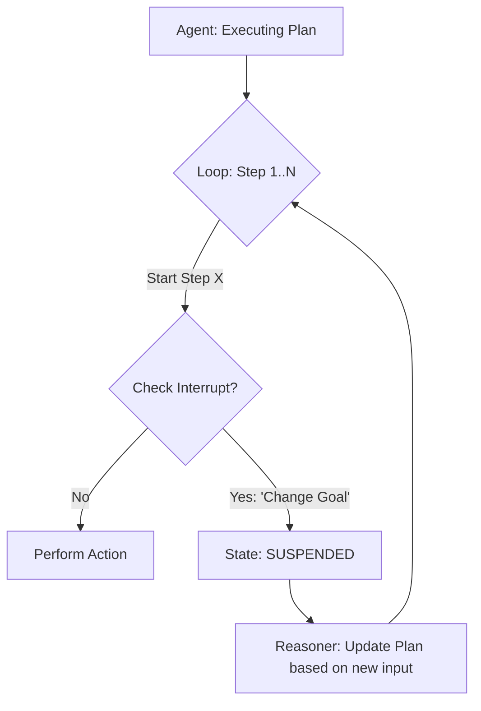

# 🛑 Handling Human Interruptions: Managing the Pivot
> **Level:** Advanced | **Language:** Hinglish | **Goal:** Master the techniques for managing "Interruptions" when a human decides to stop, modify, or redirect an agent mid-task without losing state or causing errors.

---

## 🧭 1. Beginner-Friendly Hinglish Explanation
Handling Human Interruptions ka matlab hai **"AI ko beech mein rokna"**.

- **The Problem:** Agar AI ek 10-step ka kaam kar raha hai aur aap Step 3 par realize karte ho ki "Nahi, ye galat hai," toh aap use kaise rokoge?
- **The Challenges:** 
  - AI ko turant "Stop" signal milna chahiye.
  - Usne ab tak jo kaam kiya hai, uska "Snapshot" (Save point) hona chahiye.
  - Wo aapki nayi instruction ko samajh kar apne "Plan" ko badal sake.
- **The Result:** AI "Ziddi" (Stubborn) nahi rehta, balki wo user ke hisaab se "Flexible" ho jata hai.

Interruption handling AI ko **"User-Centric"** banata hai.

---

## 🧠 2. Deep Technical Explanation
Handling interruptions requires **Asynchronous Event Processing** and **State Rollback/Pivot** logic.

### 1. The Interruption Signal:
- **WebSocket/Pub-Sub:** The agent loop must check for an "Interrupt" message at the beginning of every iteration.
- **Graceful Shutdown:** The agent finishes the current "Sub-task" (to avoid corrupting data) and then pauses.

### 2. Strategy: 'Pause, Pivot, Resume':
1. **Pause:** Stop the execution loop.
2. **Pivot:** Inject the human's new instruction into the **State Graph**.
3. **Re-plan:** The agent analyzes the "New State + New Instruction" and creates a modified plan.
4. **Resume:** Start from the new Plan's first step.

### 3. State Management:
Using **Thread-safe state stores**. If the human interrupts, the "Old Plan" is archived, and a "New Thread" is created.

---

## 🏗️ 3. Architecture Diagrams (The Interruption Flow)


---

## 💻 4. Production-Ready Code Example (An Interruptible Loop)
```python
# 2026 Standard: Checking for user signals in an async loop

async def autonomous_agent_loop(task_id):
    state = load_state(task_id)
    
    while not state.is_complete():
        # 1. CHECK FOR INTERRUPT
        user_signal = await signal_queue.get(timeout=0)
        if user_signal:
            if user_signal.type == "STOP":
                return "🛑 Stopped by user."
            if user_signal.type == "PIVOT":
                state.update_goal(user_signal.new_instruction)
                print("🔄 Goal updated mid-task. Replanning...")
                continue # Go back to start of loop to replan
        
        # 2. PERFORM NEXT STEP
        await agent.step(state)

# Insight: Always use 'Non-blocking' signal checks to 
# ensure the agent remains responsive.
```

---

## 🌍 5. Real-World Use Cases
- **Creative Writing:** User says "Actually, make the villain a hero" halfway through the agent writing a story.
- **Data Migration:** User realizes they selected the "Wrong Database" after the agent has moved 10 tables.
- **Research:** User sees the first 3 links and says "Forget about the price, focus only on the tech specs."

---

## ❌ 6. Failure Cases
- **The "Zombie" Agent:** The interrupt signal was sent, but the agent's code was stuck in a "Blocking" API call, so it didn't see the signal. **Fix: Use 'Aiohttp' with timeouts.**
- **Plan Corruption:** The agent tries to combine the "Old Goal" and "New Goal," resulting in a confusing mess.
- **Data Inconsistency:** The agent was "Writing to a file" when it was interrupted, leaving the file half-finished and corrupted. **Fix: Use 'Atomic Writes'.**

---

## 🛠️ 7. Debugging Guide
| Symptom | Cause | Fix |
| :--- | :--- | :--- |
| **Agent takes 30 seconds to 'Stop'** | Long-running sub-tasks | Break your tasks into **'Micro-tasks'** that take $< 2$ seconds each. |
| **Agent ignores the new instruction** | Context window overflow | When a pivot occurs, **'Summarize'** the old history and clearly prepend the **'New Goal'**. |

---

## ⚖️ 8. Tradeoffs
- **High Responsiveness (Check every 100ms) vs. Performance (Check every 10s).**
- **State Rollback (Safe but slow) vs. Carry Forward (Fast but messy).**

---

## 🛡️ 9. Security Concerns
- **Denial of Service (DoS):** An attacker sending 1000 "Pivot" signals per second to keep the agent in a "Replanning" loop forever. **Fix: Rate-limit human interruptions.**

---

## 📈 10. Scaling Challenges
- **Massive Concurrency:** Managing interrupt signals for 1 million agents. **Solution: Use 'Redis Pub/Sub' for efficient message routing.**

---

## 💸 11. Cost Considerations
- **Replanning Tokens:** Every time a human interrupts, the agent has to "Think" again. This uses tokens. Be transparent about this cost to the user.

---

## 📝 12. Interview Questions
1. How do you implement "Graceful Interruption" in an autonomous agent?
2. What is "State Pivot" logic?
3. How do you handle "Blocking API calls" during an interrupt?

---

## ⚠️ 13. Common Mistakes
- **Killing the Process:** Hard-stopping the agent's server (causes data loss). Always use "Signal Handling."
- **Ignoring the 'Why':** Not letting the agent know *why* it was interrupted.

---

## ✅ 14. Best Practices
- **Acknowledgement:** The agent should instantly say "I've received your stop signal, pausing now."
- **Context Preservation:** Keep the "Pre-interruption" work in a separate history tab so the user can go back if they change their mind.
- **Safe-States:** Only allow interruptions between "Tool calls," never *during* a tool call.

---

## 🚀 15. Latest 2026 Industry Patterns
- **Haptic Feedback Stop:** On mobile, "Shaking the phone" to instantly pause a running agent.
- **Sentiment-Driven Pause:** The agent detects the user is typing "Wait" or "No" in the chat and pauses itself before the message is even sent.
- **Collaborative Undo:** The agent offering to "Undo" the last 3 steps it took before it was interrupted.
