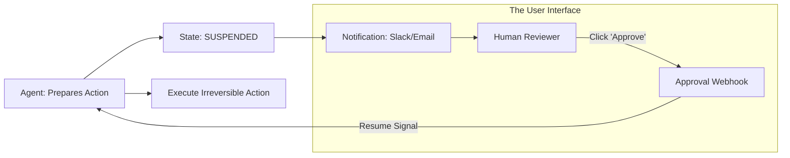

# ✅ Human Approval Workflows: Engineering the Checkpoint
> **Level:** Advanced | **Language:** Hinglish | **Goal:** Master the technical implementation of "Approval Gates"—where agents wait for explicit human permission before executing high-stakes or irreversible actions.

---

## 🧭 1. Beginner-Friendly Hinglish Explanation
Human Approval Workflows ka matlab hai **"AI ka Permission maangna"**.

- **The Problem:** Kuch kaam bahut "Risky" hote hain.
  - *Example:* "Database delete karna" ya "Social media par post karna."
- **The Solution:** Hum ek **"Approval Gate"** banate hain.
  - Agent draft banata hai (e.g., Post content).
  - Wo "Wait" mode mein chala jata hai.
  - Insaan ko notification milti hai (Approve/Edit).
  - Insaan ke "Yes" bolne ke baad hi agent tool run karta hai.
- **The Result:** Aap "Chain ki neend" (Safe sleep) so sakte hain kyunki AI bina puche koi bada panga nahi lega.

Approval AI aur Insaan ke beech ek **"Contract"** jaisa hai.

---

## 🧠 2. Deep Technical Explanation
Approval workflows require **Workflow State Persistence** and **Webhook-based Resumption**.

### 1. Types of Approvals:
- **Binary Approval:** Yes/No button.
- **Parametric Approval:** Human can change the "Amount" or "Date" before approving.
- **Conditional Approval:** "Proceed only if X condition is met by tomorrow."

### 2. The Implementation Logic (State Machine):
The agent moves from the state `EXECUTION` to `WAITING_FOR_APPROVAL`. The process ID is stored in a **Redis/Postgres** table. When the user clicks a button in the UI, it hits a **Webhook**, which updates the state to `APPROVED` and triggers the agent to continue.

### 3. Escalation Logic:
If the human doesn't approve in 24 hours, the task can be:
- **Cancelled.**
- **Escalated** to a senior manager.
- **Executed** with a default "Safe" setting.

---

## 🏗️ 3. Architecture Diagrams (The Approval Gate)


---

## 💻 4. Production-Ready Code Example (A Reusable Approval Gate)
```python
# 2026 Standard: Using a decorator for approval gates

def require_approval(threshold_usd):
    def decorator(func):
        def wrapper(agent, amount, *args, **kwargs):
            if amount > threshold_usd:
                # 1. Trigger Approval Request
                approval_id = gate_service.request(
                    source_agent=agent.id,
                    action=func.__name__,
                    amount=amount
                )
                return f"⏳ Task suspended. Approval ID: {approval_id}"
            
            # 2. Execute directly if under threshold
            return func(agent, amount, *args, **kwargs)
        return wrapper
    return decorator

@require_approval(threshold_usd=500)
def pay_vendor(agent, amount):
    return f"💸 Paid ${amount} to vendor."

# Insight: Thresholds allow you to automate 'Small' 
# tasks while keeping 'Big' ones under control.
```

---

## 🌍 5. Real-World Use Cases
- **HR Agents:** Drafted an "Offer Letter" -> Waits for HR Manager to click "Send to Candidate."
- **IT Support:** Wants to "Format a Laptop" remotely -> Waits for the employee to click "I am ready."
- **Marketing:** AI plans a $\$10,000$ ad spend -> Waits for the Marketing Director's "Green Signal."

---

## ❌ 6. Failure Cases
- **The "Lost Signal":** The user approved, but the Webhook failed, so the agent is stuck in "Waiting" forever. **Fix: Add a 'Manual Refresh' button.**
- **Context Gap:** The human sees "Approve Payment of $\$500$?" but doesn't know *who* the payment is for. **Fix: Attach a 'Summary PDF' or 'Trace Log' to every request.**
- **Approval Fatigue:** Too many notifications leading to "Lazy Approvals" without checking.

---

## 🛠️ 7. Debugging Guide
| Symptom | Cause | Fix |
| :--- | :--- | :--- |
| **Agent is skipping the gate** | Logic error in the threshold check | Ensure the **Decorator/Middleware** is correctly wrapping the "Tool Call" function. |
| **Notifications aren't reaching the user** | SMTP/Slack API error | Implement a **'Retry Queue'** for notifications with an 'Alert' for the dev team if it fails. |

---

## ⚖️ 8. Tradeoffs
- **Real-time Approval (Fast/Interruptive) vs. Batch Approval (Slow/Efficient).**
- **Mobile Approvals (Convenient) vs. Desktop Console (Detailed/Safe).**

---

## 🛡️ 9. Security Concerns
- **Approval Forgery:** An attacker sending a fake "Approved" signal to the agent's webhook. **Fix: Use 'JWT Tokens' or 'Digital Signatures' for all approval signals.**
- **Phishing:** A user getting a fake notification that looks like it's from the agent, tricking them into clicking a malicious link.

---

## 📈 10. Scaling Challenges
- **Approval Queues:** Managing 10,000 pending approvals. **Solution: Use a 'Searchable Dashboard' with filters for 'Priority' and 'Risk'.**

---

## 💸 11. Cost Considerations
- **Wait-time Costs:** Storing the "State" of 1 million suspended agents can use a lot of DB space. **Solution: Use 'Compression' for serialized state objects.**

---

## 📝 12. Interview Questions
1. How do you design an "Asynchronous Approval" system?
2. What is a "Webhook" and how is it used in agent orchestration?
3. How do you prevent "Approval Fatigue"?

---

## ⚠️ 13. Common Mistakes
- **No 'Edit' option:** Forcing the human to either "Reject" and start over, or "Approve" a slightly wrong draft. (Let them edit!).
- **Unclear Status:** Not showing the user *which* tasks are still waiting for their approval.

---

## ✅ 14. Best Practices
- **Multi-channel Notifications:** Send to Slack, and if no response in 1 hour, send an Email.
- **Reasoning First:** Always show the agent's "Chain of Thought" before the "Approve" button.
- **Safe Defaults:** For low-risk tasks, if no response in 48 hours, "Auto-Reject" to be safe.

---

## 🚀 15. Latest 2026 Industry Patterns
- **Predictive Pre-Approval:** The agent "Predicts" you will say yes and starts preparing the next steps, but doesn't "Commit" them until the click.
- **Biometric Approval:** Using "FaceID" or "Fingerprint" on a mobile app to authorize high-value AI actions.
- **Collective Intelligence:** Requiring 2 out of 3 managers to click "Approve" for a "Critical" company-wide change.
