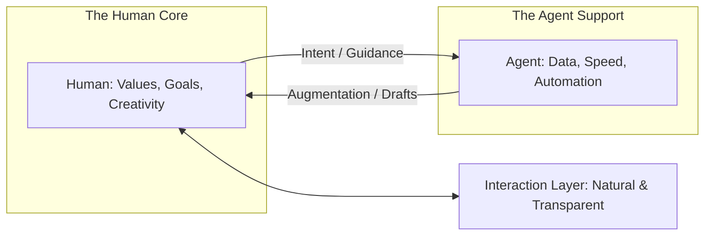

# 🧘 Human-Centric Agent Design: Designing for the User
> **Level:** Advanced | **Language:** Hinglish | **Goal:** Master the philosophy and design principles of "Human-Centric AI"—where agents are designed to empower, complement, and respect the human user rather than replace them.

---

## 🧭 1. Beginner-Friendly Hinglish Explanation
Human-Centric Agent Design ka matlab hai **"AI ko Insaan ke liye banana"**.

- **The Problem:** Aksar engineers AI ko "Cool" banate hain par bhool jate hain ki use ek "Insaan" use karega.
- **The Philosophy:** AI ko "Replacement" nahi, balki **"Empowerment"** banna chahiye.
  - AI aapka "Assistant" hai, "Master" nahi.
  - AI ko aapki "Privacy" aur "Tone" ka khayal hona chahiye.
  - AI ko "Samajhdar" hona chahiye (e.g., jab aap busy ho, wo disturbance na kare).
- **The Result:** Ek aisa AI jo "Natural" feel ho aur aapki life "Easy" banaye bina aapka control cheene.

Design mein hamesha **"Insaan"** ko center mein rakho.

---

## 🧠 2. Deep Technical Explanation
Human-centric design (HCD) for agents integrates **User Experience (UX)**, **Behavioral Psychology**, and **Cognitive Load Management**.

### 1. Key Design Pillars:
- **Agency & Control:** The user should always feel they are "The Boss." Use the **'Final Word'** pattern.
- **Transparency:** The agent must explain its actions in "Human Terms," not "Code Terms."
- **Empathy & Context:** The agent should detect user "Intent" and "Emotion" to adjust its tone.
- **Privacy by Design:** Local-first processing for sensitive data.

### 2. Cognitive Load Management:
An agent shouldn't output 5000 words of "Thought Process." It should provide a **'Mental Model'** summary that the human can quickly scan.

---

## 🏗️ 3. Architecture Diagrams (The Human-AI Synergy)


---

## 💻 4. Production-Ready Code Example (An Empathy-Aware Agent)
```python
# 2026 Standard: Adjusting behavior based on user 'Sentiment'

def process_user_query(query, history):
    # 1. Detect User Emotion/Urgency
    sentiment = sentiment_analyzer.run(query)
    
    if sentiment.urgency == "HIGH":
        # Strategy: Be brief, direct, and skip the 'Pleasantries'
        system_prompt = "You are a crisis assistant. Be extremely concise and fast."
    elif sentiment.emotion == "FRUSTRATED":
        # Strategy: Be empathetic and acknowledge the problem first
        system_prompt = "You are a helpful support agent. Acknowledge the user's frustration before solving the issue."
    else:
        system_prompt = "You are a standard helpful assistant."
        
    return agent.run(query, system_prompt=system_prompt)

# Insight: Matching the user's 'Vibe' builds $2x$ 
# more trust than a generic 'Static' response.
```

---

## 🌍 5. Real-World Use Cases
- **Educational Tools:** An agent that notices a student is "Struggling" and simplifies the explanation automatically.
- **Professional Tools:** An IDE agent that doesn't "Interrupt" while the coder is in a "Flow State" (typing fast).
- **Home Assistants:** An agent that speaks "Softer" during the night or when it detects a baby is sleeping.

---

## ❌ 6. Failure Cases
- **The "Over-bearing" Agent:** AI that keeps saying "You should do this" or "You're wrong," making the user feel small.
- **The "Mystery" Agent:** AI that does a lot of work but never shows the "Results" or "Steps," leaving the user anxious.
- **Privacy Invasion:** The agent "Listening" or "Watching" too much without the user's explicit consent.

---

## 🛠️ 7. Debugging Guide
| Symptom | Cause | Fix |
| :--- | :--- | :--- |
| **User feels 'Annoyed' by the agent** | Excessive interruptions | Implement a **'Focus Mode'** where the agent only speaks if there's a "Critical Error." |
| **User doesn't understand the AI** | High 'Technical Debt' in output | Tell the agent to **'Avoid Jargon'** and use the **'ELI5'** (Explain Like I'm 5) technique. |

---

## ⚖️ 8. Tradeoffs
- **Helpfulness vs. Disturbance:** A very helpful agent can also be a very annoying one.
- **Autonomy vs. Transparency:** More "Behind the scenes" work is faster but less transparent.

---

## 🛡️ 9. Security & Privacy (Human-Centric)
- **User Consent:** The agent asking "Can I read your emails to find the flight info?" instead of just doing it.
- **Data Erasure:** A simple button to say "Forget everything we talked about today."

---

## 📈 10. Scaling Challenges
- **Personalization at Scale:** How to make the agent "Feel" like it knows each of the 1 million users individually. **Solution: Use 'User Preference Embeddings'.**

---

## 💸 11. Cost Considerations
- **Sentiment Analysis Overhead:** Running a sentiment model on every turn costs money. **Strategy: Only run it if the user's message is $> 20$ words or contains 'Angry' keywords.**

---

## 📝 12. Interview Questions
1. What does "Human-Centric" mean in the context of AI?
2. How do you design an agent to minimize "Cognitive Load" for the user?
3. How do you handle "Privacy" in a multi-user agentic system?

---

## ⚠️ 13. Common Mistakes
- **Assuming 'One size fits all':** Thinking that every user wants the same level of detail or tone.
- **No 'Undo' functionality:** Not letting the human fix the agent's "Helpful" mistakes.

---

## ✅ 14. Best Practices
- **Human-in-the-loop by Default:** For high-stakes tasks, the default should be "Wait for Approval."
- **Adaptive Interfaces:** Change the UI based on what the user is doing (e.g., showing a 'Table' when talking about numbers).
- **Respect Boundaries:** Don't let the agent "Chat" if the user only wants "Results."

---

## 🚀 15. Latest 2026 Industry Patterns
- **Cognitive-Load Adaptive AI:** Agents that monitor your "Eye tracking" or "Typing speed" to decide how much info to show you.
- **Collaborative Co-evolution:** Systems that learn your "Shortcuts" and "Slang" and start using them to communicate faster with you.
- **Ethical-first Design:** Agents that refuse to do something "Selfish" for the user if it hurts others (The 'Good Citizen' Agent).
