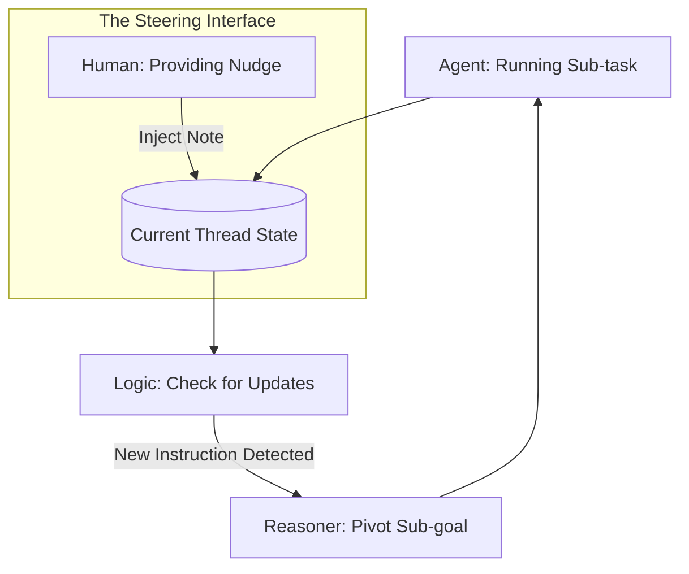

# 🏎️ Interactive Agent Steering: Nudging the Brain
> **Level:** Advanced | **Language:** Hinglish | **Goal:** Master the techniques for "Steering" an agent while it is in the middle of a task—providing real-time "Nudges" and corrections to its trajectory without stopping the entire process.

---

## 🧭 1. Beginner-Friendly Hinglish Explanation
Interactive Agent Steering ka matlab hai **"Chalte kaam mein rasta dikhana"**.

- **The Concept:** Agent ek raste par chal raha hai. Aap use bilkul "Stop" nahi karte, par thoda sa "Mod" (Steer) dete ho.
- **The Analogy:** Ye bilkul waisa hai jaise aap ek "Car" ko steer karte ho. Aap engine band nahi karte, bas handle thoda ghumate ho taki gaadi "Track" par rahe.
- **The Action:** 
  - AI ek research kar raha hai, aap beech mein kehte ho: "Prices par zyada dhyan do."
  - AI code likh raha hai, aap kehte ho: "Try catch block bhi add karo."
- **The Result:** AI aapke "Live Feedback" ke saath-saath evolve hota rehta hai.

Steering se AI aapke **"Thought Process"** ke saath sync ho jata hai.

---

## 🧠 2. Deep Technical Explanation
Steering involves **In-flight Prompt Injection** and **Dynamic Goal Weighting**.

### 1. Steering Mechanisms:
- **Latent Steering:** (Extreme Advanced) Modifying the model's internal activations (vectors) to lean towards a certain topic (e.g., "Be more helpful").
- **Instructional Steering:** Injecting a "System Note" into the current context window that overrides previous sub-goals.
- **Tool-subset Steering:** Temporarily disabling or enabling certain tools for the agent based on the user's live feedback.

### 2. Implementation:
Using a **Shared State** that the user can "Append" to while the agent is "Reading." The agent's reasoning loop checks for "User Nudges" at the start of every step.

---

## 🏗️ 3. Architecture Diagrams (The Steering Console)


---

## 💻 4. Production-Ready Code Example (The 'Nudge' Injector)
```python
# 2026 Standard: A steering-aware reasoning loop

async def steering_loop(task):
    agent_state = {"plan": [], "nudges": []}
    
    while not task_complete:
        # 1. Check for 'Live Nudges' from the user (via WebSocket)
        nudge = await websocket.get_nudge()
        if nudge:
            agent_state["nudges"].append(nudge)
            # 2. Force the agent to acknowledge the nudge
            system_update = f"USER UPDATE: {nudge}. Adjust your current step accordingly."
            await agent.re_evaluate(system_update)
            
        # 3. Proceed with the (possibly updated) step
        await agent.execute_next_step()

# Insight: Steering is better than 'Stop and Restart' 
# because it preserves the 'Momentum' of the task.
```

---

## 🌍 5. Real-World Use Cases
- **Creative Brainstorming:** User and agent building a world for a game; user nudges the agent: "Make the magic system based on water."
- **Debugging:** Agent searching for a bug; user nudges: "I think the error is in the Auth module."
- **Data Visualization:** Agent making a dashboard; user nudges: "Use a dark theme and bar charts instead of pies."

---

## ❌ 6. Failure Cases
- **Instruction Conflict:** The user nudges the agent to do X, but the original task says Y. The agent gets confused. **Fix: Use 'Last-Instruction-Priority' logic.**
- **Steering Overload:** The user nudges too much, making the agent "Stutter" and never finish any single step.
- **Context Dilution:** Too many nudges filling up the context window, making the agent forget the original starting point.

---

## 🛠️ 7. Debugging Guide
| Symptom | Cause | Fix |
| :--- | :--- | :--- |
| **Agent is ignoring the 'Nudge'** | Nudge was too weak | Use **'Force-Inject'** where the nudge is prepended to the *next* LLM call in all caps. |
| **Agent is 'Oscillating' between goals** | Conflicting nudges | Provide a **'Current Priorities' list** to the agent so it knows which nudge is the most important. |

---

## ⚖️ 8. Tradeoffs
- **Reactive Steering (Wait for Nudge) vs. Proactive Steering (Agent asks 'Am I on the right track?').**
- **Natural Language Steering vs. Parametric Steering (Sliders/Buttons).**

---

## 🛡️ 9. Security Concerns
- **Nudge Hijacking:** An attacker injecting a "Nudge" into an active session to steer the agent towards an unsafe action.
- **Gaslighting the AI:** Using nudges to "Convince" the AI that its safety filters are broken.

---

## 📈 10. Scaling Challenges
- **Real-time Steering Latency:** If the nudge takes 5 seconds to reach the agent, the agent might have already finished the wrong task. **Solution: Use 'Edge-based Websockets' for low-latency steering.**

---

## 💸 11. Cost Considerations
- **Replanning Tokens:** Steering often triggers a "Re-plan," which uses extra tokens. Inform the user that "Steering uses more energy."

---

## 📝 12. Interview Questions
1. What is "Interactive Steering" in agentic systems?
2. How do you implement "In-flight" instruction injection?
3. What is the difference between "Steering" and "Correcting"?

---

## ⚠️ 13. Common Mistakes
- **No Acknowledgment:** The agent steering correctly but not telling the user "Got it, I'm now focusing on X."
- **Over-sensitivity:** The agent changing its whole plan because of a "Minor" user comment.

---

## ✅ 14. Best Practices
- **Confirm the Nudge:** "I've received your note about the magic system, pivoting now."
- **Incremental Changes:** Don't throw away the whole plan; only update the affected steps.
- **Visual Feedback:** Show the user a "Path change" in the UI (e.g., a branching node in a graph).

---

## 🚀 15. Latest 2026 Industry Patterns
- **Slider-based Steering:** Using UI sliders to control things like "Creativity," "Detail," or "Speed" in real-time.
- **Multimodal Steering:** User "Drawing" on a map to steer a logistics agent's route.
- **Latent Activation Steering:** Directly modifying the model's 'Weights' for a single session to change its persona (The 'Control Vector' approach).
