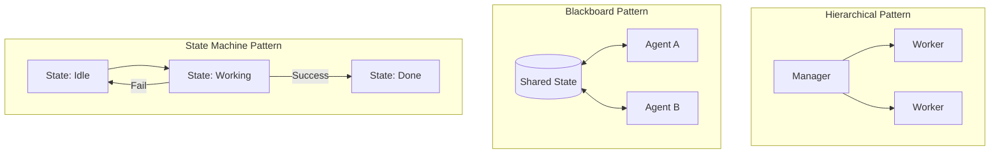

# 🏗️ Agentic Design Patterns: The Blueprints of Intelligence
> **Level:** Fundamentals | **Language:** Hinglish | **Goal:** Understand the reusable architectural templates used to solve common challenges in AI agent coordination and reasoning.

---

## 🧭 1. Beginner-Friendly Hinglish Explanation
Agentic Design Patterns ka matlab hai **"AI banane ke tried-and-tested tarike"**.

- **The Problem:** Har baar naya AI system zero se design karna mushkil hai. Kuch problems (jaise team management, memory, safety) har project mein aati hain.
- **The Solution:** Software engineering ki tarah, AI mein bhi "Patterns" hote hain:
  - **The Boss (Hierarchical):** Ek manager jo sabko kaam deta hai.
  - **The Shared Board (Blackboard):** Ek jagah jahan sab agents apni info likhte hain.
  - **The Step-by-Step (State Machine):** AI ko fix steps mein chalana (Pehle A, phir B).

Patterns use karne se aapka AI code "Spaghetti" (messy) nahi banta aur long-term mein stable rehta hai.

---

## 🧠 2. Deep Technical Explanation
Design patterns for agents provide **Structural Consistency** and **Behavioral Control** over non-deterministic LLMs.

### 1. Architectural Patterns:
- **Hierarchical:** Master-Slave relationship. Good for complex projects (e.g., building a whole app).
- **Joint-Venture:** Peer-to-peer collaboration without a supervisor.
- **Blackboard:** A common data structure where agents observe and react.

### 2. Behavioral Patterns:
- **Reflection:** Self-correcting loop.
- **Planning:** Decomposing goals before acting.
- **Tool-use:** Bridging the gap between tokens and APIs.

### 3. State Management Patterns:
- **Finite State Machine (FSM):** The agent moves through pre-defined "States" (e.g., `Searching`, `Summarizing`, `Finalizing`).

---

## 🏗️ 3. Architecture Diagrams (The Patterns Landscape)


---

## 💻 4. Production-Ready Code Example (A Pattern Choice Logic)
```python
# 2026 Standard: Deciding which pattern to use programmatically

def choose_pattern(task_complexity):
    if task_complexity == "SIMPLE_API_CALL":
        return "Chain-of-Thought (Linear)"
    elif task_complexity == "MULTI_STEP_PROJECT":
        return "Hierarchical (Manager + Workers)"
    elif task_complexity == "UNPREDICTABLE_SWARM":
        return "Blackboard (Shared State)"
    else:
        return "Standard ReAct Loop"

# Insight: Using the right pattern for the right task 
# saves $50\%$ on token costs and latency.
```

---

## 🌍 5. Real-World Use Cases
- **Hierarchical:** A "CTO Agent" managing a "Frontend Agent" and "Backend Agent" to build a web app.
- **Blackboard:** A group of "Trading Agents" watching a single "Market Data" feed and reacting independently.
- **State Machine:** A "Customer Onboarding" bot that *must* collect an Email, then a Phone Number, then a Credit Card (no skipping steps).

---

## ❌ 6. Failure Cases
- **Over-Engineering:** Using a complex "Hierarchical Swarm" for a simple task like "Summarize this PDF."
- **Pattern Mismatch:** Using a "Linear Chain" for a task that requires backtracking and replanning.
- **Static Rigidity:** A "State Machine" that is so strict it can't handle an unexpected user question (e.g., "Wait, what's your privacy policy?" in the middle of checkout).

---

## 🛠️ 7. Debugging Guide
| Symptom | Cause | Fix |
| :--- | :--- | :--- |
| **Logic is messy and hard to follow** | No pattern used (Spaghetti prompts) | Refactor the code into a **State Machine** or **Sequential Pipeline**. |
| **Agents are overwriting each other** | Resource Conflict | Implement a **Blackboard** with locking or a **Manager** to route tasks. |

---

## ⚖️ 8. Tradeoffs
- **Control (State Machine) vs. Creativity (Autonomous Loop):** More control = more reliable; More autonomy = more capable of handling unknowns.
- **Latency:** Complex patterns (like Hierarchical) involve many LLM calls, increasing response time.

---

## 🛡️ 9. Security Concerns
- **Orchestration Hijacking:** If the "Manager" in a hierarchical pattern is compromised, the whole team is compromised.
- **State Poisoning:** In a blackboard pattern, one malicious agent can ruin the data for everyone else.

---

## 📈 10. Scaling Challenges
- **Management Bottlenecks:** A single manager agent can't handle 100 workers. **Solution: Recursive Hierarchy (Managers managing Managers).**

---

## 💸 11. Cost Considerations
- **Pattern Token Density:** Some patterns are "Lighter" than others. Sequential chains are usually the cheapest.

---

## 📝 12. Interview Questions
1. What is the benefit of the Blackboard pattern?
2. When should you choose a Hierarchical design over a Sequential one?
3. What is a "State Machine" in the context of AI agents?

---

## ⚠️ 13. Common Mistakes
- **Assuming the LLM knows the pattern:** You must *code* the pattern into the system architecture; don't just "Describe it" in the prompt.
- **Fixed Workflows for everything:** Forgetting that agents are best when they can "Pivot" when things go wrong.

---

## ✅ 14. Best Practices
- **Use the 80/20 Rule:** $80\%$ of tasks can be solved with simple Sequential or ReAct loops. Only use complex patterns for the remaining $20\%$.
- **Modularize Agents:** Every agent in your pattern should be a separate, testable unit of code.
- **Visualize the Graph:** Always draw your agentic flow before you start coding it.

---

## 🚀 15. Latest 2026 Industry Patterns
- **The Router Pattern:** An agent that does nothing but "Route" the user query to the most efficient sub-agent.
- **The Auditor Pattern:** A silent observer agent that only speaks up when it detects a mistake or a security risk.
- **The Self-Evolving Graph:** A system that "Learns" the best pattern for a specific user and reorganizes its own architecture automatically.
