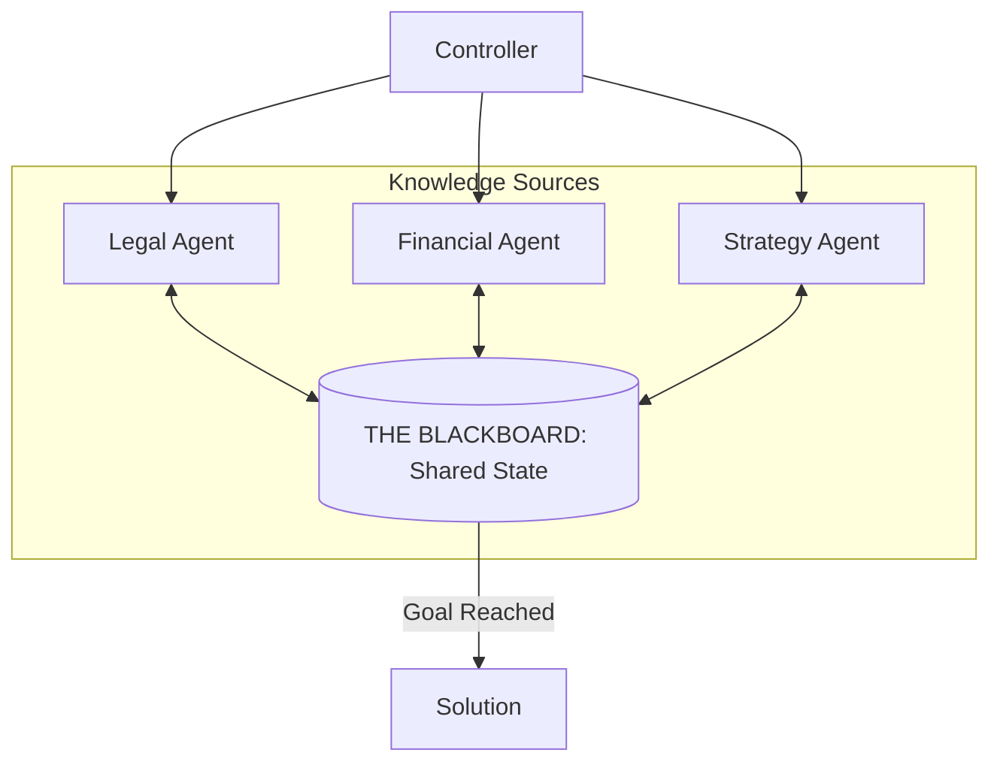

# 📋 Blackboard Pattern for Agents: Shared Intelligence
> **Level:** Advanced | **Language:** Hinglish | **Goal:** Master the "Shared State" architecture where multiple specialized agents collaborate by reading from and writing to a central data repository.

---

## 🧭 1. Beginner-Friendly Hinglish Explanation
Blackboard Pattern ka matlab hai **"Ek Common Black-Board"** jahan sab agents apni information share karte hain.

- **The Idea:** Socho ek hospital ka room hai jahan ek patient ki file table par rakhi hai.
  - **Doctor Agent** file mein "Symptoms" padhta hai aur apna "Diagnosis" likhta hai.
  - **Nurse Agent** "Diagnosis" padhti hai aur "Medicine" ka naam likhta hai.
  - **Pharmacist Agent** "Medicine" padhta hai aur "Bill" bana deta hai.
- **The Key:** Koi agent dusre agent ko direct "Command" nahi deta. Wo bas "Board" (Data) ko dekhte hain aur jo unhe samajh aata hai, wo add kar dete hain.

Ye pattern tab best hai jab aapko bahut saare "Experts" chahiye par koi fix sequence (Order) nahi hai.

---

## 🧠 2. Deep Technical Explanation
The Blackboard pattern is a **Decoupled Collaboration Architecture**.

### 1. The Three Main Components:
- **The Blackboard (Shared Memory):** A structured data store (JSON, Redis, SQL) that holds the current state of the problem.
- **The Knowledge Sources (Agents):** Independent, specialized agents that look at the Blackboard and contribute their expertise if they "See" something they can solve.
- **The Controller (Moderator):** A logic layer that decides which agent should "Write" next if multiple agents are ready (prevents conflicts).

### 2. Emergent Problem Solving:
Unlike a State Machine (fixed path), the Blackboard pattern allows for **Opportunistic Reasoning**. If Agent A finds a clue, Agent C might immediately jump in, skipping Agent B entirely.

### 3. Implementation in 2026:
We use **Global State Stores** (like LangGraph's Persistence layer) to act as the Blackboard.

---

## 🏗️ 3. Architecture Diagrams (The Shared Blackboard)


---

## 💻 4. Production-Ready Code Example (A Shared Data Store)
```python
# 2026 Standard: Conceptual Blackboard using a shared dictionary

class Blackboard:
    def __init__(self):
        self.data = {
            "symptoms": [],
            "diagnosis": None,
            "medications": [],
            "status": "IN_PROGRESS"
        }

def doctor_agent(bb):
    if bb.data["symptoms"] and not bb.data["diagnosis"]:
        print("👨‍⚕️ Doctor: Diagnosing based on symptoms...")
        bb.data["diagnosis"] = "Seasonal Flu"

def nurse_agent(bb):
    if bb.data["diagnosis"] == "Seasonal Flu":
        print("👩‍⚕️ Nurse: Adding Paracetamol to the board...")
        bb.data["medications"].append("Paracetamol")

# Execution Loop
my_bb = Blackboard()
my_bb.data["symptoms"].append("Fever")

# Agents poll the board and react
doctor_agent(my_bb)
nurse_agent(my_bb)

# Insight: Agents are decoupled. The Doctor doesn't 
# need to know the Nurse exists.
```

---

## 🌍 5. Real-World Use Cases
- **Medical Diagnosis Platforms:** Different specialists (Radiology, Blood Lab, General Physician) all adding data to a patient's case.
- **Scientific Discovery:** Agents searching for "Molecules," "Reactions," and "Toxicity" all writing to a shared research doc.
- **Cybersecurity Threat Hunting:** One agent finds a suspicious IP, another checks the "Geo-location," a third checks the "System Logs"—all contributing to one "Incident Report."

---

## ❌ 6. Failure Cases
- **The "Overwriting" Conflict:** Two agents try to update the same field in the blackboard at once. **Fix: Implement 'Row-level Locking'.**
- **The "Bystander" Effect:** All agents are waiting for someone else to write something first, so the system freezes.
- **Data Pollution:** A "Low-quality" agent writes garbage on the board, and other agents start making decisions based on that garbage.

---

## 🛠️ 7. Debugging Guide
| Symptom | Cause | Fix |
| :--- | :--- | :--- |
| **Nothing is happening** | No agent's 'Trigger Condition' met | Check if the **Blackboard Data** has the exact keys/values the agents are looking for. |
| **Agent is repeating its work** | No 'Mark as Processed' flag | Once an agent acts on a piece of data, it should set a flag like `is_analyzed: True`. |

---

## ⚖️ 8. Tradeoffs
- **Decoupling vs. Predictability:** Blackboard is very decoupled (Good) but hard to predict the exact path (Risky for simple tasks).
- **Complexity:** Managing a central state store that handles concurrent writes is technically challenging.

---

## 🛡️ 9. Security Concerns
- **State Integrity:** Malicious agent modifying the "Evidence" on the board to hide its actions.
- **Privilege Escalation:** An agent reading data from the board it's not authorized to see (e.g., the User's password). **Fix: Use 'Key-level Permissions'.**

---

## 📈 10. Scaling Challenges
- **Blackboard Bloat:** The JSON object gets too large, making LLM calls expensive and slow. **Solution: Summarize old 'Board Data' into a 'Background' key.**

---

## 💸 11. Cost Considerations
- **Polling Costs:** If agents are constantly "Checking" the board, you waste tokens. **Solution: Use 'Event-driven Triggers' (Webhooks).**

---

## 📝 12. Interview Questions
1. How does the Blackboard pattern differ from the Hierarchical pattern?
2. What is the role of the "Controller" in a Blackboard system?
3. How do you handle "Conflicts" when two agents want to update the board?

---

## ⚠️ 13. Common Mistakes
- **No Schema:** Letting agents write whatever they want to the board (leads to `KeyError`). **Use Pydantic.**
- **Infinite Reasoning:** Agents keep "Re-interpreting" the same data over and over.

---

## ✅ 14. Best Practices
- **Use a 'History' Log:** Don't just save the current state; save *who* changed *what* and *when*.
- **Set Goal Constraints:** Have a dedicated agent whose only job is to check if the "Goal" on the blackboard has been reached.
- **Strict Data Validation:** Use a middleware to validate any data being written to the board.

---

## 🚀 15. Latest 2026 Industry Patterns
- **Vector-Blackboards:** Using a Vector DB as the blackboard, where agents "Query" for related info instead of reading a flat JSON.
- **Conflict-free Replicated Data Types (CRDTs):** Allowing agents on different servers to update the same blackboard without errors.
- **Multi-modal Blackboards:** A blackboard where agents can share "Images," "Audio clips," and "Code snippets" simultaneously.
