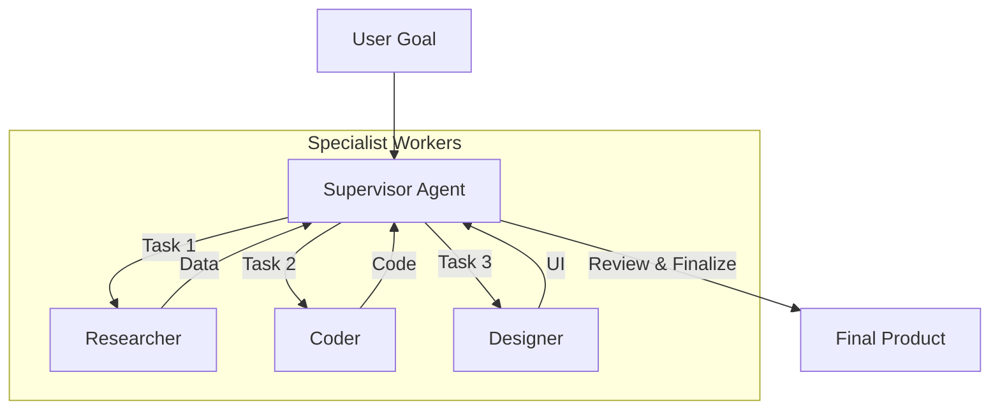

# 👑 Hierarchical Design Pattern: The Manager & The Workers
> **Level:** Advanced | **Language:** Hinglish | **Goal:** Master the pattern where a supervisor agent orchestrates sub-agents, delegates tasks, and ensures overall goal alignment.

---

## 🧭 1. Beginner-Friendly Hinglish Explanation
Hierarchical Pattern ka matlab hai **"Corporate Structure"** (CEO -> Manager -> Worker).

- **The Idea:** Ek bada goal (e.g., "Ek Full-stack App banao") ek akela AI nahi kar sakta—wo "Confuse" ho jayega.
- **The Solution:** Hum ek **Manager Agent** banate hain jo sirf "Dimaag" chalata hai.
  - Wo kaam ko 3 chote kaamo mein todta hai (Decomposition).
  - Wo Task A "Frontend Expert" ko deta hai.
  - Task B "Backend Expert" ko deta hai.
  - Unka kaam check karta hai (QA) aur agar galti ho toh unhe "Theek karne" ko bolta hai.

Manager khud code nahi likhta, wo bas **"Management"** karta hai. Isse efficiency $10x$ badh jati hai.

---

## 🧠 2. Deep Technical Explanation
The Hierarchical pattern is a **Top-down Delegation Model**.

### 1. Key Roles:
- **The Supervisor (Manager):** Holds the "Global State" and the "Ultimate Goal." Its tools are other agents.
- **The Worker (Specialist):** Holds "Local State" and specific tools (e.g., SQL, Python, Search).
- **The Critic/QA (Optional):** A separate node that verifies the worker's output before it returns to the manager.

### 2. State Management:
- **Parent State:** The high-level context and progress tracking.
- **Child State:** The specific inputs and outputs for a single sub-task.
- *Mapping:* The Manager "Maps" its goal to a Worker's input and "Reduces" the Worker's output back into its own state.

### 3. Delegation Logic:
The Manager must decide **Which** agent is best for a task and **What** information they need. This is a form of "Routing."

---

## 🏗️ 3. Architecture Diagrams (The Hierarchy)


---

## 💻 4. Production-Ready Code Example (Using LangGraph Supervisor)
```python
# 2026 Standard: A Supervisor routing to workers

def supervisor_node(state):
    prompt = f"Based on the current progress: {state['history']}, who should work next: [RESEARCHER, CODER, or FINISH]?"
    decision = llm.generate(prompt)
    return {"next_agent": decision}

# Workflow Logic
workflow = StateGraph(TeamState)
workflow.add_node("manager", supervisor_node)
workflow.add_node("researcher", researcher_worker)
workflow.add_node("coder", coder_worker)

workflow.add_conditional_edges("manager", lambda x: x["next_agent"])
workflow.add_edge("researcher", "manager") # Always return to boss
workflow.add_edge("coder", "manager")
```

---

## 🌍 5. Real-World Use Cases
- **Autonomous Software House:** A "Project Manager" agent leading a "Dev" agent and a "DevOps" agent.
- **Investment Research:** A "Portfolio Manager" agent tasking different agents to analyze "Tech," "Energy," and "Pharma" sectors.
- **Legal Compliance:** A "Lead Attorney" agent delegating "Case Research" and "Contract Drafting" to junior sub-agents.

---

## ❌ 6. Failure Cases
- **The Micromanaging Manager:** The supervisor gives too many tiny instructions, confusing the workers.
- **The 'Lazy' Manager:** The supervisor passes a task to a worker without enough context, leading to a "Hallucinated" result.
- **Infinite Delegation:** Manager sends task to A, A says "I can't do it, send to B," B says "Send to A."

---

## 🛠️ 7. Debugging Guide
| Symptom | Cause | Fix |
| :--- | :--- | :--- |
| **Workers are giving generic answers** | Manager's task description is vague | Improve the **Manager's Prompt** to include "Specific Requirements" and "Desired Format." |
| **Manager is ignoring worker results** | State not being updated correctly | Ensure the **Worker's Output** is appended to the Manager's history/state object. |

---

## ⚖️ 8. Tradeoffs
- **Complexity vs. Capability:** Hierarchical is complex to build but is the only way to solve "Truly Large" problems.
- **Token Costs:** Very high. Every delegation is an extra LLM call.

---

## 🛡️ 9. Security Concerns
- **Escalation of Privilege:** A "Worker" agent tricking the "Manager" into giving it access to an "Admin" tool that it shouldn't have.
- **Instruction Bleed:** The worker's bad output poisoning the manager's decision-making logic.

---

## 📈 10. Scaling Challenges
- **Management Bottleneck:** A single manager can efficiently handle max 3-5 workers. **Solution: Add 'Middle Managers'.**

---

## 💸 11. Cost Considerations
- **Small Model Workers:** Use **GPT-4o** for the Manager and **GPT-4o-mini** (or Llama-3-8B) for the workers to save $90\%$ on cost.

---

## 📝 12. Interview Questions
1. What is the main responsibility of a "Supervisor" in this pattern?
2. How do you handle a situation where a worker agent fails its task?
3. Why is "Shared State" important in a hierarchical team?

---

## ⚠️ 13. Common Mistakes
- **No 'Finish' condition:** The manager keeps assigning tasks even when the goal is met.
- **Direct Worker-to-Worker Talk:** In a strict hierarchy, workers should *only* talk to the manager to keep the state clean.

---

## ✅ 14. Best Practices
- **Define clear "Input/Output Contracts"** for each worker.
- **Let the Manager 'QA' the work:** Add a step where the manager reviews the worker's output before moving to the next task.
- **Human-in-the-loop:** Add a "Manager-to-Human" bridge for extremely high-stakes decisions.

---

## 🚀 15. Latest 2026 Industry Patterns
- **Dynamic Hierarchy:** The system spawns new specialized sub-agents only when the manager identifies a gap in expertise.
- **Cross-Framework Hierarchy:** A CrewAI manager leading a LangGraph worker and an AutoGen coder.
- **Supervisor-less Teams:** Using "Voting" instead of a "Manager" for simpler collaborative tasks (The 'Joint Venture' pattern).
