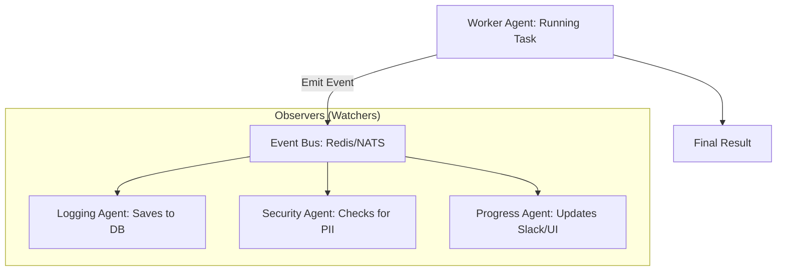

# 👁️ Observer Pattern for Agents: The Silent Watchers
> **Level:** Advanced | **Language:** Hinglish | **Goal:** Master the "Pub-Sub" architecture where "Watcher" agents monitor the actions of "Worker" agents to ensure safety, logging, or real-time auditing.

---

## 🧭 1. Beginner-Friendly Hinglish Explanation
Observer Pattern ka matlab hai **"AI ka Security Camera"**.

- **The Idea:** Jab ek "Worker Agent" kaam kar raha hota hai, toh ek dusra **"Observer Agent"** use sirf "Dekh" raha hota hai.
- **The Concept:** Observer agent Worker agent ke kaam mein interfere nahi karta, wo bas:
  - Galthiyan (Bugs) note karta hai.
  - Harmful actions (Security) check karta hai.
  - "Live Update" bhejta hai insaan ko.
- **The Analogy:** Ye bilkul ek "Exam Hall" jaisa hai jahan students (Workers) paper likh rahe hain aur ek Invigilator (Observer) unhe sirf watch kar raha hai.

Ye pattern AI ko "Safe" aur "Transparent" banata hai bina uska kaam roke.

---

## 🧠 2. Deep Technical Explanation
The Observer pattern implements a **Publish-Subscribe (Pub-Sub)** mechanism for agent events.

### 1. The Core Entities:
- **The Subject (Worker Agent):** The agent performing the main task. It "Publishes" events (e.g., `task_started`, `tool_called`, `error_encountered`).
- **The Observer (Auditor/Logger):** The agent that "Subscribes" to these events and reacts (e.g., logging to a DB, alerting a human).
- **The Event Bus:** The pipe that carries the information from the Subject to the Observers.

### 2. Non-blocking Oversight:
Unlike a "Manager" who must approve every step, an "Observer" runs **Asynchronously**. The worker doesn't wait for the observer's "OK" to proceed, which keeps the system fast.

### 3. Use in Guardrails:
Observers are used for **Post-action Guardrails**. If the observer sees the worker just leaked an API key in a log, it can immediately "Kill" the session or "Rotate" the key.

---

## 🏗️ 3. Architecture Diagrams (The Observer Flow)


---

## 💻 4. Production-Ready Code Example (An Event-Driven Watcher)
```python
# 2026 Standard: Emitting and Observing Agent Events

import asyncio

# 1. The Worker Agent
async def worker_agent(task, bus):
    await bus.publish("status", f"Started task: {task}")
    
    # Do work...
    await asyncio.sleep(1)
    await bus.publish("tool_call", "Google Search: 'AI Trends'")
    
    return "Done"

# 2. The Observer Agent
async def security_observer(bus):
    async for event in bus.subscribe("tool_call"):
        if "dangerous_site" in event:
            print("🚨 SECURITY ALERT: Worker tried to access a risky site!")
            # Trigger kill switch logic

# Insight: Observers allow you to add 'Safety' without 
# making your core agent prompt messy and long.
```

---

## 🌍 5. Real-World Use Cases
- **Enterprise Compliance:** An observer agent that watches all "Customer Support" chats and flags any mention of "Illegal Discounts."
- **Live Coding Dashboards:** An observer that updates a web UI in real-time as a "Coding Agent" writes different files.
- **Cost Management:** A "Budget Observer" that kills the worker agent's process if the session cost exceeds $\$5.00$.

---

## ❌ 6. Failure Cases
- **The "Lag" Failure:** The observer is too slow. By the time it flags a security leak, the data has already been sent to the user. **Fix: Use 'Synchronous Observers' for critical safety.**
- **Event Storm:** The worker emits 1000 events per second, crashing the observer agent.
- **Missing Events:** A bug in the event bus makes the observer "Miss" a crucial failure event.

---

## 🛠️ 7. Debugging Guide
| Symptom | Cause | Fix |
| :--- | :--- | :--- |
| **Observers aren't reacting** | Wrong Topic/Channel | Check if the **Subject** and **Observer** are both using the exact same event name (e.g., `tool_call` vs `tool-call`). |
| **High Latency** | Synchronous Observers | Move observers to a **Background Task** or a separate microservice so they don't block the main LLM loop. |

---

## ⚖️ 8. Tradeoffs
- **Async vs. Sync:** Async (Fast but risky) vs. Sync (Safe but slow).
- **Loose Coupling:** You can add 10 new observers without ever changing the worker agent's code.

---

## 🛡️ 9. Security Concerns
- **Observer Bypass:** A worker agent that "Hides" its actions from the event bus. **Fix: Implement 'System-level Tracing' that the agent can't disable.**
- **Event Spoofing:** A malicious agent sending "Fake" success events to the observer to hide a failure.

---

## 📈 10. Scaling Challenges
- **Distributed Events:** Synchronizing observers across multiple servers. **Solution: Use a managed event bus like AWS EventBridge or Redis Pub/Sub.**

---

## 💸 11. Cost Considerations
- **Observer Tokens:** If your observer is an LLM, it will consume tokens for every event it analyzes. **Strategy: Use 'Regex-based Observers' first, and only call the 'LLM Observer' for suspicious patterns.**

---

## 📝 12. Interview Questions
1. What is the benefit of the Observer pattern over a standard Hierarchical pattern?
2. What is an "Event Bus" in the context of AI agents?
3. How do you implement a "Kill Switch" using an observer?

---

## ⚠️ 13. Common Mistakes
- **Hardcoding Observers:** Putting the observer logic *inside* the worker's function (Breaks decoupling).
- **No Error Handling in Observers:** If the observer crashes, it shouldn't crash the worker agent.

---

## ✅ 14. Best Practices
- **Use 'Trace IDs':** Every event should include a unique ID so you can link it back to a specific user session.
- **Filter at Source:** Only emit events that are actually useful; don't spam the bus with "Agent is thinking..." every second.
- **Human-Observer:** Add a "Human" as an observer who gets a notification only when a high-priority event (like `security_breach`) occurs.

---

## 🚀 15. Latest 2026 Industry Patterns
- **Multi-modal Monitoring:** Observers that "Watch" the agent's screen (Visual) or "Listen" to its audio output to ensure compliance.
- **Self-Healing Observers:** An observer that "Fixes" the worker's state if it detects a loop.
- **Graph-based Observability:** Observers that visualize the agent's "Live Progress" as a moving node on a LangGraph diagram.
