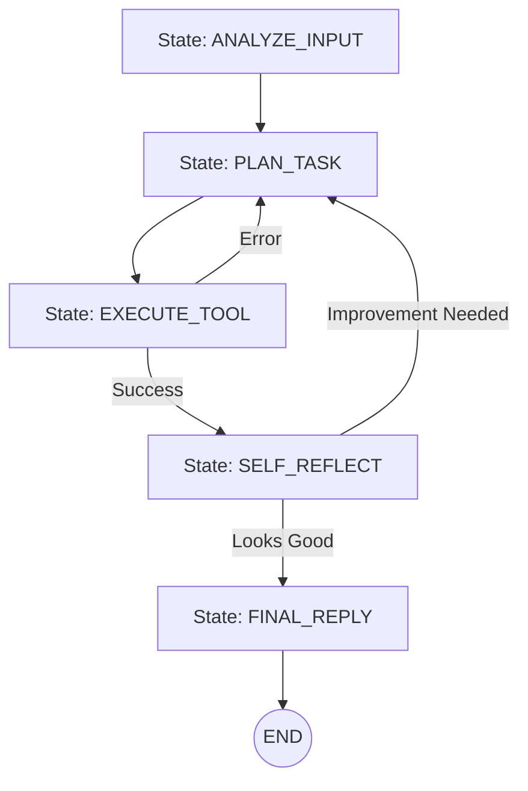

# 🚦 State Machine Pattern for Agents: Predictable Autonomy
> **Level:** Advanced | **Language:** Hinglish | **Goal:** Master the art of constraining agent behavior using predefined states and transitions to ensure $100\%$ reliability in mission-critical workflows.

---

## 🧭 1. Beginner-Friendly Hinglish Explanation
State Machine Pattern ka matlab hai AI ko **"Traffic Signals"** ki tarah chalana.

- **The Problem:** Ek fully autonomous agent kabhi-kabhi "Ajeeb" (Unexpected) cheezein kar sakta hai. Wo Step 1 ke baad Step 5 par jump kar sakta hai.
- **The Solution:** Humein AI ke liye "States" (Steps) aur "Rules" banane padte hain.
  - **State 1 (Idle):** Agent user ka intezaar kar raha hai.
  - **State 2 (Planning):** Agent plan bana raha hai. Iske baad wo sirf 'Executing' par ja sakta hai.
  - **State 3 (Executing):** Agent kaam kar raha hai. Agar success hua toh 'Finalizing' par jao, agar fail hua toh wapas 'Planning' par.
- **The Result:** Agent chahe kitna bhi smart ho, wo in "States" ke bahar nahi ja sakta.

Ye pattern AI ko "Safe" aur "Predictable" banata hai, bilkul ek bank ya medical app ki tarah.

---

## 🧠 2. Deep Technical Explanation
The State Machine pattern implements a **Finite State Machine (FSM)** where the LLM's role is to decide the **Transition** between states.

### 1. The Core Components:
- **States:** Distinct modes of behavior (e.g., `DATA_GATHERING`, `DRAFTING`, `QA_REVIEW`).
- **Transitions:** The logic that moves the agent from State A to State B.
- **Actions:** The work performed inside a specific state.
- **Events:** External triggers (User input, Tool error, Timeout).

### 2. Why Use FSM for Agents?
- **Deterministic Flow:** You know exactly what the agent *can* and *cannot* do at any moment.
- **Easy Debugging:** If the agent fails, you know it failed during the `QA_REVIEW` state.
- **Persistence:** You can "Save" the state and resume it later without re-running the whole prompt.

### 3. LangGraph as a State Machine:
LangGraph is essentially an **Infinite State Machine** that allows cycles, making it the perfect modern implementation of this pattern.

---

## 🏗️ 3. Architecture Diagrams (The Agent FSM)


---

## 💻 4. Production-Ready Code Example (A Strict State Transition)
```python
# 2026 Standard: Enforcing states in a Python agent

class AgentStates:
    PLANNING = "planning"
    ACTION = "action"
    REVIEW = "review"
    DONE = "done"

def run_fsm_agent(state_obj):
    current_state = state_obj.current
    
    if current_state == AgentStates.PLANNING:
        # Agent ONLY thinks about the plan
        plan = planner.generate(state_obj.input)
        return update_state(AgentStates.ACTION, plan)
        
    elif current_state == AgentStates.ACTION:
        # Agent ONLY executes the pre-defined plan
        result = executor.run(state_obj.plan)
        return update_state(AgentStates.REVIEW, result)

# Insight: The 'State' act as a constraint. The executor 
# agent cannot change the plan; it can only execute it.
```

---

## 🌍 5. Real-World Use Cases
- **E-commerce Checkout Bot:** (Cart -> Shipping -> Payment -> Confirm). No skipping to payment!
- **Onboarding Agents:** Collecting user data in a specific legal sequence for KYC (Know Your Customer).
- **Automated Customer Support:** (Greet -> Identify Issue -> Search Knowledgebase -> Solve -> Feedback).

---

## ❌ 6. Failure Cases
- **The Stuck State:** The agent gets into a state (e.g., `ERROR_RECOVERY`) and can't find the transition to get out. **Fix: Add a 'Timeout/Max-Retry' transition.**
- **State Explosion:** Creating 100 states for a simple task, making the system impossible to manage.
- **Rigidity Failure:** User asks a simple question ("What time is it?") but the agent is stuck in the `COLLECT_ADDRESS` state and refuses to answer anything else.

---

## 🛠️ 7. Debugging Guide
| Symptom | Cause | Fix |
| :--- | :--- | :--- |
| **Agent is repeating the same step** | Infinite transition loop | Check the **Transition Logic** to ensure it's not going A -> B -> A. |
| **Invalid State Error** | LLM outputted a state name that doesn't exist | Use **Enums (Pydantic)** to force the LLM to choose from a valid list of states. |

---

## ⚖️ 8. Tradeoffs
- **Reliability vs. Flexibility:** State machines are $100\%$ reliable but $0\%$ flexible to handle "Side conversations."
- **Complexity:** Writing the code for 10 states and 20 transitions is more work than a single "Do everything" prompt.

---

## 🛡️ 9. Security Concerns
- **State Hijacking:** An attacker providing input that "Tricks" the transition logic into skipping a `SECURITY_CHECK` state. **Fix: Use Deterministic (Hard-coded) transitions for security steps.**

---

## 📈 10. Scaling Challenges
- **Visualizing Large Graphs:** A graph with 50 nodes is hard to read. **Solution: Use 'Nested State Machines' (Sub-graphs).**

---

## 💸 11. Cost Considerations
- **Multiple LLM calls:** Every state transition is usually a new LLM call. **Strategy: Use a very small model (Llama-3-8B) for simple state transitions.**

---

## 📝 12. Interview Questions
1. What is a "Finite State Machine"?
2. Why are State Machines better for banking/legal agents than raw ReAct loops?
3. How do you handle "Errors" in a State Machine pattern?

---

## ⚠️ 13. Common Mistakes
- **No 'Global' State:** Each state node doesn't know what happened in the previous node. **Fix: Use a shared 'State Object'.**
- **LLM-only transitions:** Letting the LLM "Write" the name of the next state instead of picking from a list.

---

## ✅ 14. Best Practices
- **Explicit Transitions:** Clearly define the conditions for moving from one state to another (e.g., `if result contains 'error' -> go to PLAN`).
- **State-Specific Prompts:** Each state should have its own "Mini-System-Prompt" to keep the model focused.
- **Default/Fallback State:** Always have a "Human_Intervention" state for when the agent gets confused.

---

## 🚀 15. Latest 2026 Industry Patterns
- **Probabilistic State Machines:** Transitions happen based on "Confidence Scores" from the LLM.
- **Auto-generated State Machines:** An agent that watches a human do a task and "Writes" the state machine code to automate it.
- **Visual-to-Code:** Tools that let you "Draw" the agent's state machine and automatically generate the LangGraph code.
