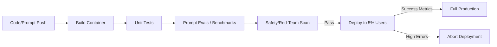

# 🚀 Continuous Deployment for Agents: The Release Machine
> **Level:** Advanced | **Language:** Hinglish | **Goal:** Master the CI/CD pipelines specifically designed for AI agents, including automated evaluation, safety testing, and blue-green deployment of agentic workflows.

---

## 🧭 1. Beginner-friendly Hinglish Explanation
Continuous Deployment (CD) ka matlab hai "Agent ko bina ruke update karna". Sochiye aapne ek feature add kiya. Kya aap poori app ko band karke naya version dalenge? Nahi. Sahi CD ka matlab hai ki aapka code check hota hai, test hota hai, aur apne aap "Live" chala jata hai bina kisi error ke. AI Agents mein ye aur bhi critical hai kyunki hume sirf "Code" nahi, balki naye "Prompts" ko bhi test karke deploy karna hota hai. Is section mein hum seekhenge ki kaise "Safe" aur "Automatic" updates karein.

---

## 🧠 2. Deep Technical Explanation
CD for agents involves a **multi-stage validation pipeline**:
1. **Unit Testing:** Testing individual tools and logic (Normal software testing).
2. **Evaluations (Evals):** Using an LLM-judge or deterministic tests to check if the new prompt/model still answers correctly.
3. **Safety Scan:** Running adversarial prompts against the new agent version.
4. **Canary Deployment:** Rolling out the new agent to only 5% of users first.
5. **Shadow Testing:** Running the new agent in parallel with the old one, but only returning the old agent's answer while logging the new one's performance.

---

## 🏗️ 3. Real-world Analogies
Continuous Deployment ek **Automatic Car Assembly Line** ki tarah hai.
- Har part check hota hai (Unit Test).
- Poori car test track par chalti hai (Evals).
- Agar sab theek hai, toh wo seedha showroom (Production) bhej di jati hai bina raste mein ruke.

---

## 📊 4. Architecture Diagrams (The Agent CI/CD Pipeline)


---

## 💻 5. Production-ready Examples (The Eval Script)
```python
# 2026 Standard: Automatic Prompt Evaluation
def run_evals(new_agent_version):
    test_cases = [
        {"input": "What is 2+2?", "expected": "4"},
        {"input": "Search for AAPL", "tool_expected": "search"}
    ]
    
    for case in test_cases:
        result = new_agent_version.invoke(case['input'])
        if not is_correct(result, case['expected']):
            raise Exception(f"EVAL FAILED: {case}")
            
    print("EVALS PASSED. Proceeding to safety scan.")
```

---

## ❌ 6. Failure Cases
- **The "Model Collapse" Rollout:** Naye version ne complex queries theek kar di par simple queries par fail hone laga (Regression failure).
- **The Evaluation Gap:** Aapne agent ko test kiya par "Tools" production mein alag data return kar rahe the, jisse agent crash ho gaya.

---

## 🛠️ 7. Debugging Section
- **Symptom:** The deployment pipeline is stuck at the 'Evals' stage.
- **Check:** **Eval Model Latency**. Kya aapka judge model (GPT-4o) slow hai? Use a **Faster Model** (Llama-3) for evals or parallelize the test cases.

---

## ⚖️ 8. Tradeoffs
- **High Automation:** Fast updates par "Silent failures" ka risk.
- **Manual Gate:** Very safe par deployment slow ho jati hai.

---

## 🛡️ 9. Security Concerns
- **CI/CD Poisoning:** Ek attacker pipeline mein "Malicious Eval" inject kar deta hai jo hamesha "Pass" bolta hai, taaki wo apna unsafe code production mein bhej sake. Secure your **CI/CD Secrets**.

---

## 📈 10. Scaling Challenges
- 1000s of test cases har deployment par chalaana expensive aur slow hai. Use **Representative Sampling** of test cases.

---

## 💸 11. Cost Considerations
- Running evals for every commit costs tokens. Optimize by running full evals only on **Master Branch** push, and light evals on Pull Requests.

---

## ⚠️ 12. Common Mistakes
- Rollback plan na hona.
- Real-world production data ko evals mein use na karna (Synthetic data is not enough).

---

## 📝 13. Interview Questions
1. What is 'Shadow Deployment' and why is it useful for AI agents?
2. How do you implement 'Automated Regression Testing' for prompts?

---

## ✅ 14. Best Practices
- Every deployment must have a **'Canary Phase'**.
- Use **Feature Flags** to turn off new agent capabilities instantly if errors spike.

---

## 🚀 15. Latest 2026 Industry Patterns
- **Blue-Green Agent Swaps:** Having two identical environments (Blue and Green). New agent goes to Green, and if it passes, traffic is switched from Blue to Green instantly.
- **Self-Testing Agents:** Agents jo autonomously apne liye naye test cases likhte hain based on edge cases they found in production.
