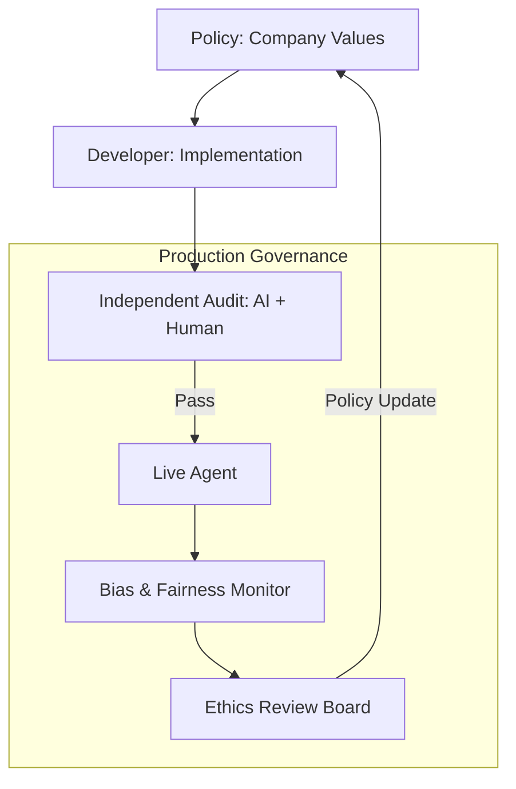

# ⚖️ Ethical Governance in Production: Beyond the Code
> **Level:** Advanced | **Language:** Hinglish | **Goal:** Master the institutional frameworks, auditing processes, and governance structures required to manage AI agents ethically at an enterprise scale.

---

## 🧭 1. Beginner-Friendly Hinglish Explanation
Ethical Governance ka matlab hai **"AI ki Adalat (Court)"**.

- **The Problem:** Code aur Prompt set karna kafi nahi hai. Ek "System" chahiye jo check kare ki kya AI abhi bhi "Ethical" hai?
- **The Core Components:**
  - **The Ethics Board:** Ek team (Humans) jo rules set kare.
  - **Audit Logs:** Har bade decision ka "Record" rakhna.
  - **Complaint System:** Agar user ko lage ki AI biased hai, toh wo report kar sake.
- **The Goal:** AI ko "Responsible" banana taki wo company ki reputation aur users ka trust na tode.

Governance se AI "Wild West" se ek **"Regulated System"** ban jata hai.

---

## 🧠 2. Deep Technical Explanation
Governance involves **Policy Enforcement**, **Bias Monitoring**, and **Compliance Automation**.

### 1. The Governance Framework:
- **Pre-deployment Review:** Every new agent version must pass an "Ethical Audit" (checking for bias, toxicity, and alignment).
- **Runtime Monitoring:** Live monitoring of "Fairness Metrics" (e.g., ensuring the agent doesn't give better discounts to one demographic).
- **Post-hoc Auditing:** Periodically reviewing 1% of random traces for ethical compliance.

### 2. Compliance Standards (2026):
- **EU AI Act:** Ensuring the agent meets "High-risk" transparency and safety standards.
- **NIST AI RMF:** Using the Risk Management Framework to document and mitigate AI risks.

### 3. Explainability (XAI):
Ensuring that for every "Denied" action, the agent can provide a "Human-readable" reason that follows company policy.

---

## 🏗️ 3. Architecture Diagrams (The Governance Cycle)


---

## 💻 4. Production-Ready Code Example (An Ethical Audit Log)
```python
# 2026 Standard: Recording 'Ethical Context' for every decision

def log_ethical_decision(session_id, action, reasoning, fairness_score):
    # This log is stored in a 'Tamper-proof' DB for future audits
    audit_db.save({
        "timestamp": iso_now(),
        "session": session_id,
        "action_taken": action,
        "internal_reasoning": reasoning,
        "demographic_impact_score": fairness_score,
        "compliant_with": ["GDPR", "EU_AI_ACT"]
    })

# Insight: Governance is $90\%$ Documentation and $10\%$ Monitoring.
```

---

## 🌍 5. Real-World Use Cases
- **Insurance:** An automated agent denying a claim must log the "Exact Clause" and "Factual Data" used, making it ready for a legal audit.
- **Social Media:** An agent that "Moderates" content must be able to justify why a post was deleted, following the "Freedom of Speech" vs. "Hate Speech" guidelines.
- **Hiring:** An agent that filters resumes must provide a "Fairness Report" every week showing no bias against any protected group.

---

## ❌ 6. Failure Cases
- **The "Ethics-Washing":** Having a policy on paper but no "Code-level" checks to enforce it.
- **Opaque Logic:** An agent denies a loan but the "Reasoning" is so complex (Black box) that even the engineers don't understand it.
- **Ignoring the Minority:** The agent works perfectly for $99\%$ of users but is consistently "Mean" or "Useless" for a $1\%$ minority group.

---

## 🛠️ 7. Debugging Guide
| Symptom | Cause | Fix |
| :--- | :--- | :--- |
| **Bias is rising in production** | Feedback Loop Drift | Check if the **'Retraining Data'** is becoming biased based on the agent's own previous (wrong) decisions. |
| **User complaints are increasing** | Lack of Transparency | Implement a **'Why did you say this?'** button in the UI that reveals the agent's (sanitized) reasoning. |

---

## ⚖️ 8. Tradeoffs
- **Full Transparency (Safe/Slow) vs. Proprietary Logic (Secret/Fast).**
- **Strict Compliance (Regulated/Expensive) vs. Agile Innovation (Unregulated/Cheap).**

---

## 🛡️ 9. Security & Governance
- **Immutable Audit Trails:** Using Blockchain or WORM (Write Once Read Many) storage for logs so they can't be "Edited" after a mistake happens.

---

## 📈 10. Scaling Challenges
- **Global Governance:** Managing different "Ethical Rules" for an agent that runs in the USA, China, and India. **Solution: Use 'Regional Governance Profiles'.**

---

## 💸 11. Cost Considerations
- **Compliance Overhead:** The cost of hiring an "Ethics Team" and running "Audit Software" can be $20\%$ of the total AI project budget.

---

## 📝 12. Interview Questions
1. What is "Algorithmic Accountability"?
2. How do you prepare an AI system for an "External Audit"?
3. What is the difference between "Ethics" and "Compliance"?

---

## ⚠️ 13. Common Mistakes
- **No 'Right to Appeal':** Not giving the user a way to "Talk to a human" if the AI's ethical decision seems wrong.
- **Reactive Governance:** Only fixing ethical issues *after* they become a PR disaster.

---

## ✅ 14. Best Practices
- **Ethical-first Design:** Ask "What could go wrong?" before you write the first line of code.
- **Diverse Audit Teams:** Ensure the people auditing the AI are from different backgrounds, genders, and ethnicities.
- **Public Reporting:** Release a "Transparency Report" every year about your AI's performance and ethics.

---

## 🚀 15. Latest 2026 Industry Patterns
- **Digital Twins for Auditing:** Running an "Audit Agent" that mimics real-world users to constantly "Probe" the production agent for bias.
- **Governance-as-a-Service:** External companies that provide "Ethical Monitoring" via APIs.
- **Explainability Probes:** Tools that can "Visualize" which specific tokens in a prompt led to an "Unethical" response.
