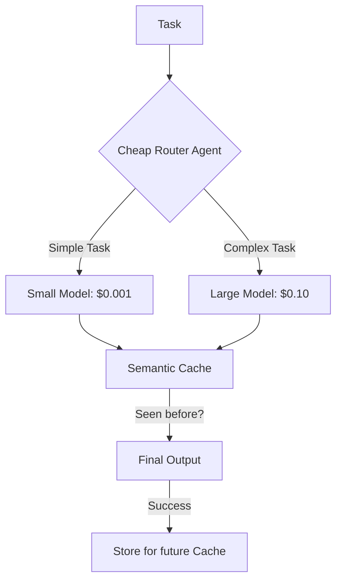

# 💸 Handling Rate Limits and Costs: The Economic Guardrails
> **Level:** Intermediate | **Language:** Hinglish | **Goal:** Master the strategies for managing LLM API rate limits, optimizing token usage, and controlling infrastructure costs in large-scale agent deployments.

---

## 🧭 1. Beginner-friendly Hinglish Explanation
Rate Limits aur Costs ka matlab hai "Budget mein rehna". Sochiye aapne ek party di. Agar har koi 10 plate khana kha raha hai (High tokens), toh aapka budget khatam ho jayega. "Rate Limit" wo hai jab waiter bolta hai "Bhai, 1 minute ruko, kitchen overload hai". AI Agents mein hume ye manage karna padta hai taaki: 1. API provider humein block na kare, aur 2. Company ka bank balance khali na ho jaye. Is section mein hum seekhenge ki kaise "Tokens" ko bachayein aur "Wait time" (Latency) ko kam karein.

---

## 🧠 2. Deep Technical Explanation
Managing economics in agents requires several strategies:
1. **Exponential Backoff:** When hit with a 429 (Rate Limit) error, waiting $2^n$ seconds before retrying to avoid "Thundering Herd" problems.
2. **Token Pruning:** Summarizing long context windows or deleting irrelevant chat history to keep the input prompt small.
3. **Model Tiering:** Using a cheap model (e.g., Llama-3-8B or GPT-4o-mini) for routing and classification, and only using an expensive model (GPT-4o) for the final complex reasoning.
4. **Caching:** Using **Semantic Caching** (e.g., RedisVL) to reuse responses for similar queries.
5. **Request Batching:** Grouping multiple independent agent tasks into a single API call to reduce overhead.

---

## 🏗️ 3. Real-world Analogies
Handling Rate Limits ek **Toll Plaza** ki tarah hai.
- Agar ek saath 1000 cars (Requests) aa gayi, toh jam lag jayega.
- Toll operator (Rate Limiter) cars ko ek-ek karke chhodta hai.
- "Cost control" ye hai ki aap bike (Cheap model) se ja rahe hain ya Truck (Expensive model) se.

---

## 📊 4. Architecture Diagrams (The Cost Optimizer)


---

## 💻 5. Production-ready Examples (The Retry Logic)
```python
# 2026 Standard: Robust Retry with Backoff
import time
import openai

def call_with_backoff(prompt, max_retries=5):
    for i in range(max_retries):
        try:
            return llm.invoke(prompt)
        except openai.RateLimitError:
            wait_time = 2 ** i # 1, 2, 4, 8, 16 seconds
            print(f"Rate limited. Waiting {wait_time}s...")
            time.sleep(wait_time)
    raise Exception("Max retries exceeded.")
```

---

## ❌ 6. Failure Cases
- **The Token Spiral:** Agent long history ke saath loop mein phans gaya, jisse har request 128k tokens ki hone lagi, resulting in a $50 bill for 1 task.
- **Deadlock by Rate Limit:** Agent A, Agent B ka wait kar raha hai, par dono rate limit ki wajah se "Pause" hain, causing a system freeze.

---

## 🛠️ 7. Debugging Section
- **Symptom:** API costs are spiking unexpectedly.
- **Check:** **Prompt Length**. Kya aap context mein pura "PDF" har baar bhej rahe hain? Use **RAG** (Retrieval Augmented Generation) to send only the relevant 500 words instead of the whole file.

---

## ⚖️ 8. Tradeoffs
- **High Quality:** Expensive models, long contexts.
- **Low Cost:** Smaller models, truncated history (Potential loss of context).

---

## 🛡️ 9. Security Concerns
- **Denial of Wallet (DoW) Attack:** Ek attacker hazaron complex queries bhejta hai taaki aapka API budget khatam ho jaye aur system band ho jaye. Always implement **User-Level Quotas**.

---

## 📈 10. Scaling Challenges
- High-concurrency systems mein rate limits hit hona "Gauranteed" hai. Use **Multiple API Keys** or a **Load Balancer** across different providers (e.g., OpenAI + Anthropic + Groq).

---

## 💸 11. Cost Considerations
- Use **Prompt Caching** (Available in Claude/DeepSeek) which gives a 90% discount for repeated prompt prefixes.

---

## ⚠️ 12. Common Mistakes
- Infinite retry loops (Without a max limit).
- No token counting (Not knowing how many tokens you are spending).

---

## 📝 13. Interview Questions
1. How does 'Exponential Backoff' help with API stability?
2. What is 'Semantic Caching' and how does it differ from traditional key-value caching?

---

## ✅ 14. Best Practices
- Every agent run should have a **'Hard Token Limit'** (e.g., max 10k tokens).
- Use **Batch APIs** for non-urgent tasks (usually 50% cheaper).

---

## 🚀 15. Latest 2026 Industry Patterns
- **LLM Load Balancing:** Routers jo automatically "Cheapest/Fastest" provider chun lete hain for every request.
- **On-Device Fallbacks:** Running a local Llama model on the user's machine when the cloud API hits a rate limit.
