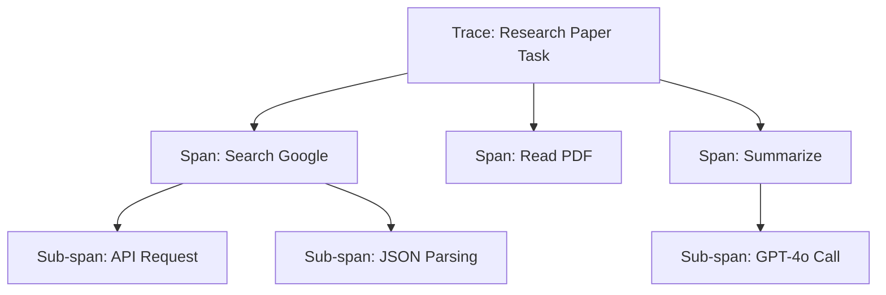

# 📜 Logging and Tracing Agent Runs: The Forensic Audit
> **Level:** Intermediate | **Language:** Hinglish | **Goal:** Master the systematic capture of every step an agent takes, ensuring you have a complete, auditable record of its internal thoughts, external tool calls, and final outputs.

---

## 🧭 1. Beginner-friendly Hinglish Explanation
Logging aur Tracing ka matlab hai "Agent ki diary likhna". Sochiye ek Detective (Agent) ek case solve kar raha hai. Wo apne har step ko ek register mein likhta hai: "10:00 baje maine X se baat ki", "10:15 baje maine Y file dekhi". AI Agents mein hume ye data chahiye hota hai taaki agar agent galti kare, toh hum "Forensic" audit kar sakein ki: Agent ne kahan galti ki? Kya usne galat data padha? Ya kya usne logic mein galti ki? Bina logs ke, agent ek "Black Box" hai jise theek karna namumkin hai.

---

## 🧠 2. Deep Technical Explanation
Effective tracing for agents requires a **Hierarchy of Spans**:
1. **Trace ID:** A unique ID for the entire user request.
2. **Span ID:** A segment of work (e.g., one LLM call, one tool execution).
3. **Metadata:** Storing the `model_name`, `temperature`, `tokens_used`, and `latency` for every span.
4. **Context Propagation:** Ensuring that the Trace ID is passed along when Agent A calls Agent B.
**Standard:** Using **OpenTelemetry (OTEL)** for distributed tracing to integrate with professional tools like Jaeger or Datadog.

---

## 🏗️ 3. Real-world Analogies
Logging aur Tracing ek **CCTV Camera System** ki tarah hain.
- **Logging:** Camera recording kar raha hai (Har event save ho raha hai).
- **Tracing:** Aap ek specific chori (Error) ko follow kar sakte hain multiple cameras (Microservices/Agents) ke through taaki pata chale chor kahan se aaya aur kahan gaya.

---

## 📊 4. Architecture Diagrams (The Trace Hierarchy)


---

## 💻 5. Production-ready Examples (The Structured Log)
```python
# 2026 Standard: Structured Logging for Agents
import logging
import json

def log_agent_action(trace_id, step, action, observation):
    log_entry = {
        "trace_id": trace_id,
        "step": step,
        "action": action,
        "observation": observation,
        "timestamp": now()
    }
    # Save as JSON for easy analysis in ElasticSearch/CloudWatch
    logging.info(json.dumps(log_entry))

# Example: log_agent_action("abc-123", 1, "search_web", "Found 5 results")
```

---

## ❌ 6. Failure Cases
- **The Log Storm:** Agent loop mein phans gaya aur 1 minute mein 10GB logs generate kar diye, jisse disk full ho gayi.
- **Blind Spots:** Aapne LLM call toh log ki, par tool ke andar ka error log nahi kiya, isliye debugging nahi ho paa rahi.

---

## 🛠️ 7. Debugging Section
- **Symptom:** "Error occurred" message dikh raha hai par logs mein koi detail nahi hai.
- **Check:** **Logger Level**. Kya aapka logger `INFO` par set hai jabki error `DEBUG` ya `ERROR` level par hai? Always use `logging.exception()` in `except` blocks to capture the full stack trace.

---

## ⚖️ 8. Tradeoffs
- **Verbose Logs:** Great for debugging, but expensive storage and slow I/O.
- **Sparse Logs:** Cheap and fast, but hard to debug complex agent behaviors.

---

## 🛡️ 9. Security Concerns
- **Credential Leakage:** Logs mein galti se API keys ya session tokens save ho jana. Always use a **Sanitization Filter** to remove strings starting with `sk-...` or `Bearer ...`.

---

## 📈 10. Scaling Challenges
- Distributed systems mein logs different servers par hote hain. Use a **Centralized Logging System** (like Fluentd or Logstash) to collect everything in one place.

---

## 💸 11. Cost Considerations
- Storage for logs can be surprisingly high. Use **Log Retention Policies** (e.g., delete non-error logs after 7 days).

---

## ⚠️ 12. Common Mistakes
- Unstructured logs (Plain text) use karna. (Inhe search aur analyze karna bahut mushkil hota hai).
- No correlation between LLM input and output in logs.

---

## 📝 13. Interview Questions
1. How do you implement 'Distributed Tracing' across multiple autonomous agents?
2. What are 'Spans' and 'Attributes' in OpenTelemetry?

---

## ✅ 14. Best Practices
- Every log entry should be **JSON formatted**.
- Log the **'Raw Prompt'** (at least for a sample of runs) to debug prompt-level failures.

---

## 🚀 15. Latest 2026 Industry Patterns
- **Trace-Driven Testing:** Using your production traces as test cases for your staging environment.
- **Real-time Log Analytics:** Using AI to scan millions of agent logs and automatically alert on "Anomalous Agent Behavior".
