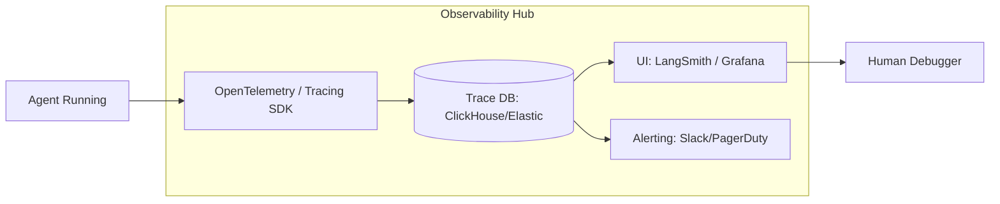

# 👁️ Monitoring & Observability: Seeing Inside the Black Box
> **Level:** Advanced | **Language:** Hinglish | **Goal:** Master the tools and techniques for tracing agentic workflows, monitoring performance metrics, and detecting hallucinations or failures in real-time.

---

## 🧭 1. Beginner-Friendly Hinglish Explanation
Monitoring aur Observability ka matlab hai **"AI ka X-Ray karna"**.

- **The Problem:** AI ke andar kya chal raha hai, wo humein dikhta nahi. Agar AI galat answer de raha hai, toh humein kaise pata chalega ki galti "Search" mein hui, "Reasoning" mein hui, ya "Tool" mein?
- **The Solution:** 
  - **Tracing:** AI ke har kadam (Step) ka peecha karna (e.g., "Pehle ye search kiya, phir ye socha").
  - **Logging:** Har error aur warning ko save karna.
  - **Dashboards:** Graphs mein dekhna ki kitne users khush hain aur kitne nahi.
- **The Result:** Jab kuch "Tootta" hai, toh aapko turant pata chal jata hai ki "Kahan aur Kyun" toota.

Observability se AI "Mystery" se "Science" ban jata hai.

---

## 🧠 2. Deep Technical Explanation
Observability for agents goes beyond standard logging; it requires **Full-Trace Replayability**.

### 1. Tracing (The Heart of Agents):
- **Span Tracking:** Every LLM call, Tool call, and Logic branch is a "Span."
- **Trace ID:** A single ID that connects all steps of a complex multi-agent task.
- **Tools:** **LangSmith**, **Arize Phoenix**, and **HoneyHive**. These allow you to "Rewind" a conversation and see the exact prompt that caused a failure.

### 2. Key Metrics (The 2026 Dashboard):
- **Faithfulness:** Does the output match the retrieved documents?
- **Answer Relevance:** Does the answer actually solve the user's query?
- **Cost-per-run:** How many dollars did this single agent task cost?
- **Token Efficiency:** Ratio of "Useful Tokens" vs. "Wasted Tokens."

### 3. Hallucination Detection:
Using an "LLM-as-a-Judge" to automatically score responses for factual errors in the background.

---

## 🏗️ 3. Architecture Diagrams (The Observability Pipeline)


---

## 💻 4. Production-Ready Code Example (Instrumenting an Agent)
```python
# 2026 Standard: Automatic tracing with LangSmith

import os
from langsmith import traceable

# 1. Setup Environment
os.environ["LANGCHAIN_TRACING_V2"] = "true"
os.environ["LANGCHAIN_PROJECT"] = "Customer_Support_Agent"

@traceable # This decorator logs every input, output, and latency
async def my_agent_logic(user_query):
    # Step 1: Search
    docs = await search_tool(user_query)
    
    # Step 2: Reason
    answer = await model.run(f"Answer using: {docs}")
    
    return answer

# Insight: Tracing is $10x$ better than print() statements 
# for debugging production AI.
```

---

## 🌍 5. Real-World Use Cases
- **Enterprise Search:** Detecting that $20\%$ of searches are failing because the "Vector DB" is returning outdated documents.
- **Coding Assistants:** Monitoring how many of the "Suggested Fixes" are actually accepted by developers.
- **Medical AI:** Auditing every single reasoning step of a diagnosis agent for legal compliance.

---

## ❌ 6. Failure Cases
- **The "Data Deluge":** Logging $100\%$ of tokens for $1$ million users, crashing your own logging server. **Fix: Use 'Sampling' (e.g., log only 1% of success and 100% of failures).**
- **Blind Spots:** Monitoring the LLM but forgetting to monitor the "Tool" performance (e.g., a slow database).
- **Latency from Monitoring:** The tracing library itself adds 1 second of delay to the user. **Fix: Use 'Asynchronous/Out-of-band' logging.**

---

## 🛠️ 7. Debugging Guide
| Symptom | Cause | Fix |
| :--- | :--- | :--- |
| **Agent is hallucinating names** | RAG retrieval is messy | Check the **'Retrieved Documents'** span in your trace. If the docs are wrong, fix your **'Embedding Model'** or **'Chunking Strategy'**. |
| **High Costs without high traffic** | Infinite Loops | Look for **'Repeating Spans'** in your traces. Add a **'Max-Turn'** limit to your agent logic. |

---

## ⚖️ 8. Tradeoffs
- **Granular Tracing (Full visibility/High storage cost) vs. Basic Logs (Low cost/Hard to debug).**
- **Self-hosted Observability (Private) vs. Cloud SaaS (Convenient).**

---

## 🛡️ 9. Security & Privacy (Monitoring)
- **PII Redaction in Traces:** Ensuring that user "Passwords" or "Secret Keys" are not visible in the LangSmith dashboard. **Fix: Implement a 'Scrubber' in your tracing SDK.**

---

## 📈 10. Scaling Challenges
- **Distributed Tracing:** Connecting a trace that starts on a Mobile App, goes through an API Gateway, and ends in 5 different Micro-agent services.

---

## 💸 11. Cost Considerations
- **Storage Retention:** Only keep full traces for 7 days. After that, keep only the "Aggregated Metrics" to save DB space.

---

## 📝 12. Interview Questions
1. What is "LLM-as-a-Judge"?
2. How do you track a single user's journey across multiple agent steps?
3. What are the 3 most important metrics for an autonomous agent?

---

## ⚠️ 13. Common Mistakes
- **No 'User Feedback' link:** Not connecting the "Trace" to the "User's Thumbs Down" button. (How will you know which trace was bad?).
- **Ignoring Latency:** Monitoring accuracy but forgetting that the agent takes 2 minutes to respond.

---

## ✅ 14. Best Practices
- **Implement 'Alerting' on Hallucinations:** Get a Slack message if the "Faithfulness Score" drops below 0.5.
- **Daily Error Reviews:** Spend 15 minutes every morning looking at the "Top 10 Failed Traces."
- **Benchmark Regularly:** Compare your current "Trace Metrics" against last month's performance.

---

## 🚀 15. Latest 2026 Industry Patterns
- **Autonomous Debugging:** An agent that "Watches" the logs of other agents and automatically "Fixes" their prompts if it sees a recurring error.
- **Predictive Alerting:** Knowing that the agent is *about* to fail because its "Perplexity" is rising mid-conversation.
- **Semantic Monitoring:** Monitoring the "Vibe" and "Style" of the agent to ensure it stays "On Brand" over millions of interactions.
