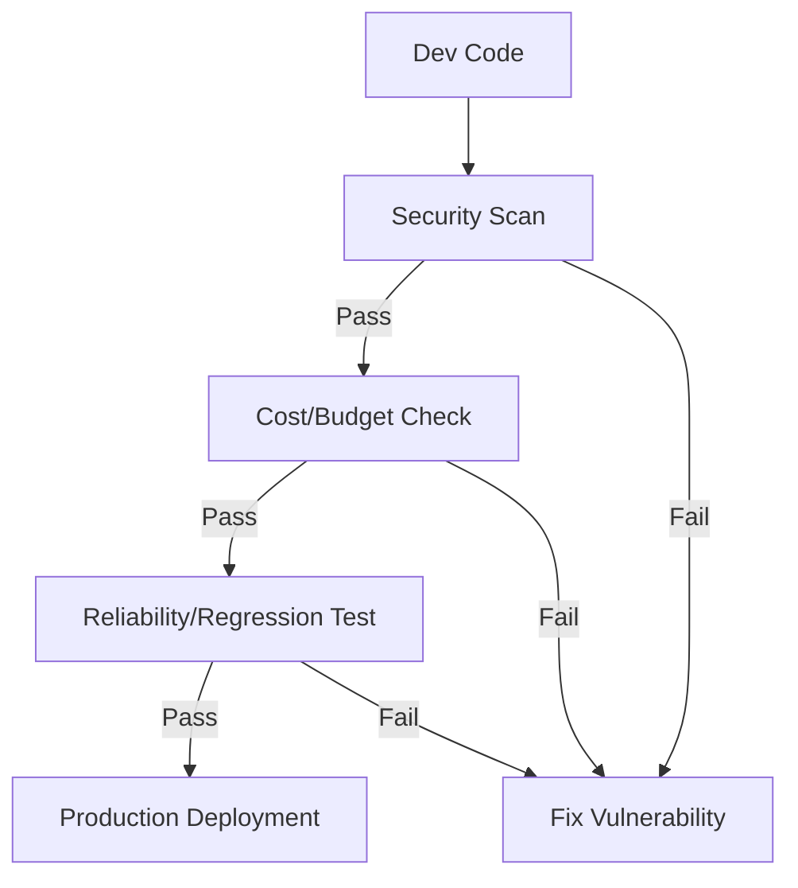

# ✅ Production Agent Checklist: Ready for the Wild?
> **Level:** Beginner | **Language:** Hinglish | **Goal:** Master the essential checklist of security, reliability, and cost controls required before launching an AI agent to real users.

---

## 🧭 1. Beginner-friendly Hinglish Explanation
Production Checklist ka matlab hai "Agent ko release karne se pehle ki tyari". Sochiye aap ek car launch kar rahe hain. Aap check karenge: "Kya brakes kaam kar rahe hain?", "Kya petrol tank full hai?", "Kya koi leak toh nahi hai?". AI Agents mein bhi hume ye sab check karna hota hai. Kya agent jailbreak ho sakta hai? Kya wo user ka poora budget 1 ghante mein khatam kar dega? Kya wo galat information de raha hai? Is checklist ko follow karke aap ek "Khilona" (Toy) aur ek "Asli Product" ke beech ka fark samajh payenge.

---

## 🧠 2. Deep Technical Explanation
A production-grade agent must pass these technical hurdles:
1. **Security Audit:** Mandatory prompt injection testing and sandboxed tool execution.
2. **Reliability:** 100% state persistence (Checkpointing) for long-running tasks.
3. **Observability:** Centralized logging of every trace (Thought -> Action -> Result).
4. **Rate Limiting:** Token and request caps per user/session.
5. **Fallbacks:** What happens if the LLM API is down? (Graceful degradation).
6. **Cost Control:** Budget alerts and hard stops on token consumption.

---

## 🏗️ 3. Real-world Analogies
Production Checklist ek **Pilot's Pre-flight Checklist** ki tarah hai.
- Pilot cabin mein baithkar har switch check karta hai.
- "Flaps? Check. Engine? Check. Fuel? Check."
- Agar ek bhi cheez "Fail" hui, toh plane udta nahi hai. Agent ke liye bhi "Deploy" button dabane se pehle ye zaroori hai.

---

## 📊 4. Architecture Diagrams (The Quality Gates)


---

## 💻 5. Production-ready Examples (The Health Check)
```python
# 2026 Standard: Simple Health & Safety Check
def production_readiness_check(agent_config):
    checks = {
        "Has_Sandbox": agent_config.get("sandbox_enabled", False),
        "Has_Budget_Cap": agent_config.get("max_budget") is not None,
        "Has_Logging": agent_config.get("trace_enabled", False),
        "Is_Stateful": agent_config.get("checkpointer") is not None
    }
    
    if all(checks.values()):
        return "READY FOR PROD"
    return f"FAILED: { [k for k, v in checks.items() if not v] }"
```

---

## ❌ 6. Failure Cases
- **The Budget Burner:** Agent ne 10,000 tasks parallel mein start kar diye bina kisi concurrency limit ke, jisse company ko $5000 ka bill aa gaya.
- **The Silent Crash:** Agent loop mein phans gaya aur user ko "Thinking..." dikh raha hai par background mein kuch nahi ho raha.

---

## 🛠️ 7. Debugging Section
- **Symptom:** Agent works in local but fails in production.
- **Check:** **Environment Variables**. Kya production keys correctly set hain? Check if the **API Rate Limits** of your LLM provider are hitting sooner than expected in prod.

---

## ⚖️ 8. Tradeoffs
- **High Safety:** Slow development, expensive infrastructure.
- **Fast Deployment:** High risk of data leak or cost explosion.

---

## 🛡️ 9. Security Concerns
- **Orphaned Sessions:** Purane sessions jo DB mein open reh gaye hain aur memory/resources consume kar rahe hain. Implement **Auto-cleanup**.

---

## 📈 10. Scaling Challenges
- Millions of concurrent agents ko run karne ke liye **Asynchronous Worker Pools** (like Celery/RabbitMQ) chahiye.

---

## 💸 11. Cost Considerations
- Always set **Alerts at 50%, 80%, and 100%** of your monthly LLM budget.

---

## ⚠️ 12. Common Mistakes
- Logging ko "Off" rakhna (Debugging impossible ho jayega).
- Hard-coding API keys in the agent code.

---

## 📝 13. Interview Questions
1. What are the top 3 safety checks you would perform before deploying an agent?
2. How do you manage state persistence for 10,000 concurrent autonomous agents?

---

## ✅ 14. Best Practices
- Use **Docker** for all tool execution.
- Maintain a **'Kill Switch'** API that can stop all active agents in 1 click.

---

## 🚀 15. Latest 2026 Industry Patterns
- **Agentic CI/CD:** Pipelines jo automatically agent ko "Adversarial prompts" se test karti hain har code change par.
- **Auto-Scale Agents:** Agents jo demand ke hisab se server par apne "Clones" banate hain and terminate hote hain.
