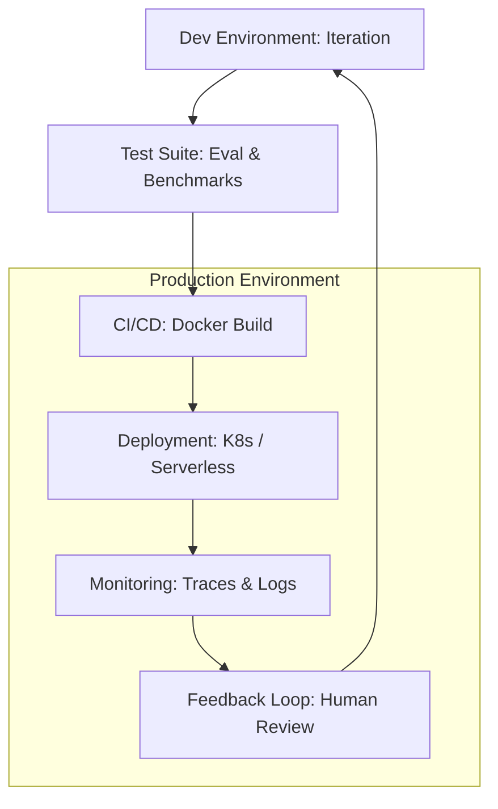

# 🚀 Production AI Agents: From Prototype to Enterprise
> **Level:** Advanced | **Language:** Hinglish | **Goal:** Understand the rigorous engineering standards required to take an agent from a "Cool Demo" to a reliable, scalable, and secure "Production System" used by millions.

---

## 🧭 1. Beginner-Friendly Hinglish Explanation
Production AI Agents ka matlab hai **"Asli duniya mein AI chalana"**.

- **The Difference:** Demo mein galti ho toh chalta hai, par Production mein nahi.
  - **Demo:** "Dekho, mera bot code likh sakta hai!" (Laptop par chal raha hai).
  - **Production:** "Mera bot 10,000 developers ki help kar raha hai, bina crash hue, bina data leak kiye, aur bahut fast." (Cloud par chal raha hai).
- **The Core Pillars:**
  - **Reliability:** AI hamesha kaam kare.
  - **Scalability:** Jab 1 se 1 million users aayein, toh system na toote.
  - **Observability:** Humein pata ho ki har second AI kya kar raha hai.

Production engineering AI ko sirf ek "Khilona" (Toy) se ek **"Business Tool"** bana deti hai.

---

## 🧠 2. Deep Technical Explanation
Moving an agent to production involves transitioning from **Stochastic Prototyping** to **Deterministic Engineering**.

### 1. The Production Stack:
- **Orchestration Layer:** LangGraph, CrewAI, or custom State Machines (not just single prompts).
- **Inference Gateway:** LiteLLM or Portkey for load balancing and caching.
- **Observability Stack:** LangSmith, Arize Phoenix, or Datadog for tracing.
- **Environment Isolation:** E2B or Docker for safe tool execution.

### 2. Key Challenges:
- **Latency (TTFT):** Optimizing the "Time to First Token" using streaming and prompt caching.
- **Cost Management:** Reducing token usage via smart routing (sending easy tasks to small models).
- **State Persistence:** Storing the "State" of millions of active agents across distributed workers.

---

## 🏗️ 3. Architecture Diagrams (The Production Agent Lifecycle)


---

## 💻 4. Production-Ready Code Example (A Resilient Execution Pattern)
```python
# 2026 Standard: Handling production failures gracefully

import logging
from tenacity import retry, stop_after_attempt, wait_exponential

@retry(stop=stop_after_attempt(3), wait=wait_exponential(multiplier=1, min=4, max=10))
async def production_agent_step(agent, state):
    try:
        # 1. Execute step with a strict timeout
        result = await asyncio.wait_for(agent.step(state), timeout=30.0)
        return result
    except asyncio.TimeoutError:
        logging.error("⏱️ Task timed out. Re-routing to faster model...")
        return await fallback_model.step(state)
    except Exception as e:
        logging.error(f"❌ Error in production step: {e}")
        raise # Let retry handle it

# Insight: Always have a 'Fallback' model ready 
# to take over if the primary model is slow or fails.
```

---

## 🌍 5. Real-World Use Cases
- **Enterprise Customer Support:** Agents handling 50k tickets a day with automatic escalation to humans.
- **Financial Analysts:** Agents reading 1000s of SEC filings in real-time and generating alerts for traders.
- **DevOps Autopilot:** Agents that automatically detect server errors and apply a "Fix" (e.g., restart or roll-back) in production.

---

## ❌ 6. Failure Cases
- **The "Token Bankruptcy":** A bug causes an agent to enter an infinite loop, spending $\$5000$ in one night. **Fix: Use 'Hard Spend Limits'.**
- **Context Window Overflow:** Forgetting to "Prune" the history, leading to the agent failing as the conversation gets longer.
- **API Outage:** OpenAI or Anthropic goes down, and your agent has no "Local Model" fallback.

---

## 🛠️ 7. Debugging Guide
| Symptom | Cause | Fix |
| :--- | :--- | :--- |
| **Users are complaining about slowness** | Latency in RAG / LLM | Implement **'Semantic Caching'** to avoid calling the LLM for repeated questions. |
| **Agent is hallucinating tools** | Weak schema validation | Use **'Strict Pydantic Models'** to validate tool arguments before execution. |

---

## ⚖️ 8. Tradeoffs
- **Model Size:** GPT-4o (High Quality/High Cost) vs. Llama-3-70B (Medium Quality/Lower Cost).
- **Autonomy vs. Safety:** Fully autonomous (Fast/Risky) vs. Human-in-the-loop (Slow/Safe).

---

## 🛡️ 9. Security Concerns
- **Environment Isolation:** Ensuring an agent's Python code can't "Escape" and see your server's environment variables.
- **Prompt Injection:** Attackers trying to "Steal" the production system prompt.

---

## 📈 10. Scaling Challenges
- **Concurrent Users:** Handling 1000 users at once. **Solution: Use 'Horizontal Scaling' for your worker nodes.**

---

## 💸 11. Cost Considerations
- **Prompt Caching:** Using providers that offer "Cache hits" at $50\%$ discount. This is a game-changer for large production systems.

---

## 📝 12. Interview Questions
1. How do you prepare an agent for "Production"?
2. What is "Observability" in AI engineering?
3. How do you handle "Rate Limits" in a high-traffic system?

---

## ⚠️ 13. Common Mistakes
- **No 'Evaluations' (Evals):** Deploying a new prompt without testing it on a "Golden Dataset."
- **Logging too much PII:** Saving user passwords or credit cards in your trace logs.

---

## ✅ 14. Best Practices
- **Use 'Blue-Green' Deployment:** Test the new agent on $5\%$ of traffic before full release.
- **Implement 'Kill Switches':** For every autonomous action, have a way to stop it instantly.
- **Versioning:** Never change a production prompt in-place; always create a `v2.0` and migrate.

---

## 🚀 15. Latest 2026 Industry Patterns
- **Agentic Microservices:** Breaking down a complex agent into 10 small "Specialist Agents" that communicate via gRPC.
- **Self-Improving Production Loops:** Agents that "Learn" from their own production logs to update their prompts automatically (DSPy style).
- **On-Device Hybrid:** Running the "Triage" on the user's phone and the "Action" in the cloud.
