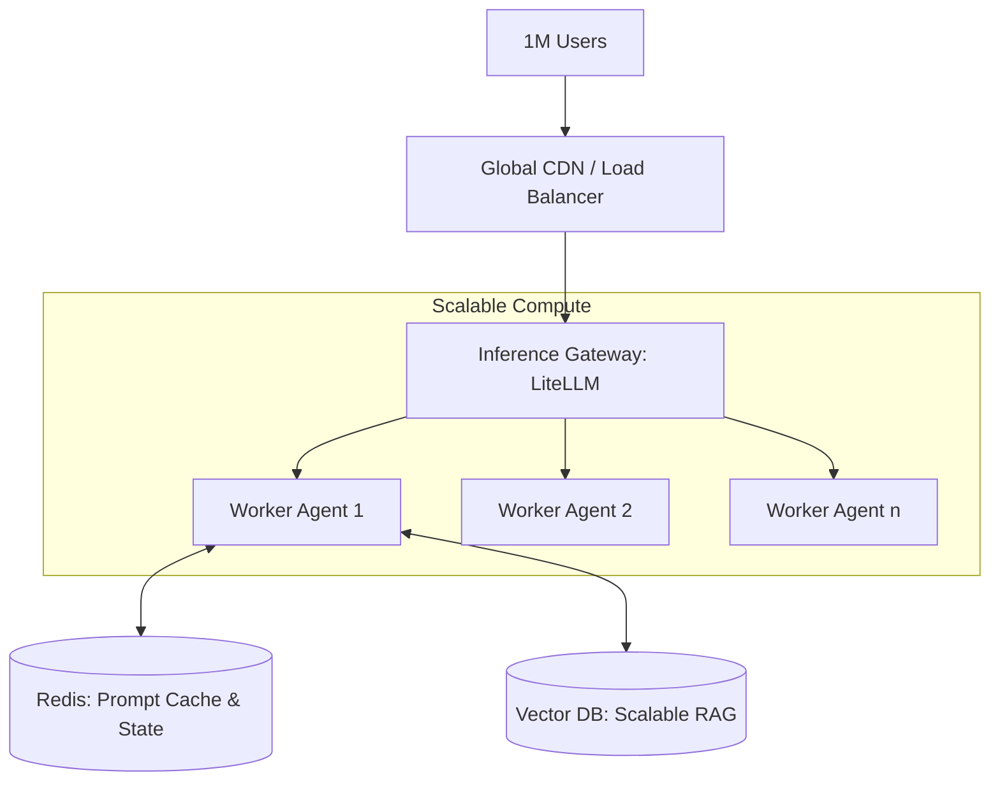

# 📈 Scalability & Performance: Architecting for Millions
> **Level:** Advanced | **Language:** Hinglish | **Goal:** Master the techniques for scaling agentic systems to handle high traffic, minimize latency, and optimize cost without sacrificing intelligence or reliability.

---

## 🧭 1. Beginner-Friendly Hinglish Explanation
Scalability aur Performance ka matlab hai **"AI ko Fast aur Bada banana"**.

- **The Problem:** Agar aapka agent ek answer dene mein 30 seconds leta hai, toh user bhag jayega. Agar 1000 users ek saath aa jayein aur server crash ho jaye, toh business doob jayega.
- **The Solution:** 
  - **Caching:** Jo sawaal baar-baar puche ja rahe hain, unka jawab save karlo.
  - **Streaming:** Poora jawab likhne ka wait mat karo, ek-ek word user ko dikhate raho (jaise ChatGPT karta hai).
  - **Parallelism:** Ek agent ki jagah 100 agents ek saath kaam karein.
- **The Result:** AI "Instant" feel hota hai aur kitne bhi users aa jayein, wo "Smooth" chalta hai.

Performance AI ko "Frustrating" se "Magical" bana deti hai.

---

## 🧠 2. Deep Technical Explanation
Scaling agentic systems is more complex than scaling web apps because of **Inference Latency** and **Context Window Limits**.

### 1. Latency Optimization (TTFT - Time to First Token):
- **Streaming:** Crucial for UX. User starts reading before the full reasoning is done.
- **Speculative Decoding:** Using a small model to "Predict" what the big model will say, speeding up output by $2x$.
- **KV Caching:** Re-using previous token calculations to speed up long conversations.

### 2. Throughput Scaling:
- **Load Balancing:** Distributing requests across multiple LLM providers (OpenAI, Anthropic, Local).
- **Asynchronous Workflows:** Using task queues (Redis/Celery) so the user doesn't wait for a 5-minute research task to finish on a single HTTP connection.

### 3. Context Management:
- **Vector DB Partitioning:** Scaling your memory to search through billions of documents in milliseconds.
- **Context Pruning:** Automatically removing irrelevant history to keep prompts short and fast.

---

## 🏗️ 3. Architecture Diagrams (The Scalable Backend)


---

## 💻 4. Production-Ready Code Example (Implementing Semantic Caching)
```python
# 2026 Standard: Avoiding redundant LLM calls

from langchain_community.cache import RedisSemanticCache
from langchain_openai import OpenAIEmbeddings

# 1. Setup Semantic Cache
# If a new question is '95% similar' to a cached one, return the cache.
set_llm_cache(RedisSemanticCache(
    redis_url="redis://localhost:6379", 
    embedding=OpenAIEmbeddings(),
    score_threshold=0.95
))

# 2. Call the agent
# The first time takes 10s. The second time (similar query) takes 0.1s.
response = agent.run("What is the tax rate in India?")

# Insight: Semantic caching can reduce your 
# LLM costs by $30-50\%$ in high-traffic apps.
```

---

## 🌍 5. Real-World Use Cases
- **Viral AI Apps:** Handling a sudden jump from 10 to 100,000 users after a TikTok video goes viral.
- **Real-time Trading:** Agents that must process news and execute trades in $< 200ms$.
- **Global Search Engines:** Scaling RAG to search through the entire internet's daily news in real-time.

---

## ❌ 6. Failure Cases
- **Rate Limit Exhaustion:** Your API key hits a limit, and all your users get "Error 429" at the same time. **Fix: Use 'Multi-key Rotation' or 'Multi-provider Fallback'.**
- **Memory Leaks:** The agent state keeps growing in the database until the disk is full. **Fix: Implement 'TTL' (Time to Live) for session data.**
- **Head-of-Line Blocking:** One user's 10-minute task blocks the server for everyone else. **Fix: Use 'Async Workers'.**

---

## 🛠️ 7. Debugging Guide
| Symptom | Cause | Fix |
| :--- | :--- | :--- |
| **High Latency** | Large System Prompt | Use **'Prompt Caching'** (offered by Anthropic/DeepSeek) to avoid paying for the same system prompt tokens every time. |
| **Server Crash during Traffic Spikes** | Blocking I/O | Switch your Python code from **'Flask/Sync'** to **'FastAPI/Async'** to handle high concurrency. |

---

## ⚖️ 8. Tradeoffs
- **Accuracy vs. Latency:** Using a smaller model (Fast) vs. a larger model (Smart).
- **Cost vs. Reliability:** Hosting your own models (Cheaper/Complex) vs. using APIs (Expensive/Simple).

---

## 🛡️ 9. Security Concerns
- **Cache Poisoning:** An attacker feeding "Bad" answers into your semantic cache so other users get wrong information.
- **Resource Exhaustion Attacks:** Users sending massive prompts to crash your tokenizers.

---

## 📈 10. Scaling Challenges
- **The 'Distributed State' Problem:** How to ensure 5 different servers all know the current "State" of a user's agent. **Solution: Use a 'Centralized State Store' like Redis or DynamoDB.**

---

## 💸 11. Cost Considerations
- **Token Efficiency:** Writing "Cleaner" prompts that use fewer tokens while achieving the same result.

---

## 📝 12. Interview Questions
1. How do you reduce "Time to First Token" (TTFT)?
2. What is "Semantic Caching"?
3. How do you scale a Vector Database to 100M embeddings?

---

## ⚠️ 13. Common Mistakes
- **No 'Streaming':** Making the user wait for the whole answer to be generated.
- **Hard-coding one model:** Being stuck with OpenAI when Anthropic is cheaper/faster.

---

## ✅ 14. Best Practices
- **Implement 'Rate Limiting' per user:** Don't let one user burn your whole budget.
- **Use 'Quantized' models for local deployment:** Use 4-bit or 8-bit versions of Llama to save RAM and speed up inference.
- **Monitor 'Tokens per Second':** This is the key metric for AI performance.

---

## 🚀 15. Latest 2026 Industry Patterns
- **LLM Mesh:** A network of models that automatically "Route" the query to the cheapest/fastest model that can solve it.
- **Edge Inference:** Running the agent's "Decision" logic on the user's laptop/phone and only the "Heavy Reasoning" in the cloud.
- **Speculative RAG:** Predicting which documents will be needed before the agent even asks for them.
