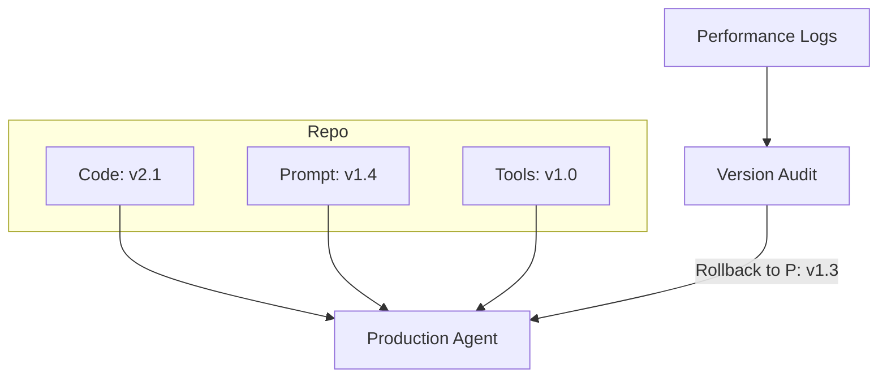

# 🌿 Version Control for Agents: Tracking Evolution
> **Level:** Advanced | **Language:** Hinglish | **Goal:** Master the systematic versioning of agent code, system prompts, tool definitions, and underlying models to ensure reproducibility and safe rollbacks.

---

## 🧭 1. Beginner-friendly Hinglish Explanation
Version Control ka matlab hai "Agent ka Time Machine". Sochiye aapne agent ka system prompt badal diya aur ab wo galat answers de raha hai. Aap chahte hain ki wo "Pehle jaisa" ho jaye. Sirf "Code" (Python/JS) ko save karna kaafi nahi hai. Hume ye bhi save karna padta hai ki: Kaunsa prompt tha? Kaunsa model version (GPT-4o vs GPT-4-turbo) tha? Aur kaunse tools active the? Version control aapko aazadi deta hai naye experiments karne ki, bina purana kaam khone ke darr ke.

---

## 🧠 2. Deep Technical Explanation
Versioning in agent systems involves three distinct layers:
1. **Code Versioning (Git):** Managing the orchestration logic (LangGraph, CrewAI code).
2. **Prompt Versioning:** Treating prompts as code. Use tools like **Promptfoo**, **LangSmith**, or simply Git-tracked YAML files for system instructions.
3. **Configuration Versioning:** Tracking model parameters (Temperature, Top_p, Tool definitions).
4. **Data Versioning (DVC):** Tracking the few-shot examples or RAG datasets used by the agent.
**Modern Standard:** Using **"Prompt Management Systems"** to A/B test different versions of a prompt in production.

---

## 🏗️ 3. Real-world Analogies
Version Control ek **Video Game Save Point** ki tarah hai.
- Aapne boss fight (New Prompt) se pehle game save kiya.
- Agar aap haar gaye (Agent failed), toh aap wahin se restart kar sakte hain (Rollback).

---

## 📊 4. Architecture Diagrams (The Multi-Layer Versioning)


---

## 💻 5. Production-ready Examples (Prompt Versioning with YAML)
```yaml
# 2026 Standard: Prompts as Config
version: "1.4.2"
model: "gpt-4o-2024-05-13"
parameters:
  temperature: 0.7
system_prompt: |
  You are a professional assistant. 
  Rules:
  - Be concise.
  - No emojis.
```

---

## ❌ 6. Failure Cases
- **The "Model Drift" Surprise:** Model provider ne "GPT-4" ko update kar diya (internal update), aur aapka purana prompt ab alag tarah se behave kar raha hai (Model decay).
- **The Mixed Version:** Code update ho gaya par database mein purana prompt hi save tha, jisse agent crash ho gaya.

---

## 🛠️ 7. Debugging Section
- **Symptom:** Agent performance dropped after the last deployment.
- **Check:** **Git Diff**. Prompt mein ek comma ya "Not" word add hone se logic poora badal sakta hai. Use **Prompt Evaluation** (Promptfoo) to compare old vs new version performance.

---

## ⚖️ 8. Tradeoffs
- **Strict Versioning:** Safe but slow (requires testing every change).
- **Loose Versioning:** Fast iterations but high risk of breaking production.

---

## 🛡️ 9. Security Concerns
- **Reverting to Vulnerable Versions:** Galti se purana "Unsafe" prompt deploy kar dena jisme jailbreak vulnerability thi. Always keep a **Security Metadata** tag on every version.

---

## 📈 10. Scaling Challenges
- Thousands of personalized agents ke liye alag-alag versions manage karna "Version Hell" ban sakta hai. Use **Centralized Registry**.

---

## 💸 11. Cost Considerations
- Storing every single version of massive RAG datasets can take TBs of space. Use **Delta Versioning** (only store what changed).

---

## ⚠️ 12. Common Mistakes
- Model version ko "Latest" par chhod dena (Always use **Pinned Versions** like `gpt-4o-2024-05-13`).
- Prompts ko database mein "Hardcode" karna bina versioning ke.

---

## 📝 13. Interview Questions
1. Why is 'Semantic Versioning' important for AI agents?
2. How do you handle 'Prompt Regression' when updating instructions?

---

## ✅ 14. Best Practices
- Every agent response should log the **Exact Version** of the code, prompt, and model used.
- Use **A/B Testing** before making a new version the "Stable" one.

---

## 🚀 15. Latest 2026 Industry Patterns
- **Prompt Ops (PROps):** Automated pipelines that test prompt changes against 1000s of scenarios before merging.
- **Self-Versioning Agents:** Agents jo autonomously apne success rate ke hisab se "v1", "v2" banate hain.
