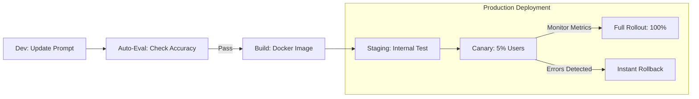

# 🚀 Versioning & Deployment: The Agent CI/CD
> **Level:** Advanced | **Language:** Hinglish | **Goal:** Master the art of deploying agents without downtime, versioning prompts and models like code, and implementing safe release strategies like Blue-Green and Canary.

---

## 🧭 1. Beginner-Friendly Hinglish Explanation
Versioning aur Deployment ka matlab hai **"Naya Update release karna"**.

- **The Problem:** Agar aapne agent ka "System Prompt" change kiya aur naya version kharab nikla, toh saare users pareshan ho jayenge. AI mein ek choti si line change karne se poora behavior badal sakta hai.
- **The Solution:** 
  - **Versioning:** Har prompt aur model ko ek "Name" aur "Version" do (e.g., `Support_Agent_v2.1`). Purana version delete mat karo!
  - **Canary Release:** Naya agent pehle sirf $5\%$ users ko dikhao. Agar wo sahi hai, tab baaki sabko dikhao.
  - **Rollback:** Agar kuch galat ho jaye, toh 1-click mein purane version par wapas chale jao.
- **The Result:** Aap bina dare naye features "Deploy" kar sakte ho.

CI/CD AI ko **"Software Engineering"** ke standards par lata hai.

---

## 🧠 2. Deep Technical Explanation
Agent deployment is different because you are versioning three things simultaneously: **Code**, **Prompts**, and **Models**.

### 1. The 'Three-Way' Versioning:
- **Code Versioning (Git):** The Python logic, API endpoints, and graph structure.
- **Prompt Versioning (PromptOps):** Storing system messages in a DB with versions (e.g., `v1.2` optimized for cost).
- **Model Versioning:** Which specific model ID is being used (`gpt-4o-2024-05-13`).

### 2. Deployment Strategies:
- **Blue-Green:** Keeping two identical environments. Switch all traffic from Blue (v1) to Green (v2) instantly.
- **Canary:** Gradually shifting traffic ($5\% \rightarrow 20\% \rightarrow 100\%$) while monitoring error rates.
- **A/B Testing:** Running two different prompts side-by-side to see which one gets better user feedback.

### 3. CI/CD for AI:
Every "Commit" should trigger an **'Auto-Eval'** where the new agent is tested against $50$ "Golden Test Cases." If accuracy drops, the build fails.

---

## 🏗️ 3. Architecture Diagrams (The Agent Release Pipeline)


---

## 💻 4. Production-Ready Code Example (A Version-Aware Router)
```python
# 2026 Standard: Routing users to different agent versions

def get_agent_for_user(user_id):
    # 1. Check which deployment group the user belongs to
    group = ab_test_service.get_group(user_id) # 'A' or 'B'
    
    if group == 'B':
        # EXPERIMENTAL: Support_v2.0
        return Agent(prompt_version="v2.0", model="gpt-4o")
    else:
        # STABLE: Support_v1.5
        return Agent(prompt_version="v1.5", model="gpt-4o")

# Insight: Never hard-code your prompt in the .py file. 
# Fetch it from a 'Prompt Registry' by version.
```

---

## 🌍 5. Real-World Use Cases
- **Fintech:** Releasing a new "Tax Calculation" agent version only after it passes $100\%$ of legal test cases.
- **E-commerce:** Testing if a "Friendly" prompt or a "Direct" prompt leads to more sales (A/B testing).
- **SaaS:** Rolling back an update that caused the agent to start speaking "Spanish" to English users by mistake.

---

## ❌ 6. Failure Cases
- **The "Model Switch" Disaster:** Upgrading from GPT-3.5 to GPT-4 and realizing the new model is "Too smart" to follow your old hacks, breaking the output format.
- **Orphaned States:** A user was in the middle of a chat with `v1.0`, and you updated to `v2.0`, causing their session to crash because the state schema changed. **Fix: Use 'State Migration' scripts.**
- **No Evaluation:** Deploying a "Faster" prompt that actually hallucinations $20\%$ more than the old one.

---

## 🛠️ 7. Debugging Guide
| Symptom | Cause | Fix |
| :--- | :--- | :--- |
| **New version is failing in production** | Environment Mismatch | Use **'Docker'** to ensure the Dev, Staging, and Production environments are identical. |
| **Users are getting inconsistent answers** | No Version Stickiness | Ensure a user stays on the **'Same Version'** for their entire session to avoid confusion. |

---

## ⚖️ 8. Tradeoffs
- **Rapid Release (Fast innovation/High risk) vs. Slow Release (Stable/Safe).**
- **Monolithic App (Simple) vs. Micro-agents (Scalable but hard to version).**

---

## 🛡️ 9. Security Concerns
- **Rollback Vulnerability:** An attacker exploiting a bug in an "Old Version" that you forgot to delete from your servers.
- **Insecure Registry:** An attacker modifying the "Prompt Registry" to change the production prompt for all users.

---

## 📈 10. Scaling Challenges
- **Global Rollouts:** Deploying a new agent version across 10 different cloud regions simultaneously.

---

## 💸 11. Cost Considerations
- **Running Dual Environments:** Blue-Green deployment requires $2x$ the server capacity for a short time.

---

## 📝 12. Interview Questions
1. What is a "Canary Release" and why is it useful for LLM apps?
2. How do you version "Prompts" as code?
3. What is "Prompt Drift" and how do you detect it after deployment?

---

## ⚠️ 13. Common Mistakes
- **Hard-coding Model IDs:** Not being able to switch models without a full code deploy.
- **Manual Deployment:** Deploying by "Copy-pasting" prompts into a web UI instead of using a CI/CD pipeline.

---

## ✅ 14. Best Practices
- **Atomic Deploys:** Ensure the Code and the Prompt update at the same time.
- **Automated Rollbacks:** If the "Error Rate" goes above $5\%$ in the first 10 minutes, the system should automatically rollback.
- **Shadow Deployment:** Run the new agent "In the background" on real traffic but don't show the result to the user—just compare it with the old agent.

---

## 🚀 15. Latest 2026 Industry Patterns
- **Agentic GitOps:** The "State of the Agent" is managed entirely via Git commits (e.g., changing a prompt file in Git automatically updates the production API).
- **Multi-Model Orchestration (MMO):** Deploying a "Squad" of different models and letting a "Router" decide which one is currently the best.
- **Dynamic Prompt Engineering:** Agents that "Self-update" their own production prompts based on real-time user feedback (Expert-level automation).
