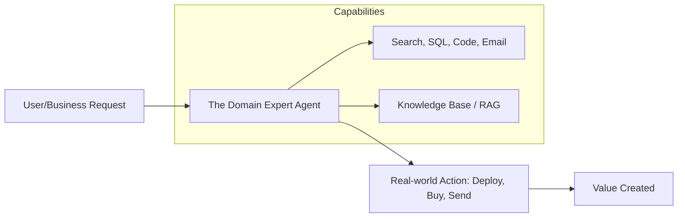

# 🚀 Agent Use Cases & Applications: AI in Action
> **Level:** Fundamentals | **Language:** Hinglish | **Goal:** Explore how autonomous agents are being deployed across industries in 2026 to solve real-world problems and drive business value.

---

## 🧭 1. Beginner-Friendly Hinglish Explanation
Agent Use Cases ka matlab hai **"AI agents ka asalki duniya mein istemal"**.

- **The Difference:** ChatGPT se sirf "Chat" hoti hai. Agents se "Kaam" hota hai.
- **The Concept:** 2026 mein AI sirf "Sawal-Jawab" ke liye nahi hai, balki:
  - **Support:** Customer ki tickets solve karna.
  - **Coding:** Poori app khud likhna aur deploy karna.
  - **Research:** Internet se data dhoondh kar report banana.
  - **Finance:** Automatic trading aur tax calculation.

Agents wahan kaam aate hain jahan kaam **"Repeated"** ho par usme thoda sa "Dimaag" chahiye ho.

---

## 🧠 2. Deep Technical Explanation
Agent applications are categorized by their **Action Space** and **Autonomy Level**.

### 1. Vertical Domains:
- **Coding Agents (SWE):** Full-stack developers that handle Git, Docker, and Unit Tests.
- **Data Agents:** Specialized in SQL, Python dataframes (Pandas), and visualization.
- **Operations Agents:** Handling DevOps, Cloud infrastructure (Terraform), and monitoring.

### 2. The Shift to 'Agent-First' Software:
In 2026, we don't just "Add AI" to an app. We build **Agentic Workflows** where the UI is just a way for humans to interact with the agent's progress.

### 3. ROI Metrics:
Business value is measured by:
- **Task Success Rate:** How often the agent completes the full loop without human help.
- **Cost Efficiency:** Token cost vs. Human salary cost.
- **Latency:** Time taken to solve a complex multi-step problem.

---

## 🏗️ 3. Architecture Diagrams (The Universal Use Case Flow)


---

## 💻 4. Production-Ready Code Example (A General-Purpose Action Dispatcher)
```python
# 2026 Standard: A generic 'Agent Task' handler for various use cases

def handle_agent_task(domain, objective):
    if domain == "E_COMMERCE":
        return shopping_agent.run(f"Find and buy: {objective}")
    elif domain == "CODING":
        return dev_agent.run(f"Fix this bug: {objective}")
    elif domain == "RESEARCH":
        return research_agent.run(f"Write a 3-page report on: {objective}")
    
# Insight: Domain-specific agents outperform 'General' agents 
# by $40\%$ in accuracy.
```

---

## 🌍 5. Real-World Use Cases (The Big Four)
1. **The Autonomous Developer:** Agents like **Devin** or **OpenDevin** that can take a Jira ticket and submit a Pull Request.
2. **The 24/7 Analyst:** Agents that watch stock markets or crypto and execute trades based on sentiment analysis.
3. **The Travel Planner:** An agent that books flights, hotels, and restaurants based on your calendar and preferences.
4. **The Personal Assistant:** Scheduling meetings, sorting emails, and summarizing "Urgent" tasks for you every morning.

---

## ❌ 6. Failure Cases
- **The "Over-Autonomous" Agent:** An agent that spends $\$500$ on Amazon trying to "Help" you with your shopping list.
- **The "Hallucinating" Researcher:** An agent that writes a research paper using "Fake" statistics.
- **The "Broken" Workflow:** An agent that gets stuck because a website changed its layout (UI Drift).

---

## 🛠️ 7. Debugging Guide
| Symptom | Cause | Fix |
| :--- | :--- | :--- |
| **Agent is failing in a specific niche** | Lack of domain data | Use **'Few-shot Examples'** from that specific domain in the system prompt. |
| **High Costs** | Too many generic LLM calls | Use **'Task Classification'** to route easy tasks to cheaper models. |

---

## ⚖️ 8. Tradeoffs
- **Vertical (Specialized) vs. Horizontal (General):** Specialized agents are more accurate; General agents are more flexible.
- **Human-assisted vs. Fully Autonomous:** Fully autonomous is cheaper but higher risk.

---

## 🛡️ 9. Security Concerns
- **Privileged Access:** Giving a "Coding Agent" access to your production database. **Fix: Use 'Read-only' credentials.**
- **Output Injection:** A research agent reading a malicious PDF that tells it to "Phish" the user.

---

## 📈 10. Scaling Challenges
- **Multi-tenant Isolation:** Ensuring one user's agent can't access another user's files or memory.
- **Concurrency:** Handling 1000 agents searching the web at the same time.

---

## 💸 11. Cost Considerations
- **Pay-per-Success Model:** In 2026, many companies charge for "Successful tasks" instead of "Tokens."

---

## 📝 12. Interview Questions
1. What is an "Action Space" in an agentic system?
2. How do you measure the ROI (Return on Investment) of an AI Agent?
3. Which industry is currently being disrupted the most by agents?

---

## ⚠️ 13. Common Mistakes
- **Treating Agents as Chatbots:** Expecting them to just "Talk" instead of "Do."
- **No Grounding:** Letting an agent act without access to "Ground Truth" data (like a company database).

---

## ✅ 14. Best Practices
- **Define clear "Boundaries":** Tell the agent exactly what it is *NOT* allowed to do.
- **Incremental Autonomy:** Start with "AI suggests, Human clicks" before moving to "Full Auto."
- **Standardized Tools:** Build a library of tools (Search, SQL, Mail) that all your agents can reuse.

---

## 🚀 15. Latest 2026 Industry Patterns
- **Multi-modal Agents:** Agents that can "See" your screen and "Click" on buttons like a human (RPA 2.0).
- **Embedded Agents:** AI agents built directly into browsers (e.g. Arc, Chrome) that handle tasks for you as you browse.
- **Agentic Marketplaces:** Platforms where you can "Hire" a specialized agent for a few hours (e.g., an "AI Accountant").
