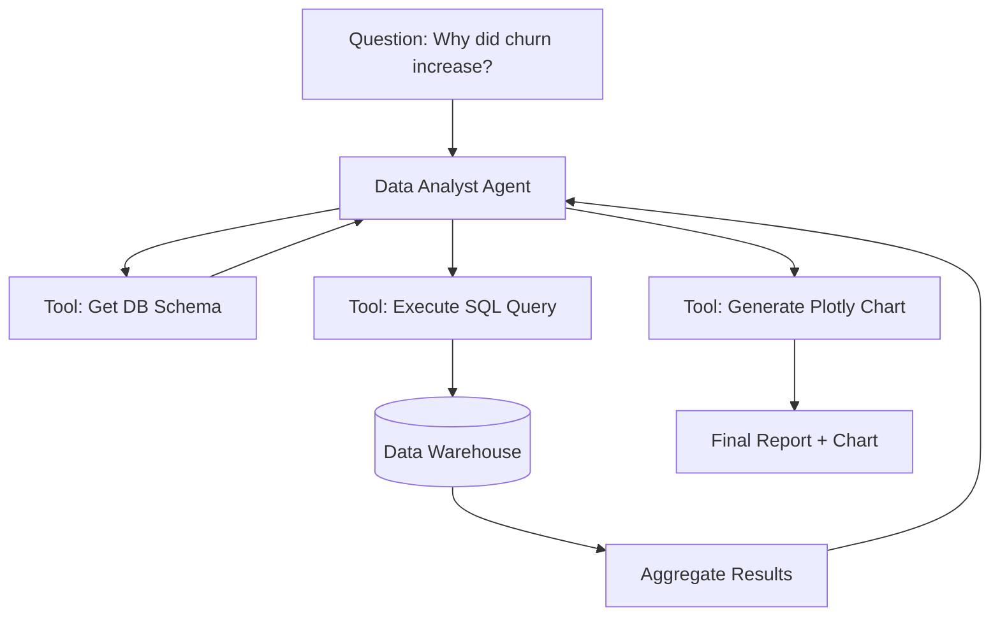

# 📊 Agents in Data Analysis: The AI Data Scientist
> **Level:** Advanced | **Language:** Hinglish | **Goal:** Master the design of agents that can write code, query databases, and generate visual insights from raw data autonomously.

---

## 🧭 1. Beginner-Friendly Hinglish Explanation
Data Analysis Agents ka matlab hai **"AI jo Analyst ka kaam kare"**.

- **The Problem:** Data itna zyada hota hai ki Excel mein handle karna mushkil hai. Aur har koi "Python" ya "SQL" nahi jaanta.
- **The Solution:** Data Agents aapki natural language (English/Hindi) ko code mein badal dete hain.
  - Aap kehte ho: "Mujhe pichle 6 mahine ki sales ka chart dikhao."
  - Agent piche se **SQL query** likhta hai.
  - Phir wo **Python code** likhta hai chart banane ke liye.
  - Aur aapko final **Image** (Graph) dikha deta hai.

Ye agents sirf "Data" nahi dikhate, balki us data ka "Matlab" (Insights) batate hain.

---

## 🧠 2. Deep Technical Explanation
Data agents use the **Code Interpreter** pattern to maintain high accuracy and prevent calculation hallucinations.

### 1. The Core Workflow:
- **Semantic Mapping:** The agent understands the database schema (Table names, Columns).
- **Code Generation:** Writing SQL (for retrieval) or Python/Pandas (for analysis).
- **Sandboxed Execution:** Running the code in a safe environment and capturing the stdout/files.
- **Reasoning over Results:** Looking at the generated table and explaining what it means (e.g., "Sales dropped in July because of X").

### 2. Tools of the Trade:
- **SQL Connectors:** Interacting with Snowflake, BigQuery, or Postgres.
- **Visualization Libs:** Using Matplotlib, Seaborn, or Plotly.
- **Statistical Tools:** Using Scipy or Statsmodels for hypothesis testing.

### 3. Handling Large Datasets:
Instead of sending 1 million rows to the LLM, the agent sends **Aggregate Queries** and only receives the summarized results.

---

## 🏗️ 3. Architecture Diagrams (The Data Agent Loop)


---

## 💻 4. Production-Ready Code Example (A Python Analysis Tool)
```python
# 2026 Standard: Executing Python for data insights

import pandas as pd

def analyze_csv_tool(file_path, question):
    df = pd.read_csv(file_path)
    
    # The Agent generates this snippet:
    analysis_code = f"""
import pandas as pd
df = pd.read_csv('{file_path}')
result = df.groupby('category')['sales'].sum().to_json()
print(result)
    """
    
    # Execute in sandbox
    output = sandbox.execute_python(analysis_code)
    return output

# Insight: Never let the LLM 'Calculate' the average. 
# Let the LLM 'Write the code' that calculates the average.
```

---

## 🌍 5. Real-World Use Cases
- **Marketing ROI:** An agent that connects to Google Ads and Shopify to calculate "Customer Acquisition Cost" (CAC).
- **Inventory Management:** Predicting when a product will go out of stock based on last 30 days' sales trend.
- **Financial Auditing:** Automatically finding "Outliers" (suspicious transactions) in a list of 1 million entries.

---

## ❌ 6. Failure Cases
- **Calculation Hallucination:** The agent tries to sum numbers in its "Head" instead of using Python. **Fix: Force tool-use for all math.**
- **Schema Confusion:** Agent joins the `users` table and `orders` table on the wrong column.
- **Resource Exhaustion:** Agent writes a Python script that tries to load a 100GB file into RAM.

---

## 🛠️ 7. Debugging Guide
| Symptom | Cause | Fix |
| :--- | :--- | :--- |
| **SQL Error: Column not found** | Outdated Schema | Refresh the **Metadata/Schema** provided to the agent before it writes the SQL. |
| **Chart is empty** | Data filtering was too strict | Log the **Intermediate Dataframe** to see if the agent filtered out all the rows. |

---

## ⚖️ 8. Tradeoffs
- **Text-to-SQL vs. Text-to-Python:** SQL is better for massive data filtering; Python is better for complex math and viz.
- **Security vs. Capability:** Giving an agent "Delete" access to the DB is dangerous but allows it to "Clean" data.

---

## 🛡️ 9. Security Concerns
- **SQL Injection:** An attacker using the agent to run `DROP TABLE users;`. **Fix: Use 'Read-only' DB users and parameterized queries.**
- **Data Privacy:** Agent showing sensitive "Salary" data because it wasn't told to ignore that column.

---

## 📈 10. Scaling Challenges
- **Concurrent Heavy Queries:** 100 agents all running complex joins on the production DB. **Solution: Use a 'Data Warehouse' (Read-replica).**

---

## 💸 11. Cost Considerations
- **High Token Count:** Sending table headers and sample rows to the LLM uses many tokens. **Strategy: Send only the top 3 rows as an example.**

---

## 📝 12. Interview Questions
1. How do you prevent an AI from hallucinating mathematical results?
2. What is a "Read-only Replica" and why is it essential for Data Agents?
3. How do you handle unstructured data (like PDFs) in a Data Analysis workflow?

---

## ⚠️ 13. Common Mistakes
- **No Data Validation:** Assuming the LLM's generated code is always correct.
- **Ignoring Nulls:** Agent forgetting that `NaN` values can break its Python logic.

---

## ✅ 14. Best Practices
- **Schema Grounding:** Always provide a JSON/YAML file describing the DB structure.
- **Incremental Analysis:** First show the "Summary Stats," then ask the user "Which part should I dive into?".
- **Code Logging:** Always show the user the **Actual SQL/Python** used, for transparency.

---

## 🚀 15. Latest 2026 Industry Patterns
- **Natural Language BI (Business Intelligence):** Replacing dashboards (Tableau/PowerBI) with a single chat box where the agent builds charts on the fly.
- **Self-Improving Dashboards:** Agents that "Notice" a trend and build a new dashboard tile to track it automatically.
- **Multi-modal Data Agents:** Agents that can analyze **Charts** (Images) from a PDF and combine them with **SQL** data from a DB.
