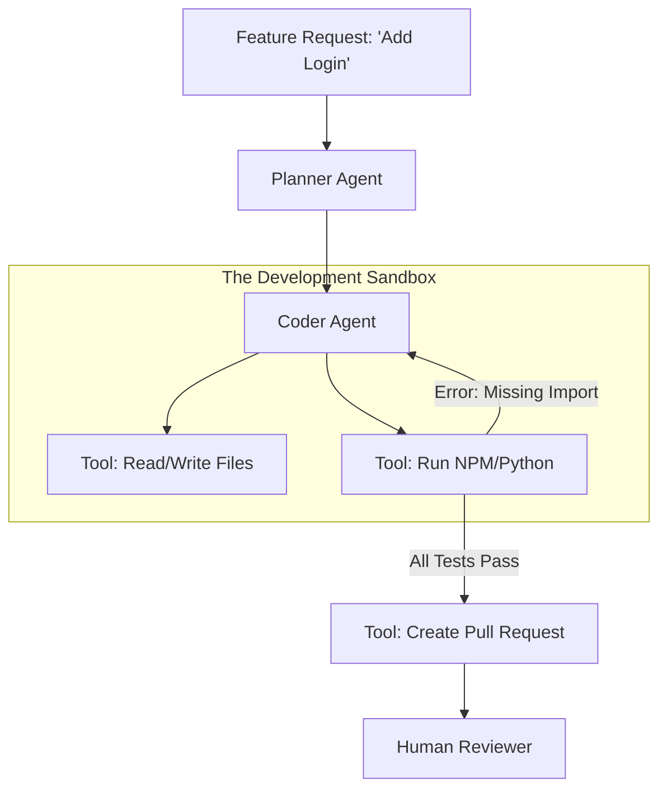

# 💻 Agents in Software Development: The Autonomous Engineer
> **Level:** Extreme Advanced | **Language:** Hinglish | **Goal:** Master the design of "Agentic IDEs" and autonomous coding agents that can plan, write, test, and deploy entire codebases.

---

## 🧭 1. Beginner-Friendly Hinglish Explanation
Software Development Agents ka matlab hai **"AI jo Programmer ka kaam kare"**.

- **The Problem:** Coding sirf syntax nahi hai. Isme "Files" manage karna, "Terminal" chalana, aur "Debugging" karna sab shamil hai.
- **The Solution:** Modern Coding Agents (jaise Devin) sirf code likhte nahi hain, wo:
  - **Plan** karte hain: "Pehle database banate hain, phir API."
  - **Execution:** Files create karte hain aur logic likhte hain.
  - **Self-Correction:** Code run karte hain, agar error aaye toh wapas jaakar code theek karte hain.
  - **Deployment:** Final code ko server par push karte hain.

Ye agents "Copilot" se bade hain; ye aapke **"Junior Developer"** hain.

---

## 🧠 2. Deep Technical Explanation
Software engineering agents operate in a **Hierarchical Feedback Loop**.

### 1. The SWE-Agent Framework:
- **Planner:** Breaks the requirements into a "Task Graph."
- **Coder:** Uses tools to `read_file`, `edit_file`, and `create_file`.
- **Test Node:** Runs unit tests (`pytest`, `jest`) and provides the traceback as feedback.
- **Linter Node:** Ensures code style and catches simple syntax errors.

### 2. Statefulness & Large Repos:
Agents can't fit the whole repo in their context window.
- **Repository Indexing:** Using a Vector DB to search for relevant files based on the task.
- **Call-Graph Analysis:** Understanding which functions depend on which, so the agent doesn't break a distant part of the code.

### 3. Tool-Use in Dev:
Tools include `grep` (search), `ls` (list files), `terminal` (run code), and `git` (commit/push).

---

## 🏗️ 3. Architecture Diagrams (The Autonomous Coder)


---

## 💻 4. Production-Ready Code Example (A File Editor Tool)
```python
# 2026 Standard: A tool that allows the agent to edit specific lines

def edit_file_tool(path, start_line, end_line, new_content):
    with open(path, 'r') as f:
        lines = f.readlines()
    
    # Replace lines
    lines[start_line-1:end_line] = [new_content + "\n"]
    
    with open(path, 'w') as f:
        f.writelines(lines)
    
    return f"Successfully updated {path} from line {start_line} to {end_line}."

# Insight: Avoid 'Overwriting' the whole file. 
# Line-by-line editing is safer and uses fewer tokens.
```

---

## 🌍 5. Real-World Use Cases
- **Legacy Migration:** An agent that takes old Java code and rewrites it into modern Python.
- **Automated Bug Fixing:** An agent that watches "Sentry" logs and automatically creates PRs to fix 500 errors.
- **Documentation Generation:** An agent that reads the whole codebase and writes the `README.md` and API docs.

---

## ❌ 6. Failure Cases
- **The "Library Hell":** The agent tries to use an outdated library version, causing a conflict.
- **Infinite Refactoring:** The agent keeps changing the variable names from `user_id` to `userID` and back forever.
- **Security Vulnerabilities:** The agent accidentally writes "Insecure" code (e.g., SQL injection) because it was focused only on "Functionality."

---

## 🛠️ 7. Debugging Guide
| Symptom | Cause | Fix |
| :--- | :--- | :--- |
| **Agent is stuck on an error** | Missing Environment Variable | Check the **Terminal Output** for 'ImportError' or 'KeyError'. |
| **Agent is changing too many files** | Unconstrained Plan | Force the agent to **'List affected files'** and get approval before starting. |

---

## ⚖️ 8. Tradeoffs
- **Speed vs. Correctness:** Fast coding agents often skip tests; Slow agents are more reliable.
- **Framework Choice:** Using LangGraph for control vs. using a fully autonomous "Agent" loop.

---

## 🛡️ 9. Security Concerns (Critical)
- **Arbitrary Code Execution:** If the agent is hacked, it can run `rm -rf /` on your server. **ALWAYS use an isolated Docker sandbox.**
- **Secret Leaking:** Agent committing `.env` files to GitHub.

---

## 📈 10. Scaling Challenges
- **Massive Repositories:** Handling a codebase with $10,000$ files. **Solution: Use a 'Filesystem Map' agent to help the 'Coder' find the right file.**

---

## 💸 11. Cost Considerations
- **High Token Consumption:** Reading and writing long code files is expensive. **Strategy: Use 'Line Diff' format (like Git) instead of sending the full file.**

---

## 📝 12. Interview Questions
1. How do you implement "Self-correction" in a coding agent?
2. What is a "Sandbox" and why is it mandatory for dev agents?
3. How can an agent understand a repository that is too large for its context window?

---

## ⚠️ 13. Common Mistakes
- **No Human Review:** Merging AI-generated code directly into production without a human looking at it.
- **No Linter:** Letting the AI write messy, unformatted code.

---

## ✅ 14. Best Practices
- **Test-Driven Development (TDD):** Tell the agent to "Write the tests first," then the code.
- **Atomic Commits:** Tell the agent to commit every small feature change separately with a clear message.
- **Isolated Sandbox:** Use **E2B** or **Docker** for all code execution.

---

## 🚀 15. Latest 2026 Industry Patterns
- **Agentic IDEs:** VS Code extensions that act like a "Pair Programmer" who can take control of the terminal and files.
- **Architect Agents:** Agents that don't code, but only design the "System Architecture" (UML/Mermaid) for other agents to follow.
- **Self-Healing Infrastructure:** Agents that monitor server crashes and "Rewrite the code" to fix the root cause in real-time.
