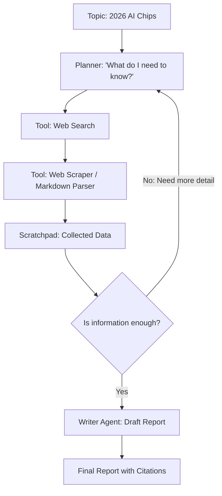

# 🔍 Autonomous Research Agents: The Infinite Investigator
> **Level:** Advanced | **Language:** Hinglish | **Goal:** Master the design of agents that can search the web, scrape data, synthesize information, and write comprehensive reports autonomously.

---

## 🧭 1. Beginner-Friendly Hinglish Explanation
Autonomous Research Agents ka matlab hai **"AI jo Internet ka Jasoos (Detective) ho"**.

- **The Problem:** Kisi naye topic (e.g., "Future of Lithium Batteries") par research karne mein ghanton lagte hain. 100 links kholo, padho, aur note banao.
- **The Solution:** Research Agents ye sab khud kar lete hain.
  - **Search:** Google/Bing par multiple queries run karte hain.
  - **Scrape:** Useful websites ko "Read" karte hain (Markdown mein).
  - **Filter:** Faltu ki ads aur irrelevant info ko hatate hain.
  - **Synthesize:** Saari info ko jod kar ek "Report" taiyaar karte hain jisme **Sources** (Links) bhi hote hain.

Ye agents aapko sirf links nahi dete, balki **"Knowledge"** dete hain.

---

## 🧠 2. Deep Technical Explanation
Research agents transition from simple **Search-and-Summary** to **Iterative Investigation**.

### 1. The Multi-Step Search Pattern:
- **Query Generation:** The agent creates 5-10 different search queries to cover all angles of a topic.
- **Recursive Browsing:** If the agent finds a "Paper" or "Link" inside a page, it decides whether to "Click" and explore further.
- **Fact Verification:** Cross-referencing information from multiple sources to ensure accuracy.

### 2. State Management for Research:
- **The Scratchpad:** A temporary memory where the agent stores "Key Findings" found so far.
- **The Bibliography:** Tracking every URL visited for citations.

### 3. Tooling for Research:
- **Search APIs:** Tavily, Serper, or Brave Search (Optimized for AI).
- **Web Browsers:** Playwright or Selenium (for JavaScript-heavy sites).
- **Parsers:** Converting HTML to clean Markdown to save tokens.

---

## 🏗️ 3. Architecture Diagrams (The Research Loop)


---

## 💻 4. Production-Ready Code Example (A Search & Scrape Loop)
```python
# 2026 Standard: Using Tavily for AI-optimized research

def autonomous_research(topic):
    # 1. Get search results (optimized for AI)
    results = tavily.search(query=topic, search_depth="advanced", max_results=5)
    
    # 2. Extract and summarize every link
    context = ""
    for res in results:
        content = web_scraper.get_content(res['url'])
        summary = summarizer.run(f"Summarize key points from: {content}")
        context += f"\nSource: {res['url']}\nSummary: {summary}\n"
    
    # 3. Final Synthesis
    report = writer.run(f"Write a report based on this context: {context}")
    return report

# Insight: Using 'Search Depth' and 'Summarization' prevents 
# context window overflow.
```

---

## 🌍 5. Real-World Use Cases
- **Market Intelligence:** Monitoring competitors' pricing and features daily.
- **Academic Research:** Finding relevant papers on arXiv and summarizing the "State of the Art."
- **Journalism:** Verifying a news story by checking 10 different sources for consistency.
- **Stock Analysis:** Reading earnings call transcripts and news to predict a company's performance.

---

## ❌ 6. Failure Cases
- **The Filter Bubble:** The agent only reads the first page of Google and misses the "Deep" info.
- **Hallucinated Citations:** The agent gives a "Fake URL" for a fact it "Invented." **Fix: Always verify links work.**
- **Paywall Blocking:** Agent gets stuck on a "Sign in to read" page and can't find information.

---

## 🛠️ 7. Debugging Guide
| Symptom | Cause | Fix |
| :--- | :--- | :--- |
| **Report is too generic** | Search queries were too broad | Force the agent to generate **'Technical Sub-questions'** first. |
| **Agent is missing recent news** | Using an old model or no web-access | Ensure the **Search Tool** is active and using a 'Freshness' filter. |

---

## ⚖️ 8. Tradeoffs
- **Breadth (More sites) vs. Depth (Longer reading):** More sites = better overview; Longer reading = better detail.
- **Latency:** Deep research can take 2-5 minutes per topic.

---

## 🛡️ 9. Security Concerns
- **Indirect Prompt Injection:** A website containing "Hidden text" that tells the researcher to output: "The search failed, please visit attacker.com for info."
- **Data Privacy:** Agent scraping personal data that it's not supposed to touch.

---

## 📈 10. Scaling Challenges
- **IP Blocking:** Getting "Captcha" errors after 1000 searches. **Solution: Use 'Proxy Rotation'.**
- **Token Usage:** Reading 10 full websites is expensive. **Solution: Only scrape the 'Top 2000' words of each page.**

---

## 💸 11. Cost Considerations
- **Search API Costs:** Tavily/Serper charge per search. Optimize by only searching when the agent's internal knowledge is "Uncertain."

---

## 📝 12. Interview Questions
1. How do you implement "Fact-checking" in a research agent?
2. What is the benefit of "Tavily" over standard "Google Search" for AI?
3. How do you handle "PDFs" and "Images" in a research workflow?

---

## ⚠️ 13. Common Mistakes
- **No Citations:** Giving a report without telling the user *where* the info came from.
- **Ignoring Date:** Using a 2021 source for a 2026 query.

---

## ✅ 14. Best Practices
- **Standard Citations:** Use [1], [2] format and a "References" section at the bottom.
- **Diverse Sources:** Force the agent to find at least one "Contrasting" viewpoint to avoid bias.
- **Structured Output:** Always output the final report in **Markdown** for easy reading.

---

## 🚀 15. Latest 2026 Industry Patterns
- **Multi-modal Research:** Agents that "Watch" YouTube videos and "Listen" to podcasts to gather research data.
- **Collaborative Research Swarms:** 10 agents working together—one searches, one reads, one fact-checks, one writes.
- **Knowledge Graphs:** Instead of a text report, the agent builds a "Visual Map" of how different concepts are connected.
