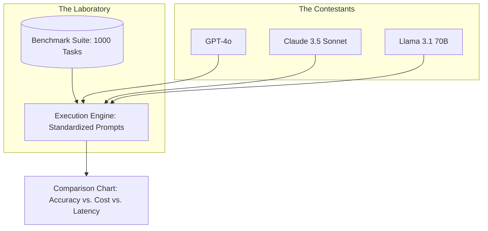

# 📊 Benchmarking Agent Performance: Standardized Intelligence
> **Level:** Advanced | **Language:** Hinglish | **Goal:** Master the use of industry-standard benchmarks (MMLU, HumanEval, GAIA) and custom internal benchmarks to compare different models and agent architectures.

---

## 🧭 1. Beginner-Friendly Hinglish Explanation
Benchmarking ka matlab hai **"AI ka Comparison karna"**.

- **The Problem:** Har model (OpenAI, Claude, Llama) kehta hai ki wo "Best" hai. Hum kaise maanein?
- **The Solution:** Humein ek "Standard Paper" (Benchmark) chahiye jisme wahi sawaal sabke liye hon.
  - **Logic Benchmarks:** Check karte hain ki AI kitna samajhdaar hai.
  - **Coding Benchmarks:** Check karte hain ki AI kitna sahi code likhta hai.
  - **Agentic Benchmarks (GAIA):** Check karte hain ki AI "Tools" (Browser, Files) ko kitna acche se use karta hai.
- **The Goal:** Ye pata lagana ki hamare kaam ke liye kaunsa model "Sasta aur Accha" (Cost-effective) hai.

Benchmarking se hum "Marketing" aur "Reality" ke beech ka farq samajhte hain.

---

## 🧠 2. Deep Technical Explanation
Benchmarking is the practice of evaluating models on **Fixed Datasets** with **Standardized Prompts**.

### 1. Popular Industry Benchmarks:
- **MMLU (Massive Multitask Language Understanding):** General knowledge and reasoning across 57 subjects.
- **HumanEval / MBPP:** Testing Python coding skills by writing functions from docstrings.
- **GSM8K:** Grade school math word problems (Testing step-by-step logic).
- **GAIA (General AI Assistants):** Tasks that require tool-use, web browsing, and multi-modal reasoning.

### 2. The 'Internal' Benchmark (The Custom Suite):
Industry benchmarks are often "Contaminated" (models might have seen the test data during training). The 2026 standard is to build a **'Private Benchmark'** specific to your business logic.

### 3. Metric Aggregation:
Using **Pass@k** (the probability that at least one of the $k$ generated samples is correct) to measure reliability in non-deterministic systems.

---

## 🏗️ 3. Architecture Diagrams (The Benchmarking Lab)


---

## 💻 4. Production-Ready Code Example (A Benchmark Comparison Script)
```python
# 2026 Standard: Benchmarking tool-use accuracy

models_to_test = ["gpt-4o", "claude-3-5-sonnet", "llama-3.1-70b"]
test_cases = [
    {"query": "Check price of AAPL", "expected_tool": "stock_tool"},
    {"query": "Email CEO the report", "expected_tool": "email_tool"},
]

def run_benchmark():
    results = {}
    for model in models_to_test:
        correct = 0
        for case in test_cases:
            prediction = call_model(model, case["query"])
            if prediction.tool_name == case["expected_tool"]:
                correct += 1
        results[model] = (correct / len(test_cases)) * 100
    return results

# Insight: Always compare 'Accuracy' alongside 'Cost'. 
# A $1\%$ accuracy gain might not be worth a $10x$ cost increase.
```

---

## 🌍 5. Real-World Use Cases
- **Enterprise Triage:** Deciding if you should use a cheap $7B$ model for "Sentiment Analysis" or a $400B$ model.
- **Autonomous Dev Teams:** Benchmarking different agents to see which one creates fewer "Security Bugs" in generated code.
- **Chatbot Optimization:** Testing if "Few-shot" prompting on a small model can beat "Zero-shot" on a large model.

---

## ❌ 6. Failure Cases
- **Benchmark Contamination:** The model "Memorized" the benchmark during training, so its 99% score is fake.
- **Goodhart’s Law:** "When a measure becomes a target, it ceases to be a good measure." (Engineers making the model good at MMLU but bad at real-world chat).
- **Static Benchmarks:** Using 2-year-old benchmarks for 2026 models.

---

## 🛠️ 7. Debugging Guide
| Symptom | Cause | Fix |
| :--- | :--- | :--- |
| **Model scores high on logic but fails in prod** | Lack of 'Instruction Following' | Use **'Complex Constraint'** benchmarks (e.g., "Explain X in 50 words without using the letter 'e'"). |
| **Benchmark takes hours to run** | Sequential execution | Use **'Parallel Processing'** to run 50 model calls at once. |

---

## ⚖️ 8. Tradeoffs
- **Public Benchmarks (Free/Standardized) vs. Private Benchmarks (Relevant/Secure).**
- **Automated Benchmarking (Fast) vs. Human-graded Benchmarking (Accurate).**

---

## 🛡️ 9. Security Concerns
- **Adversarial Benchmarking:** Attackers creating "Poisoned" benchmarks that make their malicious model look "Safe" and "Smart."

---

## 📈 10. Scaling Challenges
- **Large-Scale Evals:** Benchmarking on 1 million rows. **Solution: Use 'Clustering' to find 1000 representative samples and only test those.**

---

## 💸 11. Cost Considerations
- **Benchmark GPU Burn:** Running a full benchmark suite on 10 models can cost $\$1000$ in tokens. Only do this for "Major" releases.

---

## 📝 12. Interview Questions
1. What is "Benchmark Contamination"?
2. Explain the difference between MMLU and GSM8K.
3. How do you build a "Custom Benchmark" for a legal AI agent?

---

## ⚠️ 13. Common Mistakes
- **Ignoring Latency:** Only looking at the "Accuracy" score and forgetting that the model is too slow for real-time use.
- **Trusting Model Providers:** Taking the scores on their website at face value without verifying them yourself.

---

## ✅ 14. Best Practices
- **Use 'Dynamic' Benchmarks:** Change your test questions slightly every month to avoid contamination.
- **Include 'Cost-per-1k-tokens' in your report:** Accuracy is nothing without affordability.
- **Test in 'Real Environment':** Don't just test the LLM; test the full agent with its tools.

---

## 🚀 15. Latest 2026 Industry Patterns
- **Live Benchmarking:** Systems that constantly benchmark models in the background and "Swap" them in production if one becomes better/cheaper.
- **Multi-modal Benchmarks:** Testing an agent's ability to "See" a chart and "Write" a summary.
- **Agentic ELO:** Having models "Fight" each other (judged by a stronger model) to build a ranking system (Chatbot Arena style).
