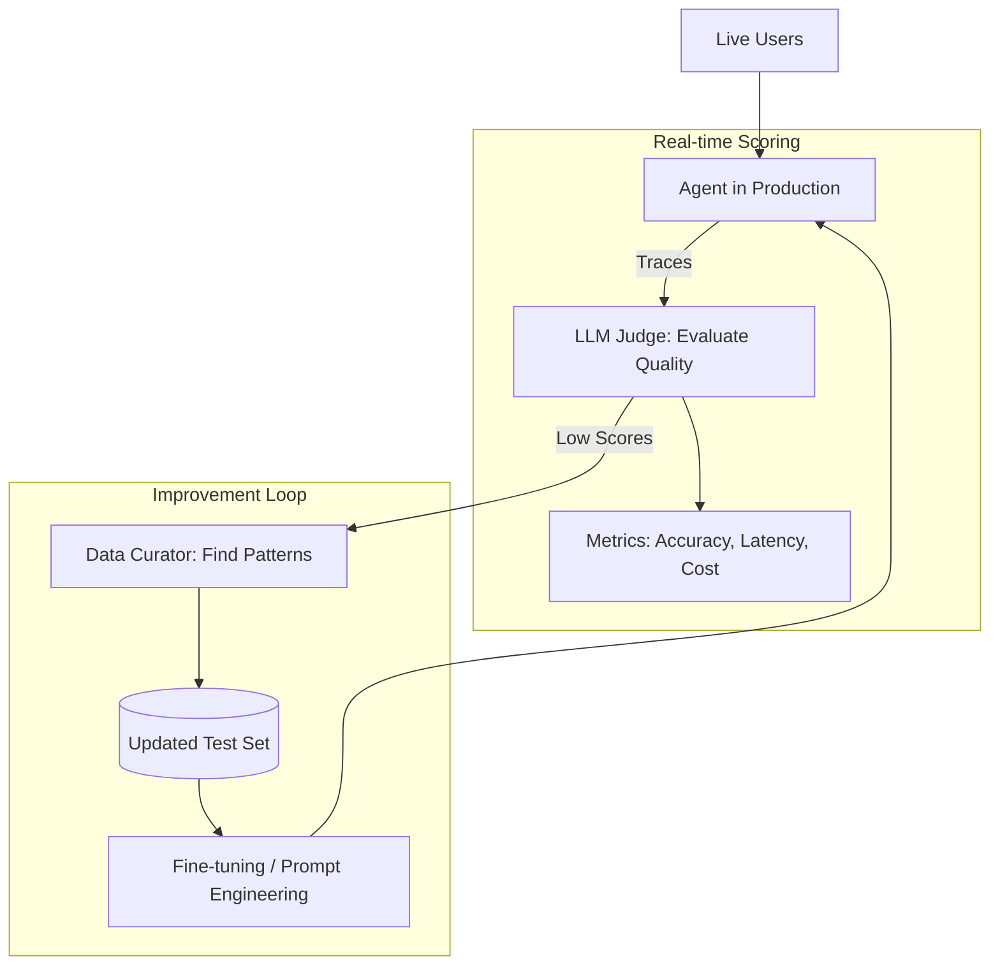

# ♻️ Continuous Evaluation: The Ever-Learning Agent
> **Level:** Advanced | **Language:** Hinglish | **Goal:** Master the production-grade workflows for "Continuous Evaluation"—where agents are constantly monitored, scored, and improved in real-time based on live performance and shifting data distributions.

---

## 🧭 1. Beginner-Friendly Hinglish Explanation
Continuous Evaluation ka matlab hai **"Hamesha Exam chalu rehna"**.

- **The Problem:** AI model release ke waqt sahi ho sakta hai, par "Duniya" badal jati hai (e.g., naye laws, naya slang, naye products). Isse AI ki quality dheere-dheere kam ho jati hai.
- **The Concept:** 
  - Hum AI ko kabhi "Sone" (Sleep) nahi dete.
  - Har live conversation ko background mein score kiya jata hai.
  - Agar quality girti hai, toh engineers ko turant alert milta hai.
- **The Goal:** AI ko "Purana" (Outdated) hone se bachana aur use har roz "Smarter" banana.

Continuous evaluation AI ke liye ek **"Fitness Tracker"** jaisa hai.

---

## 🧠 2. Deep Technical Explanation
Continuous evaluation (Cont-Eval) integrates **Production Observability** with **Automated Benchmarking**.

### 1. The Cont-Eval Loop:
- **Streaming Telemetry:** Exporting live traces to a scoring engine (LangSmith/Phoenix).
- **Online Scoring:** Using "LLM Judges" or "Deterministic Checkers" to score $1-10\%$ of live traffic instantly.
- **Drift Detection:** Monitoring for shifts in the distribution of user queries (e.g., users starting to ask about a new product you haven't trained on).

### 2. The Feedback Pipeline:
Converting "Low-score" sessions into new **Test Cases**. This is called **'Data Graduation'**—where a real failure becomes a permanent part of the evaluation suite.

---

## 🏗️ 3. Architecture Diagrams (The Continuous Improvement Engine)


---

## 💻 4. Production-Ready Code Example (An Automated Evaluation Trigger)
```python
# 2026 Standard: Automatically flagging bad sessions for review

def post_session_analysis(session_trace):
    # 1. Ask a 'Cheap' model to find potential issues
    judge_prompt = f"Analyze this session for Hallucinations: {session_trace}"
    score = evaluator_model.run(judge_prompt)
    
    if score.is_hallucination:
        # 2. Alert and Save to 'Improvement' Dataset
        alert_dev_team(f"🚨 Hallucination detected in session {session_trace.id}")
        dataset_service.add_to_finetuning_set(session_trace)
        
    return score

# Insight: Don't just log errors; 'Categorize' them 
# so you know what to fix first.
```

---

## 🌍 5. Real-World Use Cases
- **Search Engines:** Monitoring if the "Click-through rate" on AI summaries is dropping, indicating the summaries are becoming less useful.
- **Virtual Assistants:** Detecting when users start "Repeating" their questions (sign of agent confusion) and updating the knowledge base.
- **Code Generation:** Monitoring if "Generated Code" is failing CI/CD more often after a model update.

---

## ❌ 6. Failure Cases
- **The "Judge Bias" Drift:** The AI judge itself starts becoming biased or lazy over time, leading to wrong evaluation scores.
- **Feedback Exhaustion:** Generating too many "Alerts" for the dev team, causing them to ignore all of them.
- **Cost Spirals:** Scoring $100\%$ of sessions using a big model like GPT-4 can cost more than the actual agent. **Fix: Use 'Sampling' and 'Small Judge Models'.**

---

## 🛠️ 7. Debugging Guide
| Symptom | Cause | Fix |
| :--- | :--- | :--- |
| **Performance is dropping but no alerts** | Eval criteria is too loose | Tighten your **'Evaluation Rubric'** and add more specific "Negative" test cases. |
| **Too many False Positives** | Judge doesn't have enough context | Provide the **'Ground Truth'** or **'Internal Knowledge'** to the judge model so it can be more accurate. |

---

## ⚖️ 8. Tradeoffs
- **Real-time Scoring (Fast Alerts/High Cost) vs. Batch Scoring (Slow Alerts/Low Cost).**
- **Automated Evals (Scalable) vs. Manual Gold-Standard Audits (Slow but Perfect).**

---

## 🛡️ 9. Security Concerns
- **Eval Manipulation:** An attacker providing "Good Feedback" on their own malicious prompts to trick the continuous evaluation system into thinking they are safe.
- **Data Privacy:** Ensuring "Private User Info" is removed from the failure cases before they are sent to the "Data Curator."

---

## 📈 10. Scaling Challenges
- **Managing 1B Spans per Day:** How to store and query trillions of evaluation tokens? **Solution: Use 'Vector Summaries' of traces for long-term trends.**

---

## 💸 11. Cost Considerations
- **Sampling Strategy:** Start by scoring $1\%$ of traffic. Increase to $5\%$ only if you detect high volatility.

---

## 📝 12. Interview Questions
1. What is "Concept Drift" in AI?
2. How do you implement a "Continuous Feedback Loop" for an agent?
3. What are the benefits of "LLM-as-a-Judge" over human evaluation?

---

## ⚠️ 13. Common Mistakes
- **No 'Human-in-the-loop' for Evals:** Trusting the automated scores $100\%$ without ever checking them manually.
- **Slow Feedback Loop:** Taking 1 month to update the agent after a failure is detected. (Aim for 24-48 hours).

---

## ✅ 14. Best Practices
- **Define SLIs/SLOs:** (Service Level Indicators) for your agent's "Accuracy" and "Helpfulness."
- **Regression Testing:** Every time you fix a bug found by Cont-Eval, ensure that bug never comes back.
- **Dashboard Transparency:** Show the "Real-time Quality Score" to the whole company.

---

## 🚀 15. Latest 2026 Industry Patterns
- **Self-Healing Prompts:** Agents that rewrite their own system prompts every night based on the previous day's failures (The 'Self-Optimization' loop).
- **Crowd-sourced Evals:** Using your most "Expert" users to help score difficult traces in exchange for credits.
- **Cross-model Consistency:** Monitoring if different models (OpenAI vs. Anthropic) are starting to "Disagree" on the same tasks, indicating a shift in the underlying data logic.
