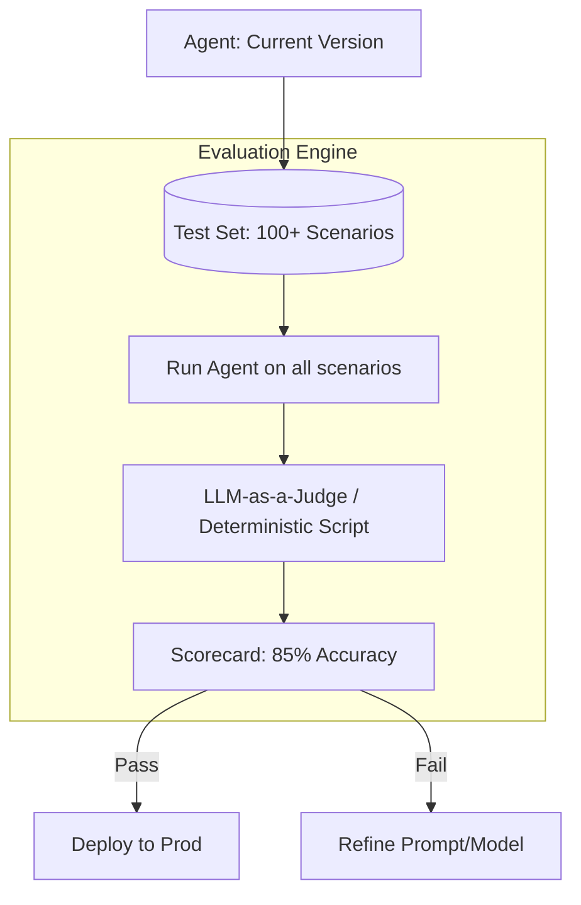

# 🧪 Evaluation & Testing Fundamentals: Measuring Intelligence
> **Level:** Fundamentals | **Language:** Hinglish | **Goal:** Understand the core principles of AI evaluation, focusing on how to scientifically measure whether an agent is "Smart," "Safe," and "Reliable" before it goes live.

---

## 🧭 1. Beginner-Friendly Hinglish Explanation
Evaluation aur Testing ka matlab hai **"AI ka Exam lena"**.

- **The Problem:** AI "Moody" hota hai. Ek bar sahi answer deta hai, dusri bar galat. Hum kaise yakeen karein ki hamara agent production ke liye ready hai?
- **The Solution:** 
  - **Unit Testing:** Chote-chote tools ko check karna (e.g., "Kya calculator tool sahi math kar raha hai?").
  - **Evals (Evaluations):** AI ko 100 sawaal dena aur uske answers ko score karna.
  - **Human Feedback:** Insaan se puchna ki "Kya ye answer helpful tha?"
- **The Goal:** AI ko "Guesswork" se nikaal kar "Certainty" par lana.

Evaluation ke bina AI building "Andhere mein teer chalane" (Shooting in the dark) jaisa hai.

---

## 🧠 2. Deep Technical Explanation
AI Testing is fundamentally different from traditional Software Testing because the output is **Probabilistic**, not **Deterministic**.

### 1. The Evaluation Hierarchy:
- **Level 1: Functional Testing:** Checking if the tools (APIs/Databases) work correctly.
- **Level 2: Model Performance:** Measuring accuracy, latency, and token usage.
- **Level 3: Agentic Logic:** Checking if the agent picks the right tool for the right task (Tool Use Accuracy).
- **Level 4: Safety & Guardrails:** Stress-testing the agent with "Red Teaming" prompts.

### 2. Metrics (The 2026 Standards):
- **Exact Match (EM):** Does the answer match the ground truth exactly? (Good for data extraction).
- **F1 Score:** Balance between precision and recall.
- **BERTScore / G-Eval:** Using another LLM (like GPT-4) to grade the response based on a rubric (coherence, relevance, safety).

---

## 🏗️ 3. Architecture Diagrams (The Evaluation Pipeline)


---

## 💻 4. Production-Ready Code Example (A Simple Eval Script)
```python
# 2026 Standard: Using 'G-Eval' pattern to grade responses

def evaluate_response(user_query, agent_answer, expected_truth):
    # We use a 'Judge' model to compare the answer with the truth
    eval_prompt = f"""
    Compare the Agent Answer with the Ground Truth. 
    Score it from 1 to 5 based on Accuracy.
    
    QUERY: {user_query}
    TRUTH: {expected_truth}
    AGENT: {agent_answer}
    
    SCORE:
    """
    score = judge_model.run(eval_prompt)
    return int(score)

# Insight: Always 'Automate' your evals. 
# Manual testing doesn't scale.
```

---

## 🌍 5. Real-World Use Cases
- **Customer Support:** Testing if the agent correctly identifies a "Refund Request" across 50 different ways a user could ask for it.
- **Legal Agents:** Testing if the agent correctly extracts "Termination Clauses" from 100 different contract formats.
- **Data Analysts:** Ensuring the agent generates the correct SQL query for a complex natural language question.

---

## ❌ 6. Failure Cases
- **The "Over-fit" Trap:** The agent is great at the 10 questions in your test set, but fails on everything else. **Fix: Use 'Diverse' and 'Synthetic' test data.**
- **The "Lazy Judge":** Using a weak model (like GPT-3.5) to judge a strong model (like GPT-4). The judge might miss subtle errors.
- **Ignoring Latency:** The agent is $99\%$ accurate but takes 2 minutes to answer.

---

## 🛠️ 7. Debugging Guide
| Symptom | Cause | Fix |
| :--- | :--- | :--- |
| **Scores are inconsistent** | Judge model is non-deterministic | Set **Judge Temperature to 0.0** and provide a very **'Detailed Rubric'**. |
| **Agent fails on 'Complex' tasks** | Test set is too simple | Add **'Multi-step'** scenarios where the agent must use 3+ tools to get the answer. |

---

## ⚖️ 8. Tradeoffs
- **Human Eval (High Quality/Slow/Expensive) vs. AI Eval (Lower Quality/Fast/Cheap).**
- **Unit Testing (Deep) vs. End-to-End Testing (Broad).**

---

## 🛡️ 9. Security Concerns
- **Eval Leakage:** The agent "Learning" the test set during fine-tuning (Cheating).
- **Poisoned Evals:** An attacker modifying your "Golden Dataset" to make the agent look safer/smarter than it actually is.

---

## 📈 10. Scaling Challenges
- **Massive Eval Suites:** Running 5000 tests for every code commit. **Solution: Use 'Parallel Inference' and 'Spot Instances' to save cost.**

---

## 💸 11. Cost Considerations
- **The 'Double Token' Cost:** You pay for the agent to answer, and then you pay for the judge to grade it. Evals can be expensive!

---

## 📝 12. Interview Questions
1. How do you test a non-deterministic system?
2. What is "LLM-as-a-Judge"?
3. What is a "Golden Dataset"?

---

## ⚠️ 13. Common Mistakes
- **Testing only 'Happy Paths':** Not testing what happens when the API is down or the user is angry.
- **No Baseline:** Not knowing if your "New Prompt" is better or worse than the "Old Prompt."

---

## ✅ 14. Best Practices
- **Version your Evals:** Just like code, your test sets should have versions.
- **Fail Fast:** If the first 5 tests fail, stop the whole suite to save money.
- **Include 'Safety' Tests:** $20\%$ of your evals should be trying to "Break" the agent.

---

## 🚀 15. Latest 2026 Industry Patterns
- **DSPy for Evals:** Using programming, not just prompting, to optimize and evaluate models.
- **Shadow Testing:** Running the new agent in production but only logging its answers (not showing them to users) to compare with the old agent.
- **Self-Improving Evals:** Using an agent to "Find the gaps" in your test set and generate new test cases automatically.
