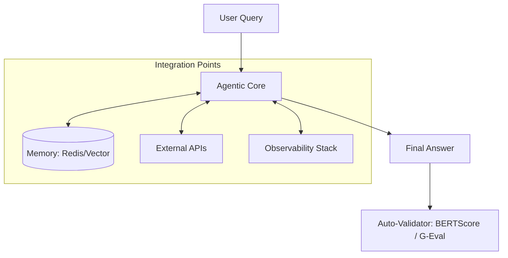

# ⛓️ Integration Testing: Testing the Workflow
> **Level:** Advanced | **Language:** Hinglish | **Goal:** Master the art of testing "End-to-End" agentic workflows, focusing on how different components (LLM, Memory, Tools, Vector DB) interact to solve complex, multi-step tasks.

---

## 🧭 1. Beginner-Friendly Hinglish Explanation
Integration Testing ka matlab hai **"Poori Machine ki jaanch karna"**.

- **The Problem:** Shayad calculator tool sahi hai, aur search tool bhi sahi hai. Par kya agent "Search" karke result ko "Calculator" mein sahi se bhej pa raha hai?
- **The Solution:** Humein poora **"Workflow"** test karna hoga.
  - **Tool Chaining:** Kya Agent Step A se Step B par sahi ja raha hai?
  - **Memory Persistence:** Kya Agent ko 5 minute pehle wali baat yaad hai?
  - **Environment Interaction:** Kya Agent database se data nikaal kar use summarize kar pa raha hai?
- **The Goal:** Ye ensure karna ki agent "Bikhra" (Disconnected) hua nahi hai, balki ek smooth system ki tarah kaam kar raha hai.

Integration testing se hum "System-level" galthiyan pakadte hain.

---

## 🧠 2. Deep Technical Explanation
Integration testing focuses on the **Interfaces** and **Data Flow** between agentic modules.

### 1. Key Integration Touchpoints:
- **LLM -> Tool Interface:** Does the LLM generate arguments that match the tool's schema?
- **Agent -> Memory:** Does the agent successfully retrieve the *correct* context from the Vector DB for a given query?
- **Agent -> State Graph:** Does the agent move from the "Planning" node to the "Execution" node correctly?

### 2. Testing Methodologies:
- **E2E (End-to-End) Tests:** Simulating a real user journey (e.g., "Plan a trip to Paris" and checking if the final result has flights and hotels).
- **Sub-graph Testing:** Testing a specific part of a complex graph (e.g., just the "Error Recovery" branch).

---

## 🏗️ 3. Architecture Diagrams (The Integration Test Bed)


---

## 💻 4. Production-Ready Code Example (An End-to-End Integration Test)
```python
# 2026 Standard: Testing a full RAG + Tool-use workflow

import pytest
from my_agent import FullAgent

@pytest.mark.asyncio
async def test_full_workflow_success():
    # 1. Initialize the full agent (No mocks, or minimal mocks)
    agent = FullAgent(memory="test_vector_db")
    
    # 2. Run a complex task
    query = "Find the revenue of Apple in 2023 and calculate the tax at 20%"
    response = await agent.run_async(query)
    
    # 3. Assert on the 'Systemic' outcome
    assert "revenue" in response.lower()
    assert "$" in response
    # Use LLM-as-a-judge to verify the math logic is correct
    assert await verify_logic_with_ai(response, expected_math="revenue * 0.2")

# Insight: Integration tests often take 10-60 seconds. 
# Run them in a 'Nightly Build' if they are too slow for CI.
```

---

## 🌍 5. Real-World Use Cases
- **Autonomous Support:** Testing if the agent can find a user's order ID in the DB and then use the "Shipping API" to give an update.
- **AI Coding:** Testing if the agent can read a file, find a bug, write a fix, and then run the unit tests successfully.
- **Market Research:** Testing if the agent can browse 3 websites, summarize them, and save the result to a PDF.

---

## ❌ 6. Failure Cases
- **The "Broken Bridge":** The LLM outputs JSON, but the tool expects a String, causing the system to crash mid-workflow.
- **State Corruption:** The agent's memory gets "Polluted" with irrelevant info from an earlier step, causing it to hallucinate the final answer.
- **Race Conditions:** Two agents trying to write to the same file or database record at the same time.

---

## 🛠️ 7. Debugging Guide
| Symptom | Cause | Fix |
| :--- | :--- | :--- |
| **Agent gets 'Stuck' in a loop** | Circular dependency in logic | Add a **'Max Iterations'** guardrail and check the **'State Graph'** for infinite cycles. |
| **Output is always 'Generic'** | RAG retrieval failed | Check if the **'Context'** is actually being passed from the Vector DB to the LLM prompt. |

---

## ⚖️ 8. Tradeoffs
- **Full E2E (Complete/Slow/Expensive) vs. Mocked Integration (Fast/Incomplete).**
- **Sequential Integration (Simple) vs. Concurrent/Swarm Testing (Complex/Scalable).**

---

## 🛡️ 9. Security Concerns
- **Data Leakage across Spans:** Ensuring that a "Secret API Key" used in Step 1 doesn't accidentally get printed in the "Final Summary" of Step 5.
- **Privilege Escalation:** An agent using the result of a "Read" tool to guess the parameters for a "Write" tool.

---

## 📈 10. Scaling Challenges
- **Massive Integration Suites:** Testing 100 different user personas. **Solution: Use 'Test Orchestrators' like Playwright (for web agents) or customized AI Test Runners.**

---

## 💸 11. Cost Considerations
- **Token Burn:** A single E2E integration test can use 50,000 tokens. **Strategy: Use 'Small Models' for integration testing during dev, and 'Big Models' only for final release.**

---

## 📝 12. Interview Questions
1. How do you test a multi-agent system where agents talk to each other?
2. What is "State Persistence" and how do you verify it?
3. How do you handle "Non-determinism" in integration tests?

---

## ⚠️ 13. Common Mistakes
- **No 'Clean State' before tests:** Not wiping the test database/memory before running a new test (causes ghost errors).
- **Ignoring Tool Failures:** Only testing "Success" cases and never testing what happens if an API returns a 404.

---

## ✅ 14. Best Practices
- **Use 'Trace IDs':** Every integration test should generate a unique ID that you can look up in **LangSmith**.
- **Automated Teardown:** Ensure all temporary files and DB records are deleted after the test finishes.
- **Real-world Data:** Use "Anonymized" production data for your integration tests to catch "Real" edge cases.

---

## 🚀 15. Latest 2026 Industry Patterns
- **Digital Twin Testing:** Creating a "Digital Twin" of your production environment (APIs, DBs, Files) specifically for integration tests.
- **Agentic Chaos Engineering:** Automatically "Killing" a tool or model mid-workflow to see if the agent can "Recover" gracefully.
- **Self-Healing Integration Tests:** An agent that "Watches" the integration tests fail and automatically "Fixes" the connection logic or prompt.
