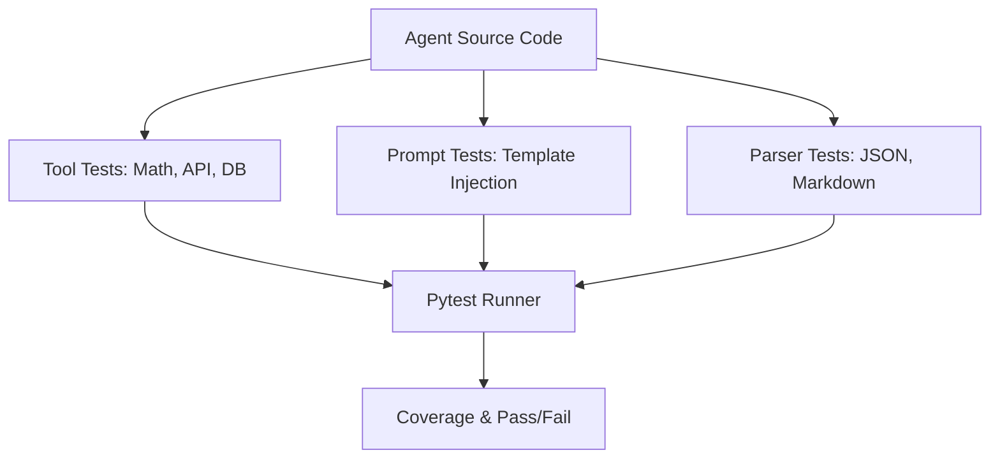

# 🧪 Unit Testing for Agents: Testing the Components
> **Level:** Advanced | **Language:** Hinglish | **Goal:** Master the art of writing unit tests for AI agents, focusing on testing individual tools, prompt templates, and logic branches in isolation to ensure a stable and bug-free system.

---

## 🧭 1. Beginner-Friendly Hinglish Explanation
Unit Testing ka matlab hai **"Purzon (Parts) ki jaanch karna"**.

- **The Problem:** Ek bada agent complex hota hai. Agar wo "Search" galat kar raha hai, toh humein poora agent run karne ki zaroorat nahi.
- **The Solution:** Humein har ek chote "Unit" ko alag se test karna chahiye:
  - **Tool Test:** Kya `calculator()` function `2+2` ka sahi jawab de raha hai?
  - **Prompt Test:** Kya hamara "System Prompt" model ko "Polite" rehne par majboor kar raha hai?
  - **Parser Test:** Kya agent ke JSON output ko humara code sahi se padh (parse) paa raha hai?
- **The Goal:** Galti ko uske "Janm sthal" (Birthplace) par hi pakad lena.

Unit testing se debugging **"Minto ka kaam"** (Minutes of work) ban jati hai.

---

## 🧠 2. Deep Technical Explanation
Unit testing in agents is divided into **Deterministic Code Testing** and **Probabilistic LLM Testing**.

### 1. Deterministic Unit Tests (Standard Python):
Testing the "Tools" and "Helpers" using frameworks like `pytest`.
- **Mocking:** Using `unittest.mock` to simulate API responses so you don't spend money on tokens during testing.
- **Boundary Testing:** Giving the tool extremely high/low numbers or empty strings.

### 2. Probabilistic Unit Tests (LLM Assertions):
Testing if an LLM call behaves as expected using "Assertions."
- **Output Validation:** Asserting that the output is valid JSON or contains specific keywords.
- **Cost/Token Checks:** Asserting that the prompt doesn't exceed a certain token limit.

---

## 🏗️ 3. Architecture Diagrams (The Unit Test Suite)


---

## 💻 4. Production-Ready Code Example (Testing a Tool and a Prompt)
```python
# 2026 Standard: Using pytest for agent components

import pytest
from my_agent.tools import search_tool
from my_agent.prompts import get_system_prompt

# 1. Testing a Deterministic Tool
def test_search_tool_valid_input():
    # We mock the external API for speed and cost
    result = search_tool("AI Agents")
    assert "Agent" in result
    assert isinstance(result, str)

# 2. Testing a Prompt Template
def test_prompt_injection_safety():
    user_name = "Hacker"
    prompt = get_system_prompt(user_name)
    # Ensure the prompt doesn't accidentally reveal internal secrets
    assert "SECRET_KEY" not in prompt
    assert "Hacker" in prompt

# Insight: Unit tests should run in milliseconds. 
# If a test takes 10s, it's an 'Integration' test, not a 'Unit' test.
```

---

## 🌍 5. Real-World Use Cases
- **Fintech Agents:** Unit testing the "Interest Calculator" tool to ensure it's $100\%$ accurate before giving it to the AI.
- **Customer Support:** Testing the "SQL Generator" unit to see if it handles "Delete" queries safely (refusal test).
- **Logistics Agents:** Testing the "Coordinate Converter" to ensure it handles negative longitude/latitude correctly.

---

## ❌ 6. Failure Cases
- **No Mocking:** Accidentally spending $\$100$ in tokens because your unit tests are calling GPT-4 in a loop.
- **Testing the 'Model' not the 'Code':** Trying to unit test if "AI is smart" (Too broad). Focus on: "Does the code send the correct prompt to the AI?"
- **Brittle Assertions:** Asserting that the AI says *exactly* "Hello," which fails if it says "Hi." **Fix: Use 'LLM-as-a-Judge' for assertions.**

---

## 🛠️ 7. Debugging Guide
| Symptom | Cause | Fix |
| :--- | :--- | :--- |
| **Tests are 'Flaky' (pass sometimes, fail others)** | Non-deterministic AI output | Use **'Regex'** or **'Similarity Scores'** for assertions instead of exact string matching. |
| **Tests are slow** | Calling real APIs | Use **'VCR.py'** to record API responses and play them back during testing. |

---

## ⚖️ 8. Tradeoffs
- **Mocking (Fast/Free/Inaccurate) vs. Real Calls (Slow/Expensive/Accurate).**
- **100% Coverage (Safe/Slow to write) vs. Critical Path Testing (Fast/Risky).**

---

## 🛡️ 9. Security Concerns
- **Sensitive Data in Tests:** Accidentally putting real API keys or user data in your `test_data.json` file. **Fix: Use 'Environment Variables' and 'Fake Data Generators' (Faker).**

---

## 📈 10. Scaling Challenges
- **Massive Toolkits:** Testing an agent with 100+ tools. **Solution: Group tests by 'Tool Domain' and run them in parallel.**

---

## 💸 11. Cost Considerations
- **Testing Budget:** Allocate a small budget for "Live Unit Tests" (tests that call real cheap models like GPT-4o-mini).

---

## 📝 12. Interview Questions
1. How do you "Mock" an LLM response in a unit test?
2. What is the difference between a Unit Test and an Integration Test in AI?
3. How do you test if a prompt is "Safe" from injection at the unit level?

---

## ⚠️ 13. Common Mistakes
- **Testing Logic in the Prompt:** Trying to write a unit test for a 10-paragraph prompt. (Break it down into smaller components!).
- **Manual Verification:** Running the code and "Looking at the print" instead of writing an automated `assert`.

---

## ✅ 14. Best Practices
- **Isolation:** Each test should be independent of others.
- **Meaningful Names:** `test_calculate_tax_invalid_input` is better than `test_1`.
- **CI/CD Integration:** Every time you push code, your unit tests should run automatically.

---

## 🚀 15. Latest 2026 Industry Patterns
- **Property-based Testing for Prompts:** Automatically generating 100 random user inputs to see if the prompt template breaks.
- **Snapshot Testing:** Saving the "Expected" JSON output of an agent and alerting if the new version changes the structure.
- **AI-Written Unit Tests:** Using an agent (like CodiumAI) to look at your tool code and write the tests for you.
